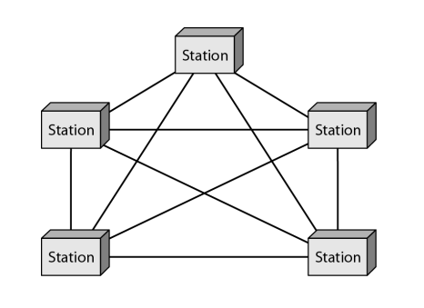
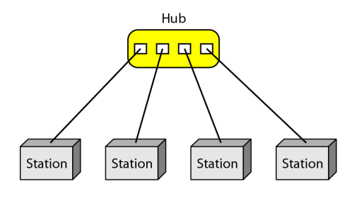
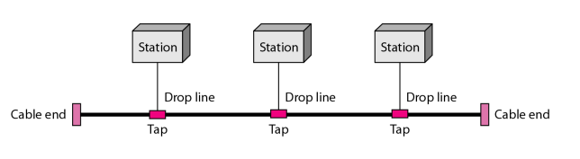
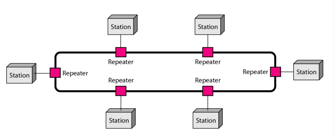
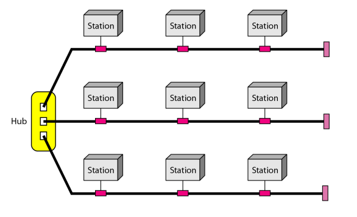
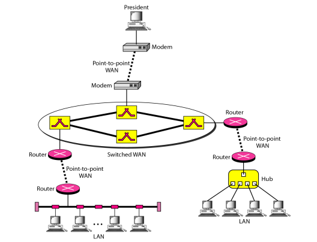

#  Data Communications and Networking 

## 
 数据通信与网络——第一章 

---
## 名词解释
<ul>
<li>Circuit Switching -- 电路交换</li>
 如电话网

<li>Packet Switching -- 分组交换</li>
 具有大量为错误补偿的费用

<li>Frame Relay --  帧中继</li>
 提供了更高的速度，减少了为错误产生的开销</li>

<li>Asynchronous Transfer Mode (ATM) -- 异步传输模式</li>
</ul>
<ul>
<li>Ethernet -- 以太网</li>
<li>Local Area Networks(LAN) -- 局域网</li>
<li>Metropolitan Area Networks(MAN) -- 城域网 </li>
<li>Wide Area Network(WAN) -- 广域网</li>
<li>internet -- 互联网</li>
<li>Internet -- 因特网</li>
<li>Protocols -- 协议</li>
<li>ISO -- 国际标准化组织</li>
</ul>

## 要点

### 通信系统五个组成部分
> 报文、发送方、接收方、传输介质、协议

### 网络的拓扑结构(physical topology)
> 网状（mesh）、星型(star)、总线(bus)、环状(ring)、混合

### 拓扑结构示例：
<b>网状：</b>
 
<b>星型：</b>
 
<b>总线:</b>
 
<b>环状:</b>
 
<b>混合:</b>
 

<b>混合网络示例：</b> 

### 网络协议组成要素：
<b>语法：</b>数据与控制信息的结构或格式。  
<b>语义：</b>需要发出何种控制信息，完成何种动作以及做出何种响应。  
<b>同步/时序：</b>事件实现顺序的详细说明。即报文发送的时间和发送的频率。  

## 问题
<b>在一个有n台设备的网络中，网状、环状、总线结构和星型拓扑各需要多少根线缆？</b>  
> Mesh(网状)：n(n-1)/2
star(星型)：n
Ring(环状)：n-1
Bus(总线)：1根主干n根垂直线

