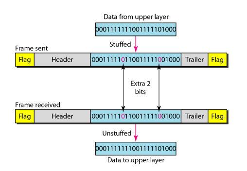
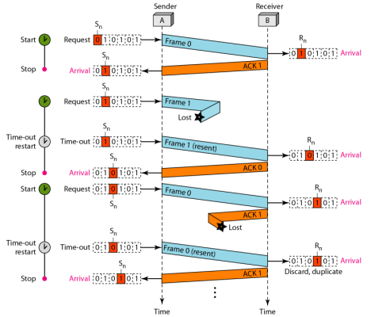
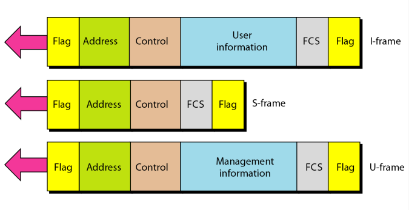
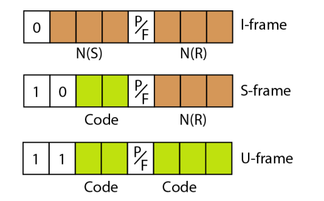
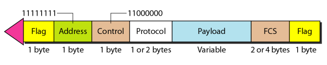

#  Data Communications and Networking 

## 
 数据通信与网络——第十一章

## 名词解释
<ul>
<li>distinguishable -- 可识别的</li>
<li>stuffing -- 填充</li>
<li>unstuffing -- 移除</li>
<li>consecutive -- 连续的</li>
<li>Flow Control -- 流量控制</li>
<li>Error Control  -- 差错控制</li>
<li>pseudocode -- 伪代码</li>
<li>Stop-and-Wait Protocol -- 停等协议</li>
<li>Stop-and-Wait Automatic Repeat Request -- 停等ARQ</li>
<li>Go-Back-N Automatic Repeat Request -- 后退N帧ARQ</li>
<li>Selective Repeat Automatic Repeat Request -- 选择性重传ARQ</li>
<li>modulo-2 arithmetic -- 模2运算</li>
<li>utilization percentage -- 利用率</li>
<li>High-level Data Link Control(HDLC) -- 高级数据链路控制协议</li>
<li>POINT-TO-POINT PROTOCOL(PPP) -- 点到点协议</li>
<li>Transition Phases -- 传输阶段</li>
<li>Password Authentication Protocol(PAP) -- 口令认证协议</li>
<li>Chanllenge Handshake Authentication Protocol(CHAP) -- 查询握手认证协议</li>
<li>Internet Protocol Control Protocol(IPCP) -- 互联网络协议控制协议</li>
<li>escape character(ESC) -- 转义字符</li>
<li>bit-oreinted protocol -- 面向位协议</li>
<li>automatic repeat request(ARQ) -- 自动重复请求</li>
<li>acknowledgment(ACK) -- 确认</li>
<li>negative acknowledgment(NAK) -- 否定确认</li>
<li>piggybacking -- 捎带</li>
<li>pipelining -- 流水线操作</li>
<li>sliding window -- 滑动窗口</li>
<li>primary station -- 主站</li>
<li>secondary station -- 从站</li>
<li>information frames(I-frames) -- 信息帧</li>
<li>supervisory frames(S-frames) -- 管理帧</li>
<li>unnumbered frames(U-frames) -- 无编号帧</li>
</ul>

## 要点
数据链路层两个主要功能是：
<ul>
<li>数据链路控制，用来处理两个相邻节点之间的通信；</li>
<li>介质访问控制， 如何共享媒介进行访问控制。</li>
</ul>

数据链路层需要将一组比特位组成帧，以便帧和帧之间是可以识别的。  

<b>字节填充:</b>是当文本中存在一个标记字符或者转移字符时，添加一个额外字节的过程。  
在面向位协议中，多数协议使用一个特殊的8位模式的标记01111110作为分隔符来标明帧的开始和结束。  
比特位填充是每五连1时，插入一个比特0的过程，以便接收方不会误认为是帧的标记。

<b>数据链路层最重要的职能就是流量控制和差错控制。通常一起称为数据链路控制。</b>
>流量控制就是一系列过程，用来限制发送方在等到确认之前发送的数据数量。
>数据链路层的差错控制基于自动重复请求，即重传数据。

最简单的停等协议中，发送方发送一帧后要等待接收方的ACK帧的反馈确认，才能发送下一帧。  
##### 停等ARQ
停等ARQ协议中，差错控制检测由保留已发送帧的副本并当重传定时器到时时重传这个帧来实现。  
停等ARQ使用序列号为每一个帧编号。序列号基于模2运算。  
停等ARQ，确认编号是期望收到下一帧的编号（模2域计算）,即编号只有0和1。  
ACK中的序列号为期待接收的序列号。  
停等ARQ在接收到错误的帧后也会发送一个ACK帧来请求自己想要的帧，可能在时钟超时之前解决问题。  
停等ARQ协议是非常低效的。  
停等ARQ协议不存在流水线操作，必须等待一个帧到达目的地并被确认后才能发送下一个帧。  

##### 后退N帧自动重发协议
后退N帧协议中，发送窗口小于2^m,接收窗口总是1.  
在此协议中确认是累加的。  
当一个帧安全有序到达时，接收方发送一个确认帧。如果帧损坏或次序颠倒，接收方不响应并丢弃所有后来的帧直到收到一个它所期待的帧。接收方的不确认会导致发送方的定时器到时，然后重发。  
只需要第一个待处理的帧有一个定时器。  
##### 选择性重发ARQ
对于噪声链路更有效。  
选择性重传ARQ，发送和接收窗口必须小于等于2^（m -1），且发送窗口与接收窗口一样大。  
选择性重复协议允许与接收窗口大小一样多的帧乱序到达，并被保留直到有一组有序帧能够交给网络层。  
每发送或重发一个帧都需要一个定时器。  
每一个窗口位置只发送一个NAK并指明窗口中的第一个时隙。  

##### HDLC
面向位的点到点和多点链路进行通信的协议。  
HDLC提供了两种通用传输模式：正常响应模式（normal response mode,NRM）和异步平衡模式(asynchronous balanced mode,ABM)。  
在正常响应方式中，有一个主站和多个从站。主站能发送指令，从站只能响应。  
在异步平衡方式（AMB）中，每个站点既有主站的功能又有从站的功能。  
HDLC是一个实际应用的面向比特的数据链路协议，支持点到点链路和多点链路。  
HDLC frames帧结构：信息帧、管理帧、无编号帧。  
信息帧用来传输用户数据及用户数据相关的控制信息，管理帧只用来传输控制信息，无编号帧携带的信息用来管理链路自身。  

>准备接收RR，字段标识是00
不准备接收RNR，字段标识是10
拒绝接收REJ，字段标识是01
选择性拒收SREJ，字段标识是11

使用无编号帧来建立连接和断开来连接。  

##### PPP
不提供流量控制，差错控制有限。  
转义字节01111101。  
数据链路层协议。  
面向字节的协议。  
PPP帧格式：

PPP是面向字节的协议，通过转义字节01111101进行透明插入和删除。  
LCP(Link Control Protocol)负责建立、维护、确认并终止链路。  
AP(Authentication Protocol)
NCP(Network Control Protocol)
## 问题
<b>假定停等ARQ系统，带宽1Mbps，往返传播时间是20ms，求带宽时延乘积？帧长度1000bits，链路利用率是多少？</b>  
> 解：宽带时延积为： 1 × 10^6 × 20 × 10^（-3） = 20000 bits.   
> 链路利用率为：1000 / 20000 = 5%.

