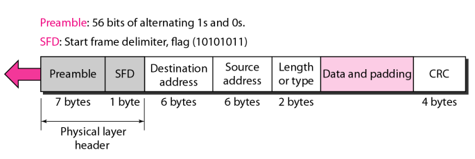
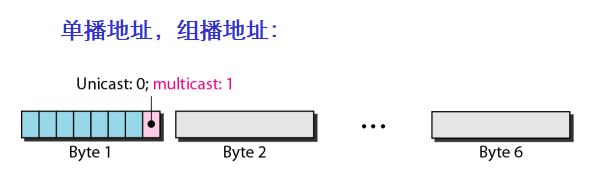

#  Data Communications and Networking 

## 
 数据通信与网络——第十二章

## 名词解释
<ul>
<li>destination service access point(DSAP) -- 目的业务接入点</li>
<li>source service access point(SSAP) -- 源业务接入点</li>
<li>logical link control(LLC) -- 逻辑链路控制层</li>
<li>media access control (MAC) -- 介质访问控制层</li>
<li>network interface card(NIC) -- 网络接口卡(网卡)</li>
<li>hexadecimal notation -- 十六进制表示法</li>
<li>collision domain -- 冲突域</li>
<li>full-duplex -- 全双工</li>
<li>autonegotiation -- 自动协商</li>
</ul>

## 要点
IEEE将数据链路层分为逻辑链路控制层和介质访问控制层。  
LLC的目的是为需要流量控制和差错控制的上层协议提供这些服务。  
在标准以太网中，MAC子层控制访问方法，也负责将来自上层的数据成帧并传输给物理层。  
<b>MAC帧:</b>

MAC帧的长度:头部和尾部算18字节,其它有效载荷长度最小为46字节,最大为1500字节.
<b>以太网地址为6字节,用十六进制表示.</b>  
当目的地址字段第一个字节最低位为0表示单播地址,1表示多播地址.  

广播地址的所有位都是1.  
在线发送地址传输是从左到右的.即界定地址是单播地址还是多播地址的那一位最先到达接收方.  
地址是被一个字节一个字节从左向右发送,每个字节是一位一位从右向左发送.  

时隙 = 往返时间 + 发送干扰序列所需时间  
在全双工模式的交换以太网中,在站点与交换机之间不是使用一条链路,而是使用两条链路,一条用于传送,一条用于接收.  

在全双工模式中,不存在冲突.  
一个2层交换机就是一个N个端口的网桥,该网桥带有允许快速处理分组的附加功能.  
多播地址只能是目的地址不能是源地址.  
传统以太网中帧长度的最小值为512bits.
## 问题
<b>写出MAC地址 47:20:1B:2E:08:EE 在线路上的发送次序。</b>
> 解:地址被一个字节一个字节地从左向右发送，每个字节是一位一位地 从右向左发送的，如下所示
