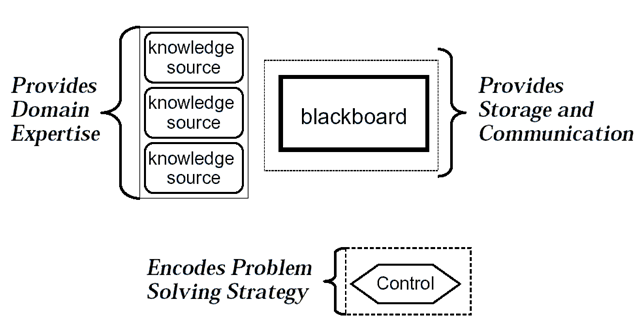
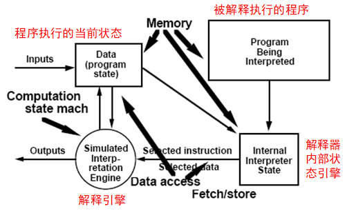
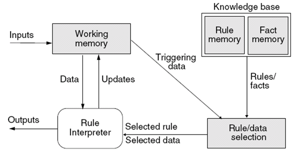

# SA02.3 黑板、虚拟机、独立组件

## 黑板

“黑板”属于“仓库”的变种，黑板的作用相当于“共享内存”  
<b>适用于</b>解决无确定性求解策略问题。  
> 不成熟的领域，其中没有相近的或可行的方法
在合理的时间内，解空间的完全求解不可行
由于领域不成熟，模块应易于替换以便试验 
对子问题的求解可以有多种算法 

<b>解决方案：</b>  

	设计公共数据结构。  
	设计多个专用组件，每个组件解决任务的一个特定部分  
	每个组件可对公共数据结构进行添加、修改、删除  
	仲裁者组件对每个组件的工作结果进行评估，协调各组件的工作。
    
<b>黑板组成/模型:</b>  

1. 知识源  
> 知识源之间不直接进行通讯，它们之间的交互只通过黑板来完成。一个知识源只能解决问题的一部分（一个方面）。  

2. 黑板数据结构  
> 按照与应用程序相关的层次来组织的解决问题的数据，知识源利用黑板的接口对黑板进行读写，通过不断地改变黑板数据来解决问题。  

3. 控制（仲裁者）  
> 控制完全由黑板的状态驱动，监控黑板的变化，决定下一步选用哪个知识源进行工作。  

<b>黑板与仓库的区别：</b>黑板的状态触发进一步的操作，仓库的操作的执行次序是预先确定的。  

<b>模型：</b>  
  

<b>黑板问题的特点</b>  
* 没有直接的算法可解  
> 多种方法都可能解决问题  
> 需要多个领域的专门知识协作解决  

* 不确定性
> 解决过程中可能会发生变化。  

* 最优或者足够好即可的问题。  
> 问题没有唯一的解答，或者“正确”答案会变化  

复杂的黑板系统可以用来解决语音识别问题。例如：  
> 音节分割问题  
> 重音问题  
> 语法问题  
> 语义问题  

问题的<b>解决策略</b>必须是增量的、机会主意的、灵活的。  
黑板结构可以同时处理多种假设。  
控制很复杂：有一个监视器，采用基于优先级的调度。  

## 虚拟机  

虚拟机是一种软件，创建了虚拟的环境，屏蔽了底层平台。  
<b>分类：</b>  

> 系统级（硬件虚拟机）：可以把一台电脑虚拟为运行不同OS的多台电脑  
进程级（应用程序虚拟机）：JVM  
机器聚合：云计算

<b>VM体系结构的成员</b>  
1. Interpreters  
2. Rule-based systems  
3. others  
> 句法shell，命令处理器  

解释器是用来“执行其他程序的程序”，很多脚本语言都采用解释的方式运行，即程序源代码直接被解释执行（不需编译）。  
浏览器也是典型的解释器。  
<b>解释器适用于</b>应用中的解决方案不能被适当的语言或者机器直接执行的情况。  
解释器用于将一种机器语言翻译为另一种机器语言。  

<b>解释器的解决方案：</b>  
<b>系统模型：</b>VM  
<b>组件：</b> 1个状态机+3个存储区  
<b>连接件：</b>数据访问和程序调用  
<b>控制结构：</b>状态转移执行引擎，输入驱动解释什么。  

专家系统通常以解释器的形式实现。  

<b>解释器模型：</b>  
  

解释器模型<b>优点：</b>  
* 功能性（可以模仿非本机的功能）   
* 可测试性（可以模仿灾难模式）  
* 灵活性（多功能通用的工具）  

解释器模型<b>缺点：</b>  
* 效率低（比硬件和编译器系统都慢）  
* 额外的测试（增加层需要测试）  

<b>解释器和编译器的区别：</b>  
解释器的执行速度慢于编译器产生的目标代码的执行速度，但低于“编译+链接+执行”的总时间  
每次解释执行时，都需要分析程序结构，而编译器只需一次性编译代码  

<b>解释器的用途</b>  
> 解释型语言、通信协议、用户输入

<b>基于规则的系统模型</b>  
  
<b>基于规则的系统适用问题：</b>  
* 当业务规则很复杂时，不宜用if-else结构表示  
* 按照OCP（开放/封闭原则），应把可变部分与不变部分进行分离，在前者发生变化时就不会影响后者  
> 核心：把频繁变化的、复杂的业务规则抽取出来，形成独立的规则库，而不是将规则写入代码。  
规则使用基于XML或自然语言的规则定义语言（不是程序设计语言），规则形如（If……Then……）。其余部分仍旧使用高级语言  
系统根据目前的状态，从规则库中选择合适的规则，对规则进行解释，根据结果控制系统的运行  

<b>基于规则的系统：一种特殊的虚拟机，使用模式匹配搜索来寻找规则，并在正确时机应用正确的规则</b>  
基于规则的系统仍然是 1引擎+3存储区 的结构，构件与解释器风格类似。  
1. 引擎  
> 解释器引擎（规则解释器）  

2. 3个存储区  
> 被执行的代码（基础知识）  
> 控制解释器状态(规则/数据选择)  
> 当前代码状态（工作内存）  

<b>基于规则的系统风格的优点</b>  
> 降低修改业务逻辑的成本与风险  
缩短开发时间  
规则可在多个应用中共享

基于规则的系统与解释器的对比：  
解释器：在高级程序语言与OS/硬件平台间建立虚拟机  
基于规则的系统：在自然语言/XML规则和高级程序语言间建立虚拟机  

## 独立构件  
举例：交流程序，事件系统，多播代理，中断驱动程序。  

交流程序风格适用于：应用程序涉及不同的集合,大量的独立计算的执行应独立进行，需要注意消息的路由和同步。  

<b>交流程序模型：</b>  
<b>系统模型：</b>独立的交流程序  
<b>组件：</b>收发消息的过程  
<b>连接件：</b>消息  
<b>控制结构：</b>每个程序有自己的控制线程。  
