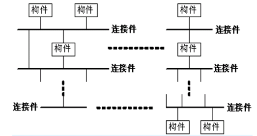

# 2.4 事件系统 异质架构 特定领域
## 事件系统  
组件对事件进行订阅（登记），并在事件被触发时得到通知。而事件并不知道（或不关心）都有谁订阅了自己。  
<b>隐式调用适用于</b>应用程序涉及松散耦合的组件集合。经常是反应式系统。尤其适用于能够动态重配置的系统。  
隐式调用系统通常需要事件句柄来注册组件的兴趣和和当事件发生时提醒它们。  

<strong>隐式调用的解决方案：</strong>
<b>系统模型：</b>独立的反应式程序。  
<b>组件：</b>不必知道接收人的发生事件的程序。  
<b>连接件：</b>事件驱动绑定。自动调用已经注册对事件感兴趣的程序。  
<b>控制结构：</b>不知道接受的信号的分散的独立的组件。  

<b>基于事件的隐式调用风格的思想：</b>  
> 构件不直接调用一个过程，而是触发一个或多个事件。  
其它构件中的过程注册一个或多个事件，当一个事件被触发，系统自动调用在这个事件中注册的所有过程。  

主要特点是事件的触发者并不知道哪些构件会被这些事件影响。  

<b>支持基于事件的隐式调用的应用系统很多。</b>  
> 在编程环境中用于集成各种工具，  
在数据库管理系统中确保数据的一致性约束，  
在用户界面系统中管理数据，  
在编辑器中支持语法检查。  

<b>基于事件系统的隐式调用的优点</b>  
* 问题分解  
> 为软件重用提供了强大的支持。当需要将一个构件加入现存系统中时，只需将它注册到系统的事件中。新的关注者不对现有的关注者构成任何影响。  

* 系统的可维护性和复用性  
> 为改进系统带来了方便。当用一个构件代替另一个构件时，不会影响到其它构件的接口。  

* 性能  
> 调用可以并行  

* 鲁棒性  
> 一个组件的冲突不会影响其它部分。  

<b>核心思想是</b>系统分解为多个低耦合的模块。  

<b>基于事件系统的隐式调用的缺点</b>  
* 问题分解  
> 调用的顺序不可知  
> 函数调用可能出现语义问题  
> 正确性难以确保  
> 循环可能出错  

* 系统的可维护性和复用性  
> 可能存在全局性能和资源管理的问题  
> 事件处理可能于其它运行时机制影响  

* 性能  
> 间接/沟通意味着一些性能损失  

事件系统的一些设计问题：
1. 事件声明（由谁在哪声明）  
2. 事件结构（怎么将事件参数化）  
3. 事件绑定（事件应该什么时候绑定到程序上）  
4. 事件通知（事件应该怎样通知和派遣）  
5. 并发（组件操作能否并发）  

<b> 事件声明</b>  
事件应该怎么声明：  
> 提前定义事件集合  
> 静态事件声明  
> 动态事件声明  

事件应该在哪声明：  
> 事件集中声明  
> 事件分散声明  

事件怎么参数化：  
> 简单的名字  
> 固定参数列表  
> 通过事件类型决定参数  
> 动态地决定参数   

事件绑定：  
事件什么时候被绑定到程序中：  
> 静态事件程序绑定  
> 动态事件注册  

事件怎么和它隐式调用地程序进行数据交流：  
> 单一固定参数  
> 多参数  
> 可选择地参数  
> 参数表达式  

事件通知（公告）  
事件应该怎样被公告：  
> 单一公告程序  
> 多公告程序  
> 拓展语言  

并行  
可隐式调用的组件是什么：  
> 独立的程序  
> 有过程调用的模块/对象  
> 独立的程序  
> 事件管理器定义的程序  

事件是怎么交付的：  
> 完全交付  
> 选择交付  
> 基于模式的交付  
> 基于状态的策略  

循环（周期的）任务和共享数据：  
> 事件通过共享数据的改变来表示  
每一个共享变量都可以被看作一个事件  
任务必须是循环（周期性的）--可以再实时系统中周期性的运行或者被写成一个外循环的程序。  

### C2架构风格

  

C2体系结构风格可以概括为：通过连接件绑定在一起的按照一组规则运作的并行构件网络。  
C2风格中的系统组织规则如下：  
> 系统中的构件和连接件都有一个顶部和一个底部；  
构件的顶部应连接到某连接件的底部，构件的底部则应连接到某连接件的顶部，而构件与构件之间的直接连接是不允许的；  
一个连接件可以和任意数目的其它构件和连接件连接；  
当两个连接件进行直接连接时，必须由其中一个的底部到另一个的顶部。  

C2风格是最常用的一种软件体系结构风格。  
从C2风格的组织规则和结构图中，可以得出C2风格具有以下特点：  
> 系统中的构件可实现应用需求，并能将任意复杂度的功能封装在一起；  
所有构件之间的通讯是通过以连接件为中介的异步消息交换机制来实现的；  
构件相对独立，构件之间依赖性较少。系统中不存在某些构件将在同一地址空间内执行，或某些构件共享特定控制线程之类的相关性假设。  

### HMB (Hierarchy Message Bus) Architecture Style  
HMB风格基于层次消息总线、支持构件的分布和并发，构建之间通过消息总线进行通信。  
> 消息总线负责消息的分派、传递和过滤以及处理结果的返回  
构件向消息总线登记感兴趣的消息类型；构件根据需要发送消息，由消息总线负责把该消息分派到所有对此消息感兴趣的构件  
消息是构件之间通信的唯一方式  
不要求各个构件具有相同的地址空间或局限在一台机器上  
一个构件可支持多个不同的接口，每个接口定义一组输入和输出的消息  
复合构件是由更简单的子构件通过局部消息总线连接而成  

消息总线为整个系统和各个层次的构件提供了统一的集成机制。  

HMB风格的消息总线是系统的连接件.  

<b>多种体系结构的组合方式</b>  
1. 聚合方式  
> 组件的体系结构。例如：编译器中的文法分析组件  

2. 联合方式  
> 某一个组件或连接件成为两种以上体系结构联系的纽带  
可能是聚合方式的展开  
例如：视频点播系统

3. 混合方式  
> 把多种体系结构的优点，混合使用。主要体现在连接件的混合使用  
例如：事件驱动的CASE系统  

<b>B/S和C/S混合模型：</b>  
<b>“内外有别”模型:</b>  
> 企业内部用户通过局域网直接访问数据库服务器，企业外部用户通过Internet访问Web服务器

<b>“查改有别”模型</b>  
凡是维护和修改操作，无论外部或内部用户，均使用C/S；若只执行查询和浏览操作，则使用B/S结构  
缺点是数据可被外部用户直接修改，不够安全  

### 对等网（P2P）  
<b>特点：</b>  
整体稳定，不会因为一点的错误影响全局  
资源共享，任务分摊  
> “我为人人，人人为我”  
每点还要承担一定量（可能大量）的中转负荷  
对网络带宽占用极大

内容很难有效控制
> 容易包含不良信息、盗版信息

### Domain Specific Software Architecture(DSSA)
<b>DSSA</b>就是一个特定的问题领域中支持一组应用的领域模型、参考需求、参考体系结构等组成的开发基础，其目标就是支持一个特定领域中多个应用的生成  

<b>DSSA的必备特征</b>  
> 和一个严格定义的问题域和/或解决域相关  
具有普遍性，使其可以用于领域中某个特定应用的开发  
对整个领域的合适程度的抽象  
具备该领域固定的、典型的在开发过程中可重用元素  

<b>DSSA的基本活动</b>  
* 领域分析  
> 主要目的是获得领域模型。领域模型描述领域中系统之间共同的需求，即领域需求  
当领域中存在大量系统时，可选择它们一个子集作为样本系统  

* 领域设计  
> 主要目标是获得DSSA。DSSA描述在领域模型中表示的需求的解决方案  
领域需求的变化性导致DSSA也相应地具有可变性

* 领域实现  
> 主要目标是依据领域模型和DSSA开发和组织可重用信息。  

DSSA的建立过程分为五个阶段:  
> 1. 定义领域范围  
2. 定义领域特定的元素  
3. 定义领域特定的设计和实现需求约束  
4. 定义领域模型和体系结构  
5. 产生、搜集可重用的产品单元  

<b>DSSA与体系结构风格的比较</b>  
DSSA以问题域为出发点；Style以解决域为出发点  
DSSA只对某一个领域进行设计专家知识的提取、存储和组织，但可以同时使用多种style；Style可以应用到多个领域  
DSSA的特定领域参考体系结构只能用于该领域，不同领域的参考体系结构之间共同点少，很难重用  
Style的定义和该风格应用的领域是直交的，应用范围广。建立一个特定style的体系结构设计环境的成本要比建立一个DSSA参考体系结构和工具库的成本要低很多  
DSSA和体系结构风格是互为补充的两种技术。领域专家知识和体系结构设计专家知识在大型软件开发项目中都扮演着重要的角色  

[Next](https://github.com/fanzhonghao/study/blob/softwareArchitecture/3.1.md)  
