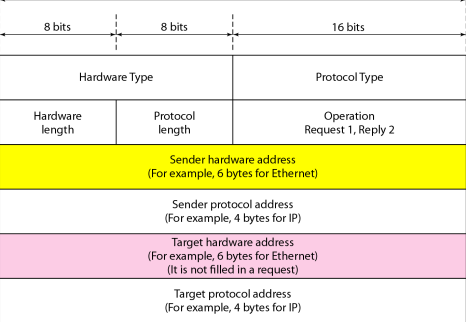
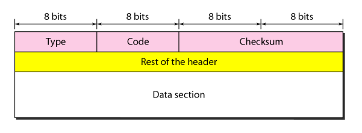
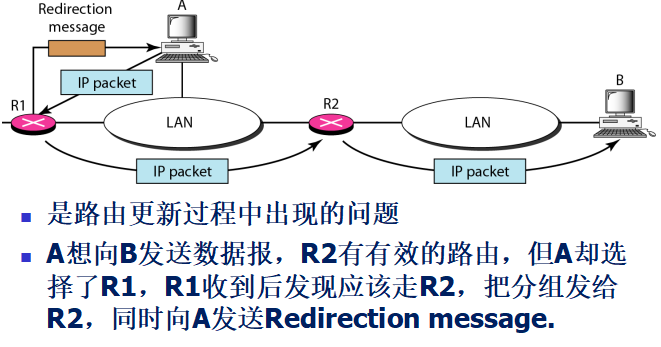
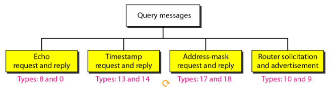
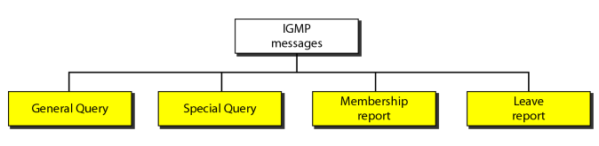
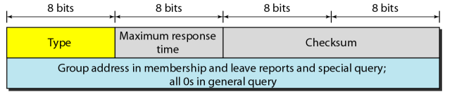
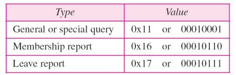
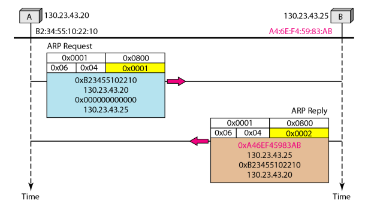

#  Data Communications and Networking 

## 
 数据通信与网络——第二十一章

## 名词解释 
<ul>
<li>Address Resolution Protocol(ARP) -- 地址解析协议</li>
<li>static mapping -- 静态映射</li>
<li>dynamic mapping -- 动态映射</li>
<li>proxy ARP -- 代理ARP </li>
<li>Bootrap Protocol(BOOTP) -- 引导程序协议</li>
<li>DynamicHost Configuration Protocol(DHCP) -- 动态配置协议</li>
<li>Internet Control Message Protocol(ICMP) -- 因特网控制报文协议</li>
<li>Internet Group Management Protocol(IGMP) -- 因特网组管理协议</li>
</ul>

## 要点
IP使用逻辑地址.  
IP最初是为单播设计的.IGMP提供了IP的一种多播能力.  
在网络级,主机和路由器用它们的逻辑(IP)地址进行标识,在物理级,主机和路由器用它们的物理地址标识.  
将分组传递到一台主机或路由器需要两级地址:逻辑地址和物理地址.   
静态映射是创建一个表将逻辑地址与物理地址联系起来.  
在动态映射中,每当一台机器直到两个地址(逻辑地址和物理地址)中的一个时,就可以使用协议将另一个求出.  
<b>ARP:逻辑地址到物理地址的映射</b>
IP数据报必须封装成帧才能通过物理网络,所以发送方必须有接收方的物理地址.  
主机或路由器发送一个ARP查询分组,该分组包括发送方的物理地址和IP地址已经接收方的IP地址.查询就是在网络上广播.网络上的每台路由器和主机都能接收和处理ARP查询分组,但是只要预期 的接收者才能识别它的IP地址,并发回ARP响应分组.响应为单播.  

ARP分组格式:  
  
ARP分组是直接封装在数据链路帧中.  

代理ARP是可以代表一组主机的ARP.  
代理ARP:当路由器收到一个ARP请求时,如果其目标IP地址与它所代表的主机之一的地址相匹配,则它发送一个ARP回答,并宣布其硬件地址作为目标硬件地址.当收到IP分组时,就将它发送给对于主机.  

物理地址到逻辑地址:RARP,BOOTP,DHCP.  
RARP使用:先创建一个RARP请求,并在本地网络上广播.在本地网络上知道所有IP地址的另一台机器就用RARP回答来响应.请求机器必须允许RARP客户程序,而响应机器必须允许RARP服务区程序.  

BOOTP是一种C/S协议.是应用层协议.BOOTP报文被封装在UDP分组中.  
BOOTP不能动态配置，只能静态配置。  

DHCP 提供可以是人工的或自动的静态或动态的地址配置。  

#####　ICMP
ICMP报文分为两类:差错报告报文(error-reporting message)和查询报文(query message).  
ICMP 允许主机或路由器报告差错情况和提供有关异常情况的报告。  
ICMP 不是高层协议，而是 IP 层的协议。  
ICMP 报文作为 IP 层数据报的数据，加上数据报的首部，组成 IP 数据报发送出去。  
ICMP 不能纠错，只能报告错误  
ICMP报文一般格式:  
  
第一个字段是ICMP的类型,它定义报文的类型.代码字段指定发送此特定报告类型的原因.  
共有5中差错可处理:目的端不可达,源端抑制,时间超时,参数问题及重定向.  
<b>目的不可达:</b>  
当路由器不能找到路由或者主机不能传递数据时候，丢弃这个数据报，然后发回目的端不可达报文.目的端的不可达报文或者有路由器产生，或者由目的主机创建  
<b>抑制源端</b>  
用来补充流量控制.  
当路由器或者目的主机中产生拥塞的时候，路由器或者目的主机丢弃数据报，发送source-quench message报文给发送方  
类似于拥塞控制中的阻流分组。  
<b>时间超时</b>  
产生的原因有两种：  
1.TTL减为0时，路由器丢弃数据报，  
2.报文的所有分片没有在有限的时间内到达（超时），由目的主机发送  

<b>参数问题</b>  
IP分组的Header中产生错误或者二义性  
路由器或者主机丢弃这个分组，然后向源方发送Parameter-problem message  

<b>重定向</b>  
  

>对于携带ICMP差错报文的数据报，不再产生ICMP差错报文。  
对于分段的数据报文，如果不是第一个分段则不产生ICMP 差错报文。  
对于多播地址的数据报文，不产生ICMP 差错报文。  
具有特殊地址的数据报文，如127.0.0.0或者0.0.0.0，不产生ICMP差错报文。  

<b>查询报文类型及类型码</b>  
  
回送请求报文：诊断网络  
时间戳请求和回答：确定数据报的往返时间  
地址掩码请求和回答：获取地址对应的掩码  
路由器询问和通告：询问路由器是否可正常工作。  

ICMP中校验和的计算包括了整个报文(包括头部和数据).  

ping程序用来确定一个主机是否正常工作与做出响应.  
UNIX的traceroute和Windows的tracert程序可用来追踪一个分组从源端到目的端所经过的路由.  
Netstat程序用来得到接口所支持的多播地址.  
netstat 的选项:  
> -n:以数字形式显示IP地址  
> -r:显示路由表  
> -a:显示所有地址  

##### IGMP
IGMP是一个辅助协议  
IGMP不是一个多播路由协议而是一个管理组成员协议.  
IGMP为多播路由器提供关于连接到网络上的主机(路由器)成员的信息状态.  

IGMP报文类型:  
  
IGMP报文格式:  
  
IGMP类型字段:  
  

在IGMP中,成员关系报告一个接着一个地发送两次.  

携带IGMP分组的IP分组的TTL字段的值为1,保证报文不能离开局域网.  

以太网的MAC地址是6字节.  

以太网的多播物理地址范围：01: 00: 5E: 00: 00: 00—01: 00: 5E: 7F: FF: FF  

对于公用加入请求,只有一个响应发送到那个组,以防止不必要的通信量,采用延迟响应的策略.  

## 问题
<b>一个主机的IP地址为130.23.43.20，物理地址为B2:34:55:10:22:10，它有一个分组想要发送给另一个主机，其IP地址为130.23.43.25，物理地址为 A4:6E:F4:59:83:AB（第一个主机并不知道该物理地址） 。两个主机在同一个网络上。试说明ARP请求与回答分组如何封装在以太网帧中。</b>  
解:  
  

<b>将多播IP地址230.43.14.7转换成以太网多播物理地址.</b>  
> 解:用十六进制写出IP地址的最右23位.可将最右的3个字节换成16进制,然后如果最左边的数字大于8或等于8,则将该数字减去8.此例中结果是 2B:0E:07.  
> 将上步得到的结果加到以太网的多播地址 01: 00: 5E: 00: 00: 00,结果是:01,00,5E,2B,0E,07.

<b>即将多播地址的最右13位加到以太网多播地址的开始即得到以太网多播物理地址.  