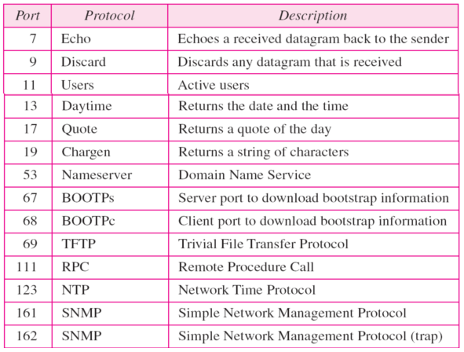
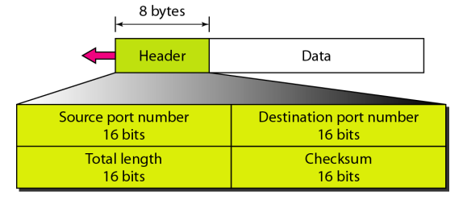
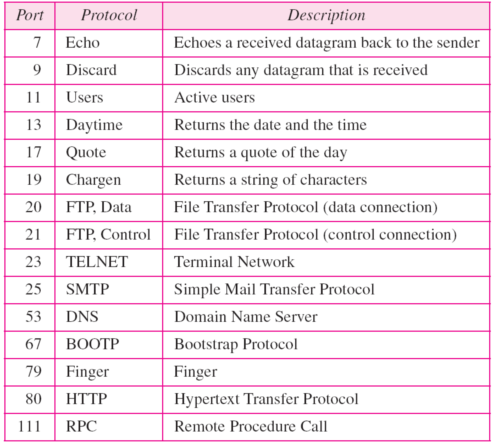
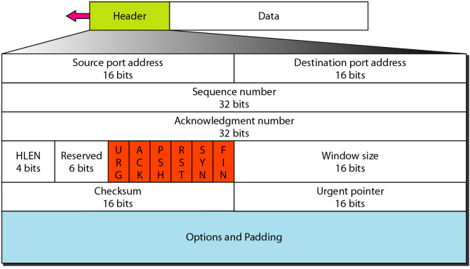
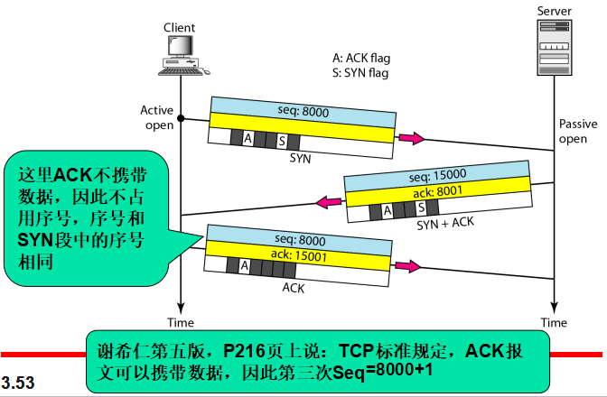
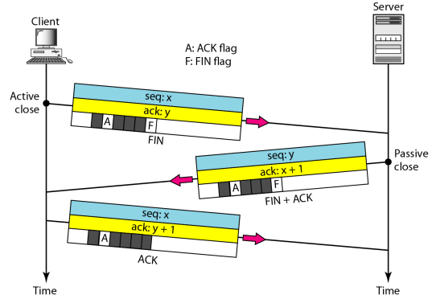
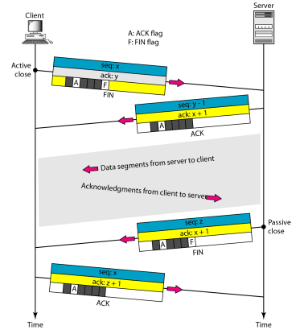

#  Data Communications and Networking 

## 
 数据通信与网络——第二十三章

## 名词解释 
<ul>
<li>transport layer -- 传输层</li>
<li>client-server paradigm -- C/S模式</li>
<li>ephemeral port -- 临时端口号</li>
<li>Internet Assigned Number Authority(IANA) -- 因特网号码分配管理局</li>
<li>socket address -- 套接字地址</li>
<li>User Datagram Protocol(UDP) -- 用户数据报协议</li>
<li>Transmission Control Protocol(TCP) -- 传输控制协议</li>
<li>segment -- 段</li>
<li>full-duplex service -- 全双工服务</li>
<li>three-way handshaking -- 三次握手</li>
<li>rwnd -- 接收方窗口</li>
<li>cwnd -- 拥塞窗口</li>
<li>retransmission timer -- 重传定时器</li>
<li>retransmission time-out (RTO) -- 重传超时</li>
<li>round-trip time (RTT) -- 往返时间</li>
<li>multistream service -- 多流服务</li>
</ul>

## 要点
传输层负责报文从一个进程到另一个进程的传递.  
传输层有三种协议:UDP,TCP,SCTP.  

数据链路层的帧需要一个目的端MAC地址用于传送数据和一个源地址用于下一节点的回答.  
网络层需要一个IP地址来选择主机.网络层的数据报需要目的IP地址用于传输数据,需要源IP地址用于接收目的主机的回答.  
传输层需要端口号的传输层地址,利用这一地址从目的主机上运行的多个进程选择相应的进程.目的端口号用于传送,源端口号用于接收回答.  

客户程序的端口号由客户主机上的传输层软件随机选择,是个临时端口号.  

服务器端口号不能随机选择.因特网给服务区使用全局端口号.  

端口号分为:熟知的,注册的,动态的.  

一个IP地址和一个端口号结合起来称为一个套接字地址.  

UDP面向无连接,TCP和SCTP面向有连接.  

传输层协议可以是面向连接的也可以是面向无连接的,可以是可靠的也可以是不可靠的.当应用程序需要可靠性,传输层通过实习流量控制和差错控制来获得这种可靠性.  

<b>SMTP、FTP、DNS基于TCP,TFTP、SNMP、BOOTP基于UDP.</b>  

##### UDP
UDP称为无连接不可靠传输层协议.  

UDP中熟知端口:  
  

UDP分组称为用户数据报,有8字节的固定头部.  
UDP头部:  
  
<b>头部中的总长度以字节为单位.</b>  
UDP长度 = IP长度 - IP头部长度  

UDP校验和包括:伪头部,UDP头部和从应用层来的数据.  

UDP协议字段是17.  

UDP发送的每一个数据报都是独立的,不同数据报之间没有任何关系,用户数据报不可以进行编号.使用UDP的进程不能向UDP发送数据流.  
每一个请求必须足够小,使其能够装入数据报中,只有那些发送短报文的进程才应当使用UDP.  
UDP没有流量控制和差错控制.  
在UDP中,队列和端口绑定.每个进程有且仅有一个入队列和一个出队列.  

##### TCP
TCP面向连接的协议,在传输层使用流量控制和差错控制机制,是可靠的传输协议.  
UDP是面向数据报的协议,TCP是面向流的协议.  
<b>TCP使用的熟知端口:</b>  
  

TCP允许发送进程以字节流形式传递数据,并且接收进程也以字节流接收数据.  
TCP使用发送缓冲区和接收缓冲区.  

IP层作为TCP服务的提供者,需要以分组的方式而不是字节流的方式发送数据,在传输层,TCP将多个字节分组合在一起成为一个分组,这个分组称为段.TCP为每个段添加头部,并将该段传递给IP层.  

TCP提供全双工服务,即数据可以在同一时间双向流动.  

TCP在段的头部采用序号(sequence number) 和 确认号(acknowledgment number)两个字段,这两个字段指的是字节序号而不是段序号.  

在每个连接中传送的字节都由TCP编号,序号开始于一个随机产生的数.  
一个段的序号字段的值定义为该段包含的第一个字节的序号.  
当一个段携带数据和控制信息时,它使用一个序号,如果一个段没有携带用户数据,那么它逻辑上不定义序号.有些段当仅携带控制信息时也需要一个序号用于接收方确认.  
段中确认字段的值定义了通信一方预期接收的下一个字节的编号。确认号是累加的。  
ACK段,如果不携带数据,则它不占用序列号.  

序号系统允许使用面向字节的流量控制.  

TCP中的分组称为段,段包括20-60字节的头部.  

<b>TCP头部</b>  
  
<b>HLEN中的数字一32bits为单位.  

TCP协议字段是6.  

面向连接的传输协议在源端和目的端建立一条虚电路.  
TCP连接建立称为三次握手.  
<b>三次握手图示:</b>  
  

SYN洪泛攻击属于拒绝服务攻击(denial-of-service attack).  

交换数据的任意一方都可以关闭连接,通常是由客户端发起.对于连接终止的实现有两种方法:三次握手和带有半关闭选项的四次握手.  
<b>三次握手连接终止</b>  
  
<b>四次握手关闭</b>  
  

TCP使用的滑动窗口协议界于回退N帧与选择重发之间的滑动窗口.  
TCP滑动窗口是面向字节的,数据链路层的滑动窗口是面向帧的.  
TCP滑动窗口是可变大小的,数据链路层的滑动窗口时固定大小的.  

一端的TCP窗口的大小取决于接收方窗口(rwnd)和拥塞窗口(cwnd)中较小的一个.  

接收方可张开或合拢窗口但是不能收缩窗口.  

ACK段不占用序列号,不需要确认.  

当重传计时器或发送到收到三个重复的ACK段时,重传段.  

数据可以失序到达,并被接收的TCP暂时存储.但是TCP确保传递给进程的段是无失序的.  

##### SCTP
流传输协议(SCTP)是可靠的,面向报文的传输层协议.  
SCTP是一种面向报文的可靠的协议,它兼有 UDP和TCP的最佳特性  

TCP的每次连接都包含一个单一的流.,SCTP在每一次连接中提供多流服务,SCTP称之为关联.  
SCTP关联允许每个端有多个IP地址  
在SCTP中，数据大块(data chunk )按传输序列号(TSN) 编号.  
为了区别不同的流， SCTP 使用SI  
为了区别属于同一个流中的不同数据大块， SCTP使用流序列号(SSN)  
TCP 有段; SCTP 有分组.  
在SCTP 中，控制信息和数据信息在分开的大块中携带。  

## 问题
UDP数据报最小长度在传输层是8字节,在IP层是28字节.  
UDP数据报最大长度是65535字节在传输层,在IP层为了保存IP头部最大长度为65515字节.  