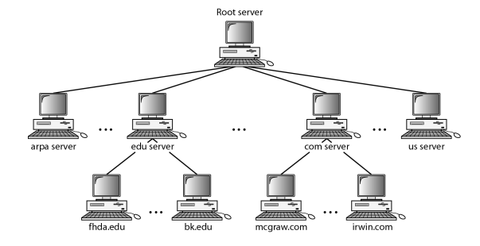
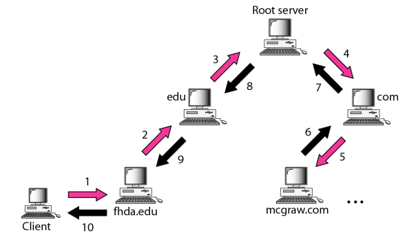
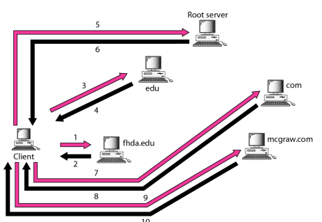

#  Data Communications and Networking 

## 
 数据通信与网络——第二十五章

## 名词解释 
<ul>
<li>hierarchical name space -- 平面名字空间</li>
<li>domain name space(DNS) -- 域名空间</li>
<li>generic domain -- 通用域</li>
<li>inverse domain -- 反向域</li>
<li>recursive resolution -- 递归解析</li>
<li>iterative resolution -- 迭代解析</li>
<li>Dynamic Domain Name System(DDNS) -- 动态域名系统</li>
<li>FQDN -- 全称域名</li>
<li>PQDN -- 部分域名</li>
</ul>

## 要点
域名系统是一种支持程序.  
中央管理机构只控制名字的一部分,而不是整个名字.  
域名空间的名字树最多有128级. 0-127.  
域名从叶子往树根读,最后是空字符串的为全称域名,反之为部分域名.  

<b>名字服务器的层次结构:</b>  
  

一台服务器负载或授权的范围称为域(zone).  
根服务器通常不保留关于域的任何信息,只是将其授权托给其他服务器.  

主服务器能够从磁盘文件中装载所有信息，辅助服务器从主服务器中装载信息。  
当辅助服务器从主服务器中下载信息时，这称为区域的传递。  
辅助服务器既不创建也不更新区域文件.  

域名空间被划分为三个部分:通用域,国家域和反向域.  

反向域(inverse domain)用于将地址映射为名字.  

将名字映射成为地址或者将地址映射成为名字的过程，称为名字-地址解析。  
解析有递归解析和迭代解析.  
<b>递归解析:</b>  
  
<b>迭代解析:</b>  
  

DNS有查询和响应报文.  
DNS有两种类型的记录，在查询和响应报文的询问部分使用了询问记录；在响应报文中的应答、授权、附加信息部分使用了资源记录。  

DNS可以使用UDP或者TCP协议。在这两种情况下，服务器使用熟知端口53。当响应报文的长度小于512字节时，就使用UDP。因为大多数UDP分组有512字节分组大小的限制。如果响应报文大于512字节，则必须使用TCP连接。  

## 问题