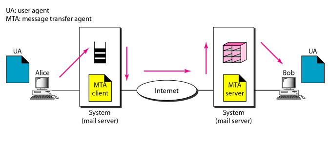
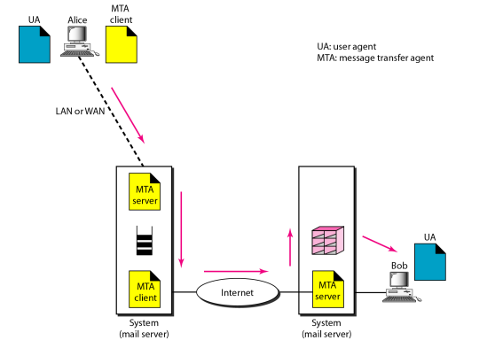
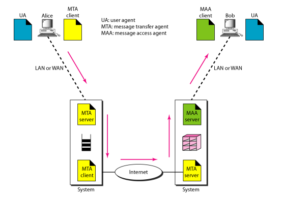
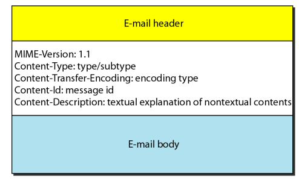
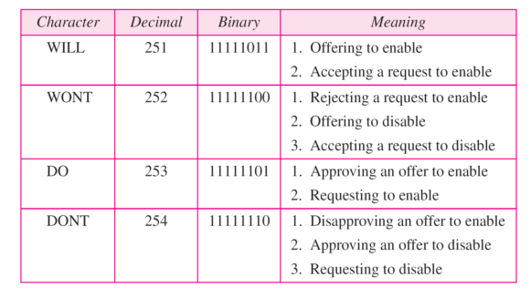

#  Data Communications and Networking 

## 
 数据通信与网络——第二十六章

## 名词解释
<ul>
<li>network virtual terminal(NVT) -- 网络虚拟终端</li>
<li>TELNET -- 终端网络</li>
<li>user agent(UA) -- 用户代理</li>
<li>message transfer agent(MTA) -- 报文传输代理</li>
<li>MIME -- 多用途因特网邮件扩充</li>
</ul>

## 要点
TELNET 是一个通用的客户/服务器应用程序。  
客户通过TELNET客户程序和TELNET服务程序连接远程系统.  

客户TELNET将来自本地终端的字符串转换成NVT形式,然后传递给网络.而服务器TELNET将来自NVT形式的数据或命令转换成远程计算机可接受的形式.  

NVT字符集使用两个字符集:数据字符和控制字符.两者都是8位字符.对于数据,它的低7位与ASCII一样,最高位为0,控制字符最高位为1.  
TELNET使用一个TCP连接,服务器使用熟知端口23.  

当电子邮件的发送方和接收方都在同一个系统上，我们仅需要两个用户代理。  
用户代理(UA)可以检索邮箱并读取内容,同时可以在邮箱中存储报文.  
报文传输带来(MTA)将报文在网络上传播.  

当电子邮件的发送方和接收方在不同的系统中时，我们需要两个UA和一对MTA(客户机和服务器)。  
  

当发送方通过LAN或WAN连接邮件服务器时，我们需要两对MTA(客户和服务器)。  
  

当发送方和接收方通过局域网和广域网连接到邮件服务器时，我们需要两个UA、两对MTA(客户机与服务器)和一对MAA(客户与服务器)。这就是当前最常见的情形。  
  
<b>MTA客户机将报文推入MTA服务器,MAA客户机将报文从MAA服务器拉出.</b>  

邮件传递的第一,二阶段使用SMTP协议,这是一个推(push)协议,第三阶段使用报文访问代理协议,这是一个拉(pull)协议.  
邮件协议版本3(POP3)和因特网访问协议版本4(IMAP4)是拉协议.  

FTP(文件传输协议)在主机之间建立两个连接,一个用于数据传输,一个用于控制信息传输.  
FTP使用TCP连接,使用21端口用于控制连接,使用20端口用于数据连接.  

ASCII文件是传送文本文件的默认格式,图像文件是传送二进制文件的默认格式.  

<b>MIME头部</b>  
  
<b>NVT选项协商字符集</b>  
  
附: 0xFF:IAC	 0x01:ECHO

## 问题
