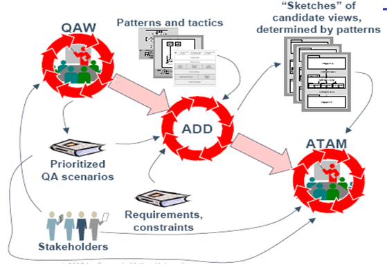
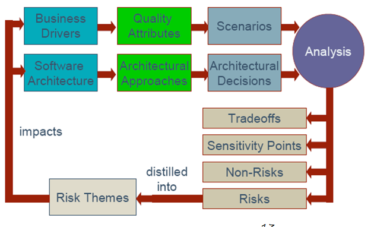

# 3.1体系结构的建模和文档化
<b>体系结构的作用</b>
	
    可以达到系统的质量属性要求  
    允许分散的团队并行开发  
    将整体分解为部分  
    涉及全系统的设计决策。  

### Architecture Business Cycle (ABC)  
系统需求来自于企业目标，架构来自于系统需求，系统来自于架构。  
软件架构是技术、 商业和社会等诸多因素作用的结果，而软件架构的存在反过来又会影响技术、商业和社会环境，从而影响到未来的架构。我们把这种相互影响的周期（环境->架构->环境）称作架构商业周期。  
<b>QAW</b>  
QAW(Quality Attributes Workshop) -- 质量属性会议 
质量属性会议：分析系统的质量属性并进行优先级排序  
输入：Stakeholders的需求  
输出：按优先级排序的质量属性  

<b>Attribute-Driven Design method (ADD)</b>  
属性驱动方法是一个为了系统地产生某个系统的第一个架构设计的逐步开发方法。  

<b>ADD所需的输入</b>  
Quality attribute requirements 质量属性需求  
Functional requirements 功能需求  
Constraints 约束  
架构师所掌握的策略与风格

<b>ADD所需的输出</b>  
初步设计的体系结构

实现架构时一般不使用“全新”的解决方案，而是改进、组合现有的经过验证的方案。  

<b>Architecture-Based Dev --基于架构开发，图示：</b>  
  

<b>Architecture Tradeoff Analysis Method(ATAM) -- 质量属性评估</b>  
主要任务：对产生的软件体系结构进行评估，判断其是否合理  
输入：软件体系结构和业务需求  
输出：绩效树、场景、风险点、非风险点、敏感点和权衡点。  

<b>ATAM概念图：</b>  
  

架构是系统的蓝图，作用有：  
* 定义了工作任务  
* 它是质量属性的主要载体  
* 是早期分析的最好的制品  
* 是后期部署维护和简化的关键  

<b>完善文档的7个原则:</b>  
* 从用户的观点来写  
* 避免不必要的重复  
* 避免二义性  
* 使用标准的组织结构  
* 合理地记录  
* 保持文档的更新，但不要太新（保持文档的稳定性）  
* 检查文档是否满足目的  

架构结构可以被分解为三种类型：  
* 模块结构 -- 以软件实现的模块为视角  
* “构件和连接件”结构 -- 以运行时的组件及其相互关系为视角  
* 配置结构 -- 以软件不同部分的部署或工作分配为视角  

<b>模块视图举例：</b>  
* 分解视图
> 通过“是...的一个子模块”关系来展示模块  

* 使用视图
> 通过在使用起来是相关的关系来展示模块  

* 分层视图
> 展示因功能相近或耦合而分组的模块。每一组展示了整体结构的一层。  

* 类/泛化视图
> 展示的模块是类。  

<b>组件和连接件视图举例：</b>  
* 进程视图  
* 并发视图  
* 共享数据视图  
* C/S视图  

<b>配置视图举例：</b>  
* 部署视图  
* 实现视图  
* 工作任务视图  

<b>4+1视图</b>  
* 逻辑视图  
> 支持行为需求。关键抽象，都是对象和对象类

* 过程视图  
> 定位并发和分布  

* 开发视图  
> 组织开发的软件模块，librarys，子系统和单元。  

* 物理视图  
> 将其它的元素分配到运行和交流节点上。  

* “pluse one” 视图  
> 分配其它的视图到重要的用例上，去展示它们是怎么工作的。  

[Next](https://github.com/fanzhonghao/study/blob/softwareArchitecture/3.2.md)