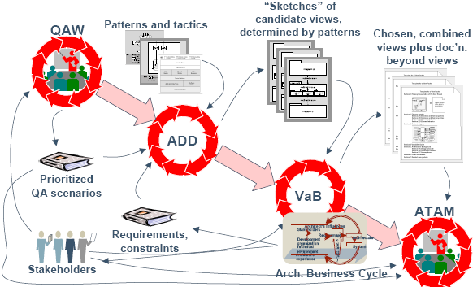

# 3.2建模与文档化
## “4+1”视图模型
Kruchten在1995年提出了“4+1”的视图模型。  
“4+1”视图模型从5个不同的视角来描述软件体系结构：逻辑视图、进程视图、物理视图、开发视图、场景视图  
每一个视图只关心系统的一个侧面，5个视图结合在一起才能反映系统的软件体系结构的全部内容  

<b>视图模型:</b>  
  

<b>Use case view(Scenarios):</b>  
* 看系统对外提供什么功能  
* 描绘该系统被期望去做什么，其它的视图均依赖于此视图。  

<b>逻辑视图</b>  
抽象描述系统的某一部分，对系统的组成和系统的各个部分是如何交互的进行建模。  
常用的UML视图有：类图、对象图、状态图、交互图。  

<b>进程视图</b>  
研究系统完成业务的过程。  
使用的UML视图有：活动图。  

<b>开发视图</b>  
研究系统的部分是如何被组织成模块和组件的。  
使用的UML视图有：包图、组件图。  

<b>物理视图</b>  
描述系统的设计是如何变成现实实体的。  
使用的UML视图有：部署图。  

逻辑视图和开发视图描述系统的静态结构  
进程视图和物理视图描述系统的动态结构  

<b>Architecture Description Language(ADL)</b>  
ADL是在底层语义模型的支持下，为软件系统的概念体系结构建模提供了具体语法和概念框架。  
其三个基本元素是：构件、连接件、体系结构配置。  

<b>UML构成</b>  
  

<b>"4+1"各视图与使用的UML图</b>  
  

<b>用例</b>描述系统对外的提供的功能：  
  
用例图用来帮助理解系统的功能需求。  
用例图是从系统的外部来看系统提供什么功能，而不关心系统的内部结构。  

<b>类图</b>  
表示系统中的类和类与类之间的关系，它是对系统静态结构的描述  
  

<b>对象图</b>  
描述系统运行时刻的状态,也称为实例图  
  
  
对象图可以用来描述对象之间的联系。  

<b>包图</b>  
包图用来将元素组织在一起形成一个更高层级的单元。  
  

<b>序列/顺序图</b>  
用来反映若干个对象之间的动态协作关系  
  
序列图描绘了多个对象如何协作来完成一个用例  
不适合精确定义对象的行为  

<b>协作/通信图</b>  
描述对象间的协作关系,显示对象间的动态合作关系。如果强调时间和顺序，则使用序列图；如果强调联系，则选择协作图.  
  

<b>状态图</b>  
描述类的对象所有可能的状态以及事件发生时状态的转移条件  
  
用于描述一个对象在不同用例中的状态变化  

<b>活动图</b>  
描述满足用例要求所要进行的活动以及活动间的约束关系，有利于识别并行活动  
  

<b>组件图</b>  
描述代码构件的物理结构各构件之间的依赖关系  
  

<b>部署图</b>  
定义系统中软、硬件的物理体系结构  
  

<b>组成结构</b>  
逐层地将类分解成一个内部结构。允许你将一个复杂地对象分解成各个组成部分。  
  

<b>Interaction Overview Diagrams(交互概览图)</b>  
交互概览图是活动图和序列图地组合。  
  

<b>Timing Diagrams（时序图）</b>  
时序图关注时间约束。  
  
  

<b>视图文档化</b>  
1. 一个主要描述  
2. 一个元素目录  
> 对主图地内容进行解释  
3. 一个上下文关系图  
> 描绘系统与外界地关系  
4. 一个可变性指南  
> 展示系统的哪些地方是可变的  
5. 架构背景  
> 各种决策的依据  
6. 其它信息  
> 系统或项目的特殊信息  
> CM信息等  
7. 有关的视图包  

以上总结为：一个主要的展示和支持文档。  

VaB(Views and Beyond)  

<strong>Architecture-Based Dev</strong>  
  
