#  Data Communications and Networking 

## 
 数据通信与网络——第四章

## 名词解释
<ul>
<li>scrambling -- 扰码</li>
<li>AMI(alternate mark inversion) -- 交替传号反码</li>
<li>pseudoternary -- 伪三元编码</li>
<li>pulse code modulation -- 脉冲码调制</li>
<li>Quantization levels -- 量化等级</li>
<li>Quantization errors -- 量化误差</li>
</ul>
## 要点
数据速率：1秒钟发送的数据元素(位)的数量，即bps(bits per second),或 b/s,也叫比特率。  
信号速率：1秒钟发送的信号元素的数量，单位是波特率(baud)，或者叫做脉冲速率(pulse rate),调制速率(modulation rate)或波特率(baud rate)。  
目标：增加数据速率而降低信号速率  
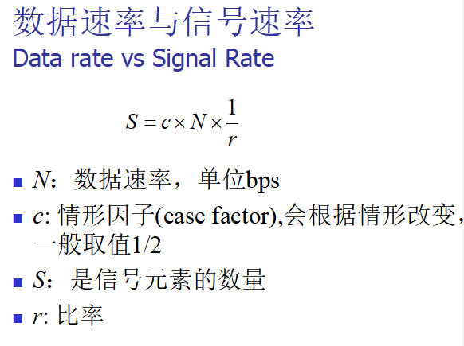
<b>r 是每个信号元素承载的数据元素的个数。</b>  
<b>是波特率而不是比特率决定了数字信号的带宽</b>  
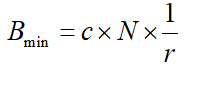
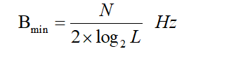
<b>其中B(min)为最小带宽，c情形因子，N数据速率，r比率</b>
##### 数字信号的最小带宽是模拟信号的带宽的n(b)倍。
<b>若给定通道带宽，则可以得到最大数据速率</b>
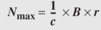
### 几种编码方式
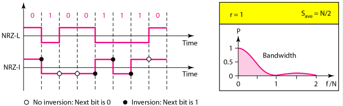
<b>在NRZ-L中，电平决定了位值，在NRZ-I中电平是否反相决定了位值</b>  
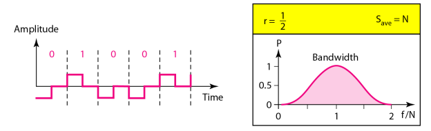
<b>在RZ编码中，在每个位中间信号变为0</b>  
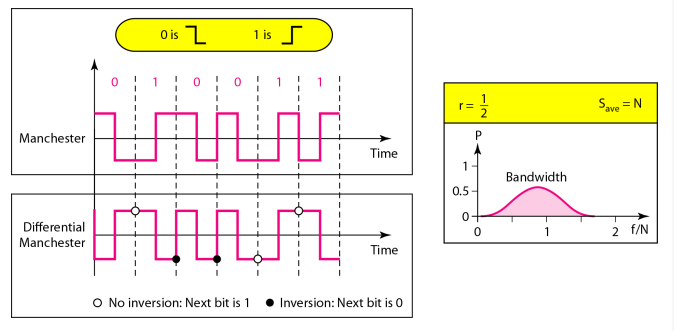
<b>Manchester and differential Manchester schemes</b>  
<b>曼彻斯特编码和差分曼彻斯特编码的最小带宽是NRZ的两倍</b>  
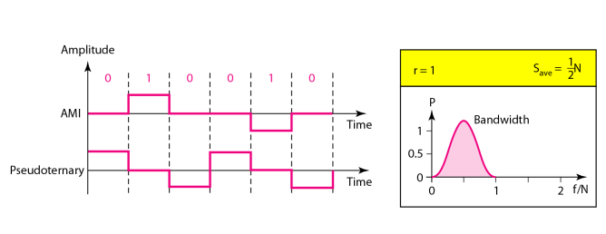
<b>在mBnL 方案中, m 个数据元素模式编码成n 信号元素模式， 2m ≤ Ln.即m表示二进制模式的长度，n是信号模式的长度</b>  
##### 2B1Q编码
<b>S(avg) = 1/2 × N × (1/2）</b>
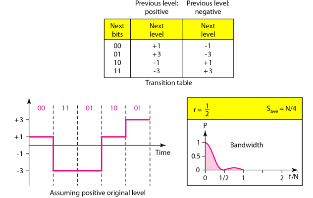
##### 8B6T scheme
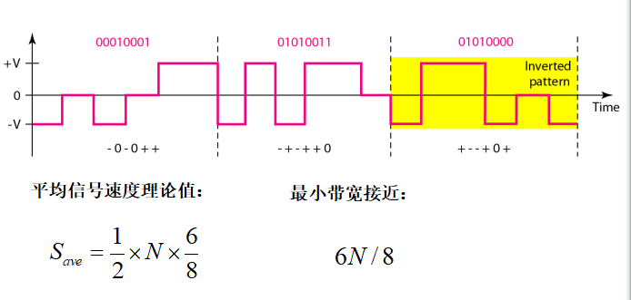
# 一个问题 S(avg) = 1/2 × N × n/m ？
##### MLT-3 scheme
<b>遇到0不变，遇到1跳变</b>  
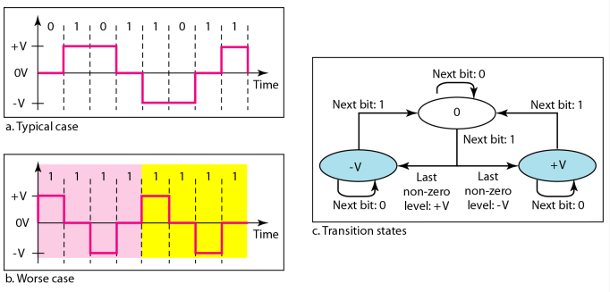
##### 总结
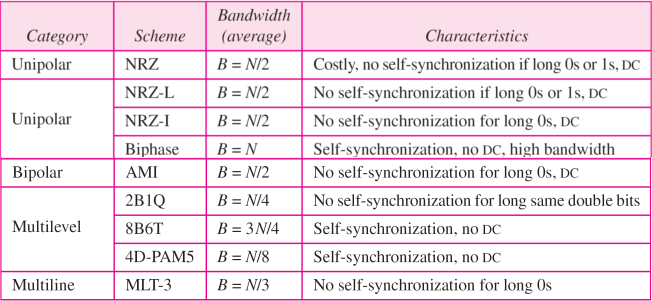

### 块编码通常称为mB/nB 编码技术，用 n-bit 位组替换m-bit.
一般n>m，这时可以提供多余的为进行其它操作。
# 具体实施方法 ？？？
##### 4B5B
4B/5B编码方案解决了同步问题，客服了NRZ-I的缺陷，增加了NRZ-I的信号速率，冗余位增加20%的波特,但是没有解决NRZ-I的DC分量。在此处增加了16位冗余位。

##### B8ZS(bipolar with 8-zero substitution)
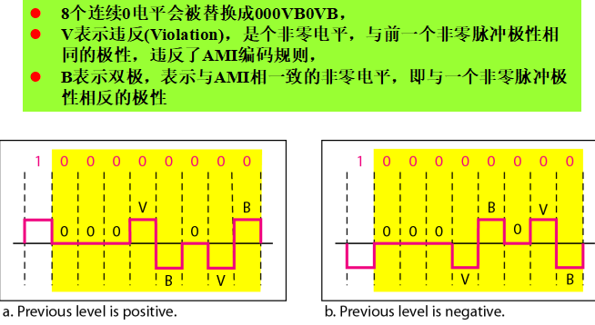
##### HDB3(high density bipolar 3-zero)
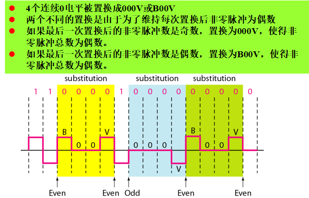
### 根据Nyquist 定理,采样速率必须至少是信号所含最好频率的2倍.
### 量化误差对信号SNRdB的影响取决于量化级别L或每个样本位数nb
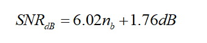
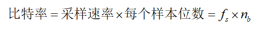

在异步传输过程中，需要在每个字节开始时发送1个起始位，结束时发送1个或者多个停止位。在每个字节之间会有一个时间间隔。  
异步在这里是指在字节级上的异步，但是每位仍然要同步，它们的持续时间是相同的。  
在同步传输模式中，依次发送位流而不含起始位、停止位和间隙，接收方负责将位流进行分组。  

## 问题
<b>要数字化人的语音，假定每个样本有8个位，那么比特率是多少?</b>  
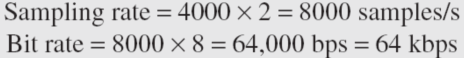

<b>有一个4 kHz的低通信号. 如果发送这个模拟信号，需要最小带宽是  4 kHz 的通道. 如果数字化这个信号并且每个样本发送8个位，需要最小带宽是 8 × 4 kHz = 32 kHz的通道.</b>  

<b>电话用户线路必须有高于40的SNR(dB),。那么每个样本大的最小位数是多少？</b>  
解：SNR(dB) = 6.02n(b) + 1.76 = 40 所以 n = 6.35 即最小位数为7.  

<b>对带宽200kHz的低通信号使用1024级采样。
a.计算数字化信号的速率	b.计算这个信号的SNR(dB)  
c.计算这个信号的PCM的带宽  </b>  
解：
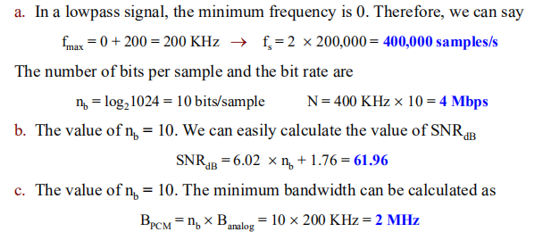

<b>如果使用4级数字信号，问带宽为200kHz的通道最大速率是多少？</b>
解：
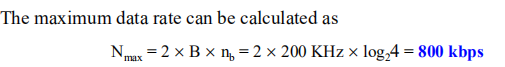