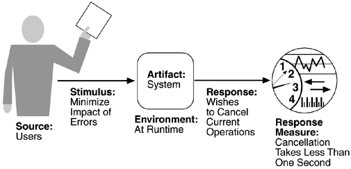

# 理解质量属性

<b>功能性是指系统应该有能力去做它应该做的事。</b>  
实现功能特性必须给构成系统中的各个部分（模块）赋予正确的职责、正确的资源和正确的调度顺序。  

功能性是质量属性是正交的，功能性不会决定质量属性。  

没有任何一个质量属性是完全只依赖于设计、实现或者部署的。必须结合设计、实现、部署三方面才能满足质量属性。  
架构对于实现许多系统感兴趣的质量属性是非常重要的，这些质量属性应该在架构水平上被设计或者被度量。  
在体系结构层面就要对质量属性进行设计，但体系结构只是满足质量属性的基础（忽视细节同样无法满足）。  

质量属性之间相互影响，甚至相互抑制。  

质量属性种类：  
> System Quality attribute  
Business Quality attribute  
Architecture Quality attribute  

使用质量属性场景来捕获质量属性以便对质量属性进行具体描述。  
质量属性场景是描述系统如何对刺激做出反应。  

<b>一个质量属性场景包括六个部分:</b>  
1. 刺激源  
> 产生刺激的实体  
2. 刺激(stimulus)  
> 影响系统的一个条件
3. 制品  
> 被刺激的部分
4. 环境  
> 刺激发生的条件
5. 响应  
> 由刺激导致的活动
6. 响应方法  
> 响应方法

<strong>系统质量属性</strong>  
* Availability 
> 可用性
* Modifiability
> 可修改性
* Performance
> 性能
* Security
> 安全
* Testability
> 可测试性
* Usability
> 易用性

<b>U-STAMP</b>  

### 可用性
关注系统失败及其导致的结果。  
可用性是系统当其被需要的时候可被操作的可能性。被定义为：  
  
当计算可用性时，每周停机维护不被考虑。  

<b>可用性场景:</b>  
* 刺激源：内部和外部可见的错误或失败  
* 刺激：下列的某一事件的发生：
> 遗漏：一个组件没有对输入响应  
> 冲突：组件重复的遭到遗漏失败  
> 时序：组件响应的过早或过晚  
> 响应：组件做出了错误响应  
* 制品：被要求高可用性的指定的资源。  
> 处理器，通信通道，程序，仓库
* 环境：错误发生时，系统的状态。  
* 响应
> 记录日志，关闭外部系统进入降级模式等  
* 响应方法
> 一个可用性比率  
> 规定一个事件修复  
> 系统必须能够使用的时限  

<b>通用图示:</b>  
  
<b>可用性场景举例:</b>  
  

### 可修改性
<b>关于修改的花费  
关注可以修改什么，关注什么人什么时候改变它。</b>  

<b>可修改性场景</b>  
* 刺激源：谁做出改变  
* 刺激：做出了什么改变  
* 制品：改变了什么  
* 环境：什么时候做出的改变（越晚越不利）  
* 响应：做出改变的人不仅需要知道如何去修改，还需要修改它，测试它和部署它。  
* 响应方法：时间和花费  

<b>可修改性场景举例:</b>  
  
<b>图示：</b>  
  

### 性能
性能主要关注当事件发生时，系统多长时间能够响应。  
<b>性能通用场景</b>  
* 刺激源：刺激可能来自内部或外部  
* 刺激：事件发生就是刺激  
* 制品：系统的服务  
* 环境：系统可能处于大量的可操作模式下，例如正常模式，紧急模式和过载模式  
* 响应：系统必须处理到达的事件，可能导致系统环境的改变  
* 响应方法：处理事件所花的时间、一定时间内处理事件的个数、处理的错误率/丢失率  

<b>性能场景举例：</b>  
  
<b>简单图示</b>  
  

### 安全
确保合法用户可用，非法用户不可用。  
提供nonrepudiation(不可否认), confidentiality（机密性）, integrity（完整性）, assurance（保证性）, availability（可用性，有效性）, and auditing（审计）。  
<b>安全通用场景</b>  
* 刺激源：人或者系统  
* 刺激：一个攻击或者尝试破坏安全  
* 制品：攻击的目标，可能是系统服务或者是数据。  
* 环境：系统可能存在的任何状态。  
* 响应：授权合法用户，拒绝非法用户  
* 响应方法：入侵检测、入侵容忍、多机备份……  

<b>安全场景举例</b>  
  
  
  

<b>简单图示：</b>  
  

### 可测试性
让软件的bug容易被测试出来  
<b>可测试性场景</b>  
* 刺激源：测试人员或者用户  
* 刺激：可能是分析/设计/编码/集成阶段的结束，或系统完全开发结束  
* 制品：设计，代码或者是整个系统  
* 环境：测试可能发生在设计阶段，开发阶段，编译期或者部署期间。  
* 响应：可以进行测试、可以观察测试结果  
* 响应方法：语句覆盖率，最长的测试链条的长度  
* 降低找到额外错误的可能性  

<b>测试场景举例</b>  
  
  

<b>简单图示：</b>  
  

### 易用性
易用性关注用户能够多简单地使用系统去完成一个目标任务和系统提供地用户帮助地种类。  
<b>易用性场景举例</b>  
* 刺激源：易用性只针对终端用户  
* 刺激：用户希望使用系统的效率高、学习使用系统简单、错误的影响很小，对系统的适应性，和对系统的满意度。  
* 制品：系统  
* 环境：系统运行时间和系统配置时间。  
* 响应：系统应该满足用户特色需求，或者预期用户的需求。  
* 响应方法：用户满意度，错误数量，被解决问题数量，成功操作数与总操作数比率等。  

<b>易用性场景举例</b>  
  
  
  

<b>简单图示</b>  
  

<b>质量属性的刺激</b>  
  
periodic:周期的，stochastic：随机的，sporadic：分散的  

<b>其它的质量属性：</b>  
可拓展性（scalability）  
可移植性（Portability）  
互操作性（interoperability）  

<b>Business Qualities</b>  
* Time to market(销售时间)  
* Cost and benefit（花费与收益）  
* Projected lifetime of the system（系统预期寿命）  
* Targeted market（目标市场）  
* Rollout(首次展示) schedule（首次展出顺序）  
* Integration with legacy systems （与遗留系统集成）  

<b>Architecture Qualities</b>  
* 概念完整：潜在的愿景和主题与系统的在各个水平上统一。  
* 正确性和完整性：所有系统资源和运行时资源约束满足。  
* 可构建性：系统能够被可得到的小组在有效的时间内完成并且对确定的改变开发。  

<b>Quality Attribute Workshop(QAW) -- 质量属性会议</b>  

<b>QAW Steps</b>  
  
