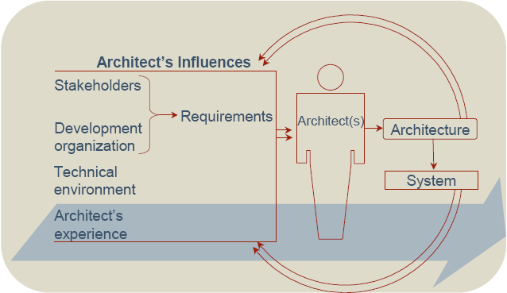
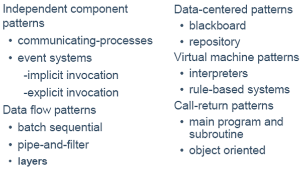
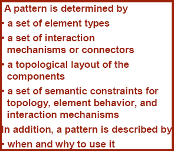
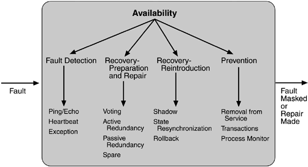
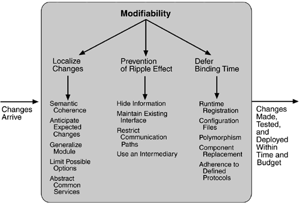
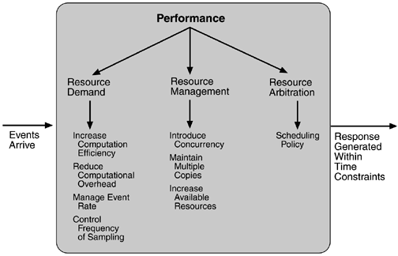
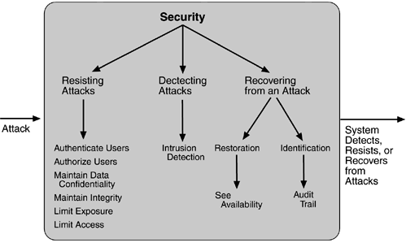
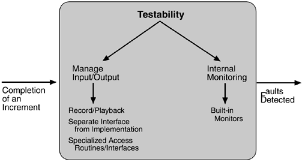
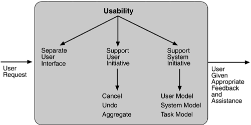

# 5.架构设计
<b>Architecture Business Cycle (ABC)</b>  
  

<b>创建一个架构的方法</b>  
* 从其它的架构中重用方法  
* 重新开发新的方法  
* 想象  

架构师的主要是重用已经经过测试的解决方案。  
> 大规模的：模式和风格  
> 小规模的：策略  

<b>模式和风格</b>  
  

<b>架构模式:</b>  
* 在实践中经常被发现  
* 是一个设计决策组成的包  
* 知道被允许复用的内容  
* 描述了一类架构  

<b>模式组成:</b>  
  

<b>tactics -- 策略</b>  
一个架构策略是一个被用来实现一个质量属性的详细的设计方法。  

<b>可用性策略</b>  
<b>目的：</b>尽可能地降低“故障”所造成的影响  
<b>策略：</b>  
* 故障检测  
> Ping/echo，心跳，异常  
* 错误恢复  
> 投票，活动冗余，被动冗余，备用，状态再同步，检查点/回滚  
* 错误预防  
> 过程监视，事务，服务迁移  

ping/echo、心跳一般是两个进程（主机、监控），而异常一般是在一个进程  
ping/echo是监控向主机不定时发消息，心跳是主机向监控定时发消息  

  

<b>可修改性策略</b>  
<b>目的：</b>控制实现、测试和部署改变的花费和时间。  
<b>策略：</b>  
* 本地化修改  
> 维持语义一致  
> 预期期望的变更  
> 泛化模块  
> 限制可能的选择  
* 预防连锁反应  
> 隐藏信息  
> 维护已经存在的接口  
> 限制通信路径  
> 使用中介  
* 推迟绑定时间  
> 运行时注册  
> 发布/订阅  
> 配置文件  
> 多态  
> 构件更换  
> 坚持已定义的协议  

  

<b>性能策略</b>  
<b>目的：</b>在约束时间内响应系统事件。  
<b>策略：</b>  
* 资源请求  
> 增加计算效率  
> 减少计算开销  
> 管理事件速率  
> 控制采样频率  
> 限制执行时间  
> 限制队列大小  
* 资源管理  
> 引入并发  
> 维护数据和计算的多重备份  
> 增加可用资源  
* 资源仲裁  
> 先来先服务  
> 固定优先级调度  
> 动态优先级调度  
> 静态调度  

  

<b>安全策略</b>  
<b>目的：</b>使合法用户可用，非法用户不可用。  
<b>策略：</b>  
* 抵抗攻击  
> 用户认证  
> 用户授权  
> 维护数据机密性  
> 维护数据完整性  
> 限制暴露  
> 限制访问  
* 检测攻击  
> 使用侵入检测系统  
* 从攻击中恢复  
> 状态恢复  
> 攻击者识别  

  

<b>可测试性策略</b>  
<b>目的：</b>允许早期测试。  
<b>策略：</b>  
* 输入/输出  
> 录制/回放  
> 实现接口分离  
> 专门的访问接口/路径  
* 内部监视  
> 内置监视器  

  

<b>易用性策略</b>  
<b>目的：</b>用户能够容易的使用系统提供的功能。  
<b>策略：</b>  
* 运行时策略  
> 维护任务模型  
> 维护用户模型  
> 维护系统模型  
* 设计时策略  
> 从应用的剩余部分中分离用户界面  

  

pattern/style和tatics分别处理高层和具体细节  

### Architecting with Design Operators(架构的设计操作)  
Design operators are a fundamental design tool for creating an architectural design.   
* 分解  
* 复制  
* 浓缩（压缩）  
* 抽象  
* 资源共享  

<b>分解</b>  
分解是将有区别的功能分解成有去别的且有良好接口定义的组件。  
分解可以影响的质量属性有：可修改性，可移植性，性能，可构建性。  
* Part/Whole分解系统分解为没有功能重叠的子构件。  
* 泛化-特殊化分解，构件之间可能有功能重复。  

<b>划分子系统的原则：</b>  
* 具体的划分方法依赖于想实现的质量属性  
* 需要有“一定”的前瞻性  

<b>复制/冗余</b>  
复制一个部件能够提高性能和可靠性。  
* 冗余  
> 静态复制  
> 运行时复制  
> N-版本程序  

<b>浓缩/压缩</b>  
通过消除间接引用来提高性能。  
eg:将所有代码写在一个文件中。  

<b>抽象</b>  
抽象能够隐藏信息，提高适应性。  

<b>共享资源</b>  
把公共的数据、服务抽取封装起来。  
可以提高可集成性，可移植性和可修改性。  

<b>Attribute-driven Design (ADD)</b>  
ADD是一个为了系统而一步步地系统地产生第一个架构设计的方法。  
ADD输入：质量属性需求、功能需求、约束  
ADD输出：整体架构决策、互连和协调机制、将模式和策略应用到系统的特定部分、质量属性需求的显示成就、非细节的接口。  

<b>ADD steps</b>  
1. 确定这里有足够的需求信息  
2. 选择系统的某一部分去分解  
3. 识别架构驱动和需求优先级排序  
4. 选择设计理念-模式、风格、策略  
5. 举例说明架构元素，将功能分配到各个部分  
6. 整合已经完成的设计  
7. 定位剩余的功能  
8. 为实例化的元素定义接口  
9. 验证和精炼需求，为实例化元素提供约束  
10. 为你希望分解的系统部分重复2-9  

[Next](https://github.com/fanzhonghao/study/blob/softwareArchitecture/6.md)
