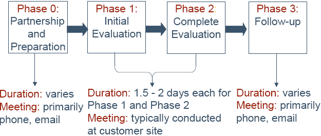
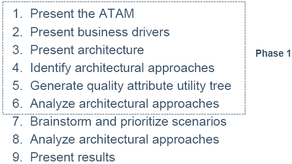
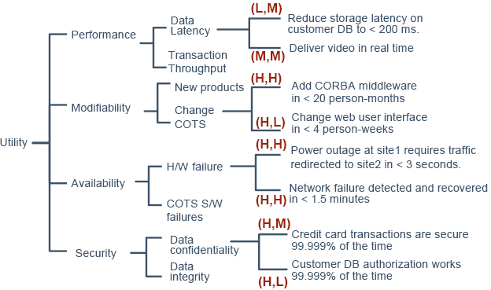
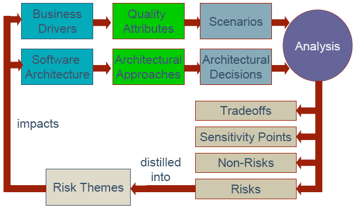

# 6.架构评估
Evaluation -- 评估  
<b>架构评估</b>是开发生命周期的活动,一些利益相关者一起在正式或非正式的过程中使用例如“场景”的技巧去分析架构。  
<b>软件架构的评估方法</b>  
* 基于场景的架构分析方法（SAAM - Scenario-based Architecture Analysis Method）  
* 架构权衡分析法（ATAM - Architecture Trade-off Analysis Method ）  
> 使用质量属性效用树和质量属性分类的分析方法  
> SAAM不会显示质量属性之间的关系，ATAM会  
> 分析了多个质量属性间的关联。  

<strong>ATAM的目的:</strong>  
<b>让我们能尽早提出正确问题，来发现：</b>  
* 风险  
> 可能在将来损害某些质量属性的方案  
* 非风险  
> 可以提高质量、帮助实现目标的决策  
* 关键点/敏感点  
> 方案中一个小小的变化，就可能对某些质量属性有很大影响  
* 权衡点  
> 影响一个以上质量的决策  

<b>ATAM的益处：</b>  
* 明确质量需求  
* 提高体系结构文档质量  
* 体系结构方案文档的基础  
* 及早发现风险  
* 促进了角色之间的交流

<b>ATAM的益处</b>  
* 识别风险  
* 澄清QA需求  
* 改进文档  
* 为架构决策提供的文档化基础  
* 增进沟通  

ATAM的结果就是改进架构  

<b>ATAM 四个阶段</b>  
  

<b>ATAM 步骤</b>  
  

1. 呈现ATAM  
> 让各方明白ATAM的基本内容  
2. 呈现商业驱动  
> 客户描述系统的商业目标  
3. 架构展示  
4. 确定架构方法  
5. 生成质量效应树  
> 把最重要的质量目标放在高层节点（典型的有：性能、适应性、安全和可用性），逐层细分,场景放到叶子节点.  

<b>质量效用树</b>  
  
<b>COTS:</b>商品化的产品和技术  
<b>H/W:</b>硬件和网络错误  

<b>场景的三种类型:</b>  
* 用例场景  
> 被期望的系统使用方式  
* 成长场景  
> 被期望的系统改变  
* 试探场景  
> 未预料的系统压力  

场景应该尽可能具体。  

phase1以架构为中心，phase2以利益相关人为中心。  

Phase2的目的是诱发利益相关人的观点与phase1的结果向论证。  
  

<b>7. Brainstorm and Prioritize Scenarios</b>  
当投票时，可以给每个利益干系人0.3*场景数的票数。  
<b>8. Analyze Architectural Approaches</b>  
看之前投票产生的重要场景对体系结构的影响  

<b>ATAM概念流图</b>  
  

phase3为客户撰写最终报告。  

ATAM是：  
* 在考虑多个质量属性的前提下，对体系结构进行评估  
* 对于发现体系结构决策所带来的结果/影响，是有效的策略  
* 用来识别关联，而不是精确的分析

