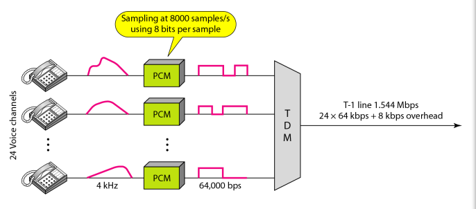
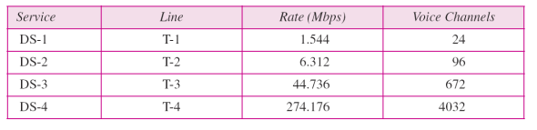
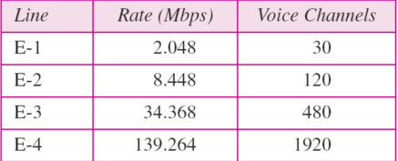
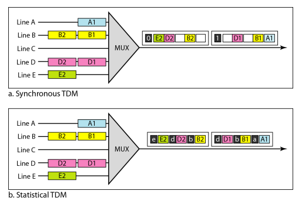

#  Data Communications and Networking 

## 
 数据通信与网络——第六章

## 名词解释
<ul>
<li>multiplexing -- 复用</li>
<li>spreading -- 扩频</li>
<li>Frequency-Division Multiplexing(FDM) -- 频分多路复用</li>
<li>Wavelength-Division Multiplexing(WDM) -- 波分多路复用</li>
<li>Synchronous Time-Division Multiplexing -- 同步时分多路复用</li>
<li>Statistical Time-Division Multiplexing -- 统计时分多路复用</li>
<li>Frequency Hopping Spread Spectrum (FHSS) -- 调频扩频</li>
<li>Direct Sequence Spread Spectrum Synchronous(DSSS) -- 直接序列扩频</li>
<li>MUX -- 复用器</li>
<li>DEMUX -- 分离器</li>
</ul>

## 要点
复用(multiplexing)可获得效率，扩频(spreading)可以到保密与抗干扰。  
复用就是是允许同时通过一条数据链路传输多个信号的一组技术。  

频分复用和波分复用用于模拟信号，时分复用用于数字信号。  

FDM 是用来组合模拟信号的模拟多路复用技术.  
WDM是合并多个光信号的模拟多路复用技术.(三棱镜合光和分光)  
TDM是组合多个低速的通道为一个高速通道数据的复用技术.  

<b>在同步TDM中,链路速率是数据速率的 n 倍，并且比单元持续时间短 n 倍.</b>  
<b>TDM中，每个时隙持续时间是复用前每位持续时间的1/n</b>  

<b>用于电话线路多路复用的T-1线路,每一帧有一个同步位</b>

<b>电话网，T线路</b>

<b>E线路</b>

<b>FM信号的带宽是调制信号的10倍。</b>

在统计时分复用中，每个帧中时隙的个数小于输入线的条数。  
<b>同步时分复用与统计时分复用的比较</b>

跳频扩频(FHSS)是用源信号调制M个不同的载波频率。  
直接序列扩频(DSSS)，把每个数据位用扩展编码的n位代替，即每一位被编码为n个码片。
## 问题
<b>有4个数据通道，每一个通道的传输速率是1Mbps，使用1MHz的卫星通道。使用FDM设计一种合理的配置。</b>
解：卫星通道是模拟的。将其划分为4个通道，每个通道的带宽是250kHz.对每个1Mbps的数字通道进行调制，每4位调制为1Hz。一种解决方案是16-QAM调制。  