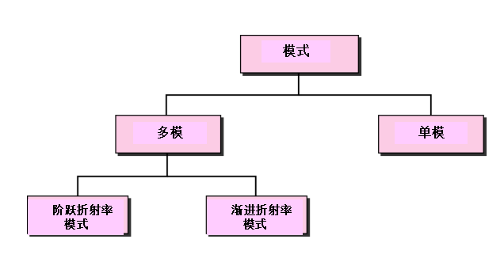
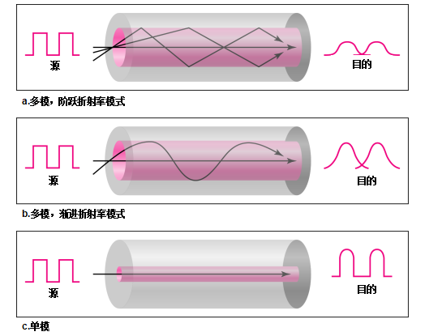

#  Data Communications and Networking 

## 
 数据通信与网络——第七章

## 名词解释

## 要点
<b>传播模式</b>  
  
  
<b>无向介质不使用物理导体传输电磁波。这种类型的通信通常是指无线通信。</b>  
<b>无线传输：</b>无线电波、微波、红外波。  

无线电波用于多播通信，如收音机、电视以及寻呼系统。  
微波用于单播通信，如移动电话、卫星网络和无线局域网。  
红外信号可以在封闭区域用于短距离通信，使用视线传播。  

微波是单向的，属于视线传播。  
同轴电缆与双绞线相比可以传输更高频率范围的信号，但信号衰减很快。  

## 问题