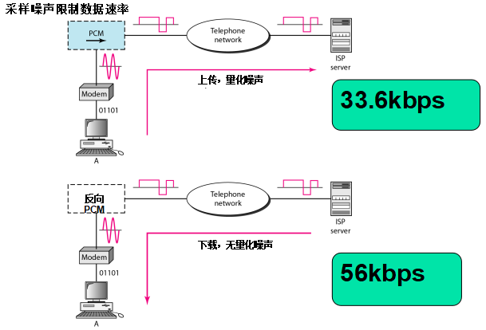

#  Data Communications and Networking 

## 
 数据通信与网络——第九章

## 名词解释
<ul>
<li>digital subscriber line(DSL) -- 数字用户线路</li>
<li>end office -- 本地局</li>
<li>tandem office -- 中继局</li>
<li>regional office -- 地区局</li>
<li>trunk -- 干线</li>
<li>in-band signaling -- 带内信令</li>
<li>out-of-signaling -- 带外信令</li>
</ul>

## 要点
传统的电话线路可以传送频率范围是300~3300Hz的信号，提供给信号的带宽是3000Hz。整个频率范围用于传输语音，在不丢失可识别性的情况下，有一些干扰和失真是可以接受的。  
DSL技术是在现有本地回路上支持高速数字通信的最有前途的技术之一。  
电话网络具有多级交换局，如：本地局、中继局、地区局。   
<b>56K解调器、PCM   </b>

# 此处PCM待了解