# 操作系统

## 词义
<ul>
<li>boot up -- 启动</li>
<li>Memory management(RAM) -- 文件管理</li>
<li>Command Line Interface (CLI) -- 命令行界面</li>
<li>Graphical User Interface (GUI) -- 图形化界面</li>
<li>spooling -- 假脱机</li>
<li>Multithreading -- 多线程</li>
<li>nanosecond -- 纳秒</li>
<li>Interrupt -- 中断</li>
<li>Mainframe -- 主机,大型机</li>
<li>throughput -- 吞吐率</li>
<li>Symmetric -- 对称的</li>
<li>successive  -- 连续的</li>
<li>hypervisor -- 管理程序</li>
<li>platform-neutral -- 平台无关的</li>
<li>Interprocess Communication(IPC) -- 进程间通信</li>
<li>Termination -- 终止</li>
<li>Hierarchies -- 层次</li>
<li>pseudo parallelism -- 伪并发</li>
<li>descendants -- 后辈,晚辈</li>
<li>Skeleton -- 骨架,纲要</li>
<li>assembly language -- 汇编语言</li>
<li>utilization -- 利用率</li>
<li>usage -- 使用,用法,惯例</li>
<li>Hybrid Implementations -- 混合实现</li>
<li>critical -- 临界的</li>
<li>Semaphores -- 信号量</li>
<li>Mutexes -- 互斥锁</li>
<li>Monitors -- 管程</li>
<li>mutual exclusion -- 互斥</li>
<li>critical region -- 临界区</li>
<li>Disabling Interrupts -- 屏蔽中断</li>
<li>Test and Set Lock(TSL) </li>
<li>simultaneously -- 同时地</li>
<li>algorithm -- 算法</li>
<li>nonpreemptive -- 非抢占式</li>
<li>preemptive -- 抢占式</li>
<li>First-Come, First-Served (FCFS) -- 先来先服务</li>
<li>Shortest job first(SJF) -- 短作业优先</li>
<li>Round-robin scheduling -- 时间片轮转</li>
<li>Priority scheduling -- 优先级调度</li>
<li>Multiple queues -- 多级队列</li>
<li>Shortest process next -- 短进程优先</li>              <!-- 不知是否正确-->
<li>Guaranteed scheduling -- 保证调度</li>
<li>Lottery scheduling -- 彩票调度</li>
<li>Fair-share scheduling -- 公平分享调度</li>
<li>Ostrich  -- 鸵鸟</li>
<li>Acquisition -- 获得</li>
<li>Recovery through preemption -- 利用抢占恢复</li>
<li>Recovery through rollback -- 利用回退恢复</li>
<li>Recovery through killing processes -- 通过杀死进程恢复</li>
<li>forcibly -- 强制地</li>
<li>Two-Phase Locking -- 两阶段加锁</li>
<li>Starvation -- 饥饿</li>
<li>deallocate -- 归还,解除分配,释放</li>
<li>relocation -- 重定位</li>
<li>Memory compact -- 内存紧缩</li>
<li>bitmap -- 位图</li>
<li>bloatware -- 膨胀软件</li>
<li>overlays -- 覆盖</li>
<li>Memory Management Unit(MMU) -- 内存管理单元</li>
<li>paging -- 分页</li>
<li>page frames -- 页帧</li>
<li>evict -- 驱逐，逐出</li>
<li>Translation Lookaside Buffer(TLB) -- 转换检测缓冲区</li>
	TLB 也叫做 associative memory（相联存储器）

<li>Inverted Page Tables -- 倒排页表</li>
<li>prepaging -- 预先调页</li>
<li>segment -- 段</li>
<li>compaction -- 紧缩</li>
<li>persistent -- 永久性的</li>
<li>monitoring -- 监控</li>
<li>Directories -- 目录</li>
<li>Append -- 附加</li>
<li>folders -- 文件夹,目录</li>
<li>absolutely path name -- 绝对路径</li>
<li>relative path name -- 相对路径</li>
<li>Drawback  -- 缺点</li>
<li>simultaneously -- 同时地</li>
<li>Directed Acyclic Graph(DAG) -- 有向无环图</li>
<li>intact -- 完整的，完好的</li>
<li>Virtual File Systems(VFS) -- 虚拟文件系统</li>
<li>underlying -- 潜在的</li>
<li>Defragmenting -- 磁盘整理，碎片整理</li>
<li>Backup -- 备份</li>
<li>circumstances -- 环境，情况</li>
<li>incremental dumps -- 增量转储</li>
<li>single indirect block -- 一次间接块</li>
<li>double indirect block -- 二次间接块</li>
<li>Principles -- 原则，法则</li>
<li>mechanical -- 机械的</li>
<li>hybrid -- 混合的</li>
<li>cycle stealing -- 周期窃取</li>
<li>Synchronous -- 同步</li>
<li>asynchronous -- 异步</li>
<li>dedicated -- 独占</li>
<li>polling -- 轮询</li>
<li>handers -- 处理器</li>
<li>sector -- 扇区</li>
<li>compact -- 紧凑的</li>
<li>concentric -- 同轴的，同中心的</li>
<li>preamble -- 前导码</li>
<li>interleaving -- 交错</li>
<li>track -- 磁道</li>
<li>cylinder -- 柱面</li>
<li>property -- 性质,性能</li>
<li>canonical -- 规范的</li>
<li>Remote Procedure Call(RPC) -- 远程过程调用</li>
<li>virtualization -- 虚拟化</li>
<li>Hypervisor -- 虚拟层</li>
<li>Paravirtualization -- 半虚拟化</li>
<li>Publish-Subscribe -- 发布/订阅</li>
<li>threats -- 威胁</li>
<li>intruders -- 入侵者</li>
<li>cryptography -- 加密</li>
<li>plaintext -- 明文</li>
<li>ciphertext -- 密文</li>
<li>cryptography -- 密码学,加密</li>
<li>Authentication -- 验证,证实</li>
<li>Malware -- 恶意软件</li>
<li>rootkit -- 隐蔽软件</li>
<li>infect -- 感染</li>

</ul>

## 要点
操作系统位置：  
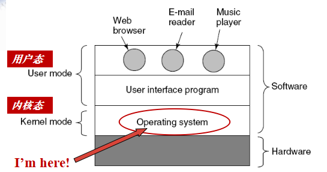  

<b>The operating system is as an extend machine and a resource manager.</b>  

Device driver: The software that talks to a controller, giving it commands and accepting response.  

<b>A process is an executing program, including the current values of the program counter, registers, and variables.</b>  
> the program is a group of instructions whereas the process is the activity.   

在UNIX中,所有的进程都是init的子进程,在Windows中,所有的进程都是平等的.  

<b>Process state(进程状态):</b>  
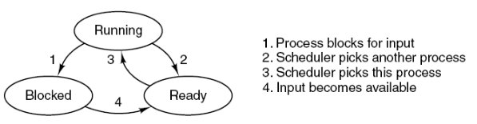  

<b>左边为同一个进程中所有线程共享，右边为线程私有：</b>  
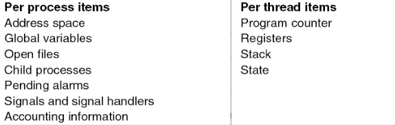  

<b>用户级线程：</b>  
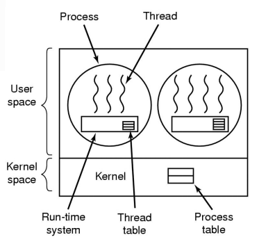  

> 优点：  
> 用户级线程包可以在不支持线程的操作系统上实现；  
> 允许每个进程有自己定制的调度算法；  
> 较好的伸缩性。  
> 缺点:  
> 大多数系统调用是阻塞的，因此内核阻塞进程，故进程中所有线程将被阻塞；  
> 如果一个线程开始运行，那么在该进程中的其他线程就不能运行，除非第一个线程自动放弃CPU。  

<b>内核级线程:</b>  
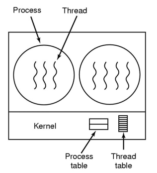  
> 优点：  
> 对多处理器，内核可以同时调度同一进程的多个线程；  
> 阻塞在线程一级完成。  
> 缺点：  
> 在同一进程内的线程切换调用内核，开销大，导致速度下降。  

<b>race conditions:</b> Situations that where two or more processes are reading or writing some shared data and the final result depends on who runs precisely.  

<b>TSL instruction:</b>  
> TSL    RX, LOCK  
> 将一个内存字LOCK读到寄存器RX中，然后在该内存地址上存一个非零值。  
> 读数和写数操作保证是不可分割的。  
> 执行TSL指令的CPU将锁住内存总线，以禁止其他CPU在本指令结束之前访问内存。  

<b>Busy waiting(忙等待):</b>  
Continuously testing a variable until some value appears   

<b>P(down)操作：</b>  
> 检查信号量的值是否大于0  
> 若大于0，则将其值减1，并继续；  
> 若等于0，则进程将休眠，而此时down操作并未结束。  
> 上述操作均作为单一的、不可分割的原子操作完成。  

<b>V(up)操作：</b>  
> 对信号量的值增1  
> 如果一个或多个进程在该信号量上休眠，无法完成一个先前的down操作，则由系统选择其中一个并允许该进程完  > 成它的down操作。  

A<b> monitor（管程） </b>is a collection of procedures, variables, and data structures that are all grouped together in a special kind of module or package.  
> Processes cannot directly access the monitor’s internal data structures.  
> Only one process can be active in a monitor at any instant.  

<b>管程与进程的区别:</b>  
> 进程定义的是私有数据结构PCB，管程定义的是公共数据结构；  
> 进程是由顺序程序执行有关操作，而管程主要是进行同步操作和初始化操作；  
> 设置进程的目的，在于实现系统的并发性，而管程的设置，则是解决共享资源的互斥使用问题；  
> 管程为被动工作方式，进程则为主动工作方式；  
> 进程之间能并发执行，而管程则不能与其调用者并发；  
> 进程具有动态性，而管程则是操作系统中的一个资源管理模块，供进程调用。  

信号量（semaphore）的值大于0时，表示当前可用资源的数量；小于0时，其绝对值表示等待使用该资源的进程个数。  
信号量的值仅能由P、V操作来改变。  

The <b>long-term scheduler</b> selects processes from this process pool（进程池） and loads selected processes into memory for execution. （作业调度）  
The <b>short-term scheduler</b> selects the process to get the processor from among the processes which are already in memory. （CPU调度）  

<b>Scheduling in Batch Systems</b>  
> First-come first-served(FCFS)（先来先服务）  
Shortest job first(SJF)（短作业优先）  
Shortest remaining Time First(SRTF)（最短剩余时间优先）  

<b>Schedulable real-time system:  </b>  
>Given  
> m periodic events（周期性事件）  
> event i occurs within period Pi and requires Ci seconds  
> Then the load can only be handled if  
>   

<b>Possible scheduling of user-level threads</b>  
> 50-msec process quantum  
> threads run 5 msec per CPU burst.  
> 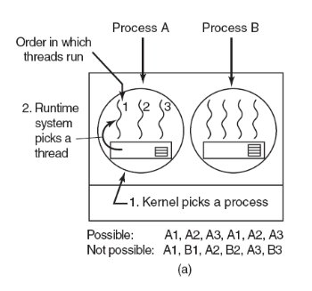  

<b>Possible scheduling of kernel-level threads</b>  
> 50-msec process quantum  
> threads run 5 msec per CPU burst.  
> 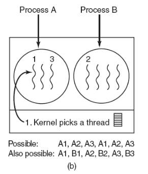  

用户级线程只能进行进程调度,不能直接调度线程,而内核级线程可以直接调度线程.  

<b>死锁定义:</b>  
A set of processes is deadlocked if each process in the set is waiting for an event that only another process in the set can cause.  

<b>Four Conditions for Deadlock</b>  
1. Mutual exclusion condition（互斥条件）  
> each resource assigned to 1 process or is available

2. Hold and wait condition（占有和等待条件）  
> process holding resources can request additional

3. No preemption condition（不可抢占条件）  
> previously granted resources cannot forcibly taken away

4. Circular wait condition（环路等待条件）  
> must be a circular chain of 2 or more processes  
> each is waiting for resource held by next member of the chain  

<b>银行家算法</b>中,使用矩阵进行运算.  
其中:E代表存在的资源数,A代表可得到的资源数,C代表已经占有的资源,R代表还需要的资源.共四个矩阵.  

<b>避免死锁,破坏死锁四条件</b>  
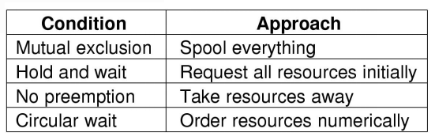  

避免通信死锁的方法：超时（timeouts）  

<b>Livelock（活锁）</b>  
Busy waiting (polling) that can lead to livelock  

<b>Address space</b> is the set of addresses that a process can use to address memory.  

Two general approaches to dealing with memory overload(过载): swapping（对换）,virtual memory（虚拟存储器）.  

当按照地址顺序在链表中存放进程和空闲区时，为新创建的进程分配空间，可采用：  
> first fit（首次适配）  
> next fit（下次适配）  
> best fit（最佳适配）  
> worst fit（最差适配）  
> quick fit（快速适配）  

first fit(首次适配)  
> 沿着链表搜索，直到找到一个足够大的空闲区为止。

best fit(最佳适配)  
> 搜索整个链表，找出恰好够用的最小的空闲区。

next fit（下次适配）  
> 每次找到合适的空闲区时，都记录当时的位置，以便在下次寻找空闲区时从上次结束的地方开始，而不是每次从头开始。

quick fit（快速适配）  
> maintains separate lists for some of the more common sizes required

Worst Fit(最差适配)  
> Allocate the largest block among those that are large enough for the new process.   

MMU(Memory Management Unit) maps the virtual addresses onto the physical memory addresses.  

Most virtual memory systems use a technique called paging（分页）.  
The virtual address space is divided into fixed-size units called pages.  
The corresponding(对应的) units in the physical memory are called page frames（页帧）.  
The pages and page frames are generally the same size.  

The OS uses a page table to map program pages to memory frames.   
Paging permits a program to allocate noncontiguous blocks of memory  

Translation Lookaside Buffer(TLB) is mapping virtual address to physical addresses without going through the page table.  
当一个虚拟地址放入MMU进行转换时，硬件首先通过将该虚拟页面号与TLB中所有表项同时进行比较，判断虚拟页面是否在其中。  
当虚拟页面号不在TLB中，MMU进行正常的页表查询。从TLB中淘汰一个表项，然后用新找到的页表表项替换它。  

Soft miss: page referenced is not in TLB but in memory  
Hard miss: page referenced is not in memory  

两级页表：  
  
多级页表中，顶级页表（Top level page table）的表项0指向程序正文的页表，表项1指向数据的页表，表项1023指向堆栈的页表。  
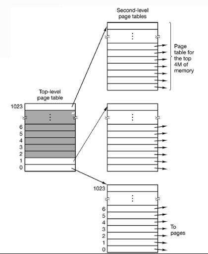  
顶级页表中的每个表项表示4MB的虚拟地址空间。  

当一个虚拟地址被送到MMU时，MMU首先提取PT1域并把这个值作为访问顶级页表（Top-level page table）的索引。  
由索引顶级页表得到的表项中含有二级页表（Second-level table）的地址或页帧号。  

<b>页面替换算法</b>( Page Replacement Algorithms)  
> The Optimal Page Replacement Algorithms（最优页面置换算法）  
> The NRU(Not Recently Used) Page Replacement Algorithms（最近未使用页面置换算法）  
> The FIFO(First in First Out) Page Replacement Algorithms  
> The Second Chance Page Replacement Algorithms  
> The Clock Page Replacement Algorithms（时钟页面置换算法）  
> The LRU(Least Recently Used) Page Replacement Algorithms（最近最少使用页面置换算法）  
> The Working Set Page Replacement Algorithms（工作集页面置换算法）  
> The WSClock Page Replacement Algorithms（工作集时钟页面置换算法）   

<b>NRU algorithms:</b>  
> Each page has Reference bit, Modified bit  
bits are set when page is referenced, modified  
Pages are classified  
Class0: not referenced, not modified  
Class1: not referenced, modified  
Class2: referenced, not modified  
Class3: referenced, modified  
NRU removes page at random from the lowest numbered nonempty class.  

<b>The Second Chance Page Replacement Algorithms</b>  
> A simple modification to FIFO that avoids the problem of throwing out a heavily used page  
Inspect the R bit of the oldest page  
R bit is 0, it is replaced  
R bit is 1, the bit is cleared, the page is put onto the end of the list of pages, and its load time is updated. Then the search continues.  
第二次机会页面置换算法就是寻找在上一个时钟间隔以前没有被访问过的页面。  

<b>LRU(Least Recently Used)</b>  
> When a page fault occurs, throw out the page that has been unused for the longest time  

进程的工作集可以定义为在过去的τ秒实际时间中进程实际访问的页面集合。  

<b>页面置换算法比较</b>  
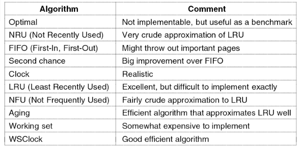  

pages are fixed size and segments are not.  

<b>Regular files（普通文件）</b>  
contain user information  
<b>Directories</b>  
maintain the structure of the file system  
<b>Character special files（字符特殊文件）</b>  
related to input/output and used to model serial I/O devices  
<b>Block special files（块特殊文件）</b>  
used to model disk  

<b>path name</b>  
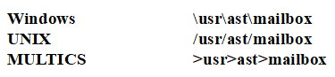  

In UNIX `.` – refers to the current directory while `..` – refers to its parent  

<b>Sector 0 of the disk is called the MBR(Master Boot Record).</b>  

Linked List Allocation(定位) Using a Table in Memory  
taking the pointer word from each disk block and putting it in a table in memory  
such a table in main memory is called a <b>FAT(File Allocation Table).</b>  

The main function of the directory system is to map the ASCII name of file onto the information needed to locate the data.  

A directory consists of a list of fixed-size entries, one per file, containing a fixed-length file name, a structure of the file attributes and one or more disk addresses.And store file attributes in the i-nodes.  
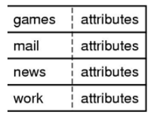  
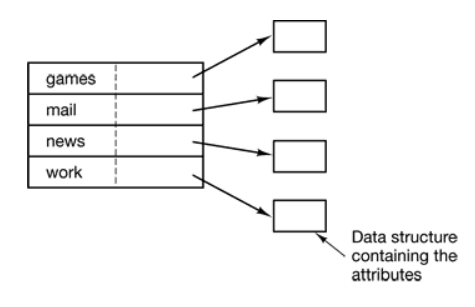    

<b>Operations required to remove a file in UNIX</b>  
Remove the file from its directory.  
Release the i-node to the pool of free i-nodes.  
Return all the disk blocks to the pool of free disk blocks.  

对于一个块的访问时间完全由寻道时间和旋转延迟来决定.最主要的是由寻道(seek)时间决定.  

<b>Block Devices</b> is one that stores information in fixed-size blocks, each one with its own address.  
The essential property of a block device is that it is possible to read or write each block independently. Such as Disks, CD-ROMs, USB sticks  
<b>Character Devices</b> delivers or accepts a stream of characters, without regard to any block structure.  
It is not addressable and does not have any seek operation.Such as Printers, network interfaces, mice.  

There are three fundamentally different ways that I/O can be performed.  
> 1.Programmed I/O  
2.Interrupt-driven I/O  
3.I/O using DMA  

<b>Layers of the I/O Software </b>  
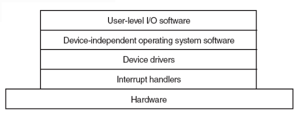  

Before the disk can be used, each platter（盘片） must receive a low-level format done by software.  
After low-level formatting is completed, the disk is partitioned（分区）.  
The final step is preparing a disk for use is to perform a high-level format of each partition.  

partition table（分区表）- gives the starting sector and size of each partition.  
<b>On the Pentium and most other computers, sector 0 contains the master boot record（主引导记录）.</b>  

<b>Disk Arm Scheduling Algorithm</b>
	
> First Come First Serve(FCFS)  
按照输入/输出请求到达的顺序，逐一完成访问请求。  
> Shortest Seek First (SSF)  
总是先完成距当前磁盘臂距离最近的柱面上的输入/输出请求。  
> The elevator algorithm  
keep moving in the same direction until there are no more outstanding requests in that direction, then switch directions.  

All the keyboard hardware provides is the key number not the ASCII code.  

shared-memory multiprocessor  
Message-passing multicomputer.  
wide-area distributed system  
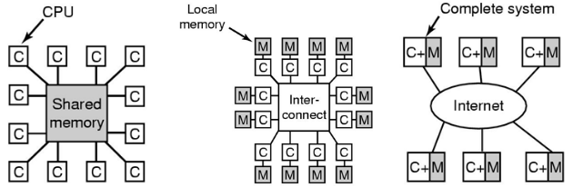

<b>Type 1 Hypervisor</b>  
> The virtual machine runs a guest operating system that thinks it is in kernel mode. (it is really in user mode)  
This is called virtual kernel mode.  
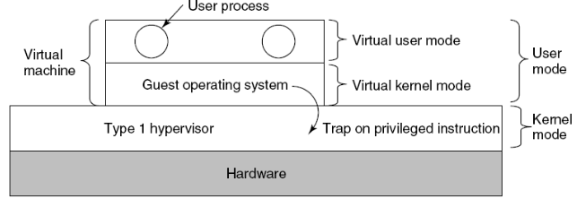  

<b>Type 2 Hypervisors</b>  
> Example: VMware  
VMware runs as an ordinary user program on top of a host operating system.  
When it starts for the first time, it will installs the operating system to its virtual disk.  
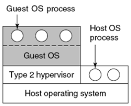  

<b>Paravirtualization（半虚拟化）:</b> To modify the source code of the guest operating system so that instead of executing sensitive instructions at all, it makes hypervisor calls.  

<b>Difference between true virtualization and paravirtualization</b>  
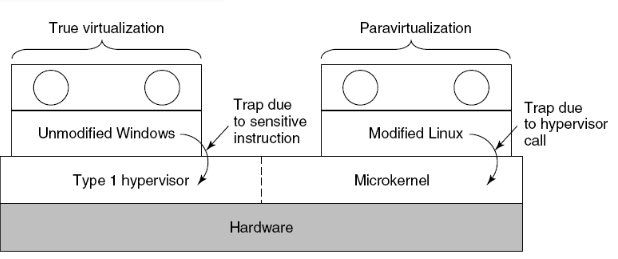  

<b>Security goals and threats</b>  
> Data confidentiality（数据机密性） – having secret data remain secret  
Data integrity（数据完整性） – unauthorized users should not be able to modify any data without the owner’s permission  
System availability（系统可用性） – nobody can disturb the system to make it unusable  
Privacy（隐私）: protecting individuals from misuse of information about them  

<b>Security goals and threats</b>  
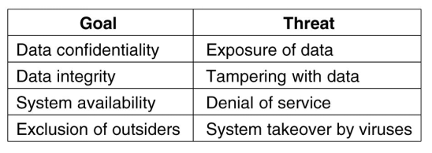  

People who are nosing around places where they have no business being are called intruder or sometimes adversaries.  
>Passive intruders（被动入侵者） – to read files they are not authorized to read  
Active intruders（主动入侵者） – to make unauthorized changes to data  

<b>Common Categories</b>  
> Casual prying by nontechnical users（非专业用户的随意浏览）  
Snooping by insiders（内部人员的窥视）  
Determined attempt to make money（为获取利益而尝试）  
Commercial or military espionage（商业或军事间谍）  

<b>Virus（病毒）</b>  
a piece of code that replicates itself and dose some damage  

<b>Protection Domains</b>  
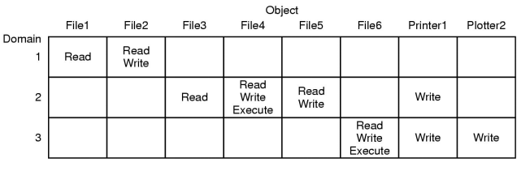  

<b>Access Control Lists(ACL)</b>  
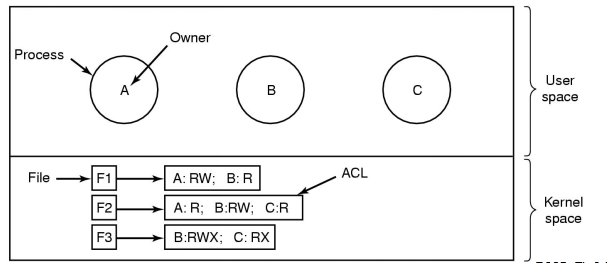  

<b>capability list (C-list)</b>  
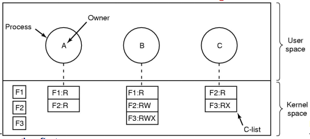

<b>There are different user authentication schema</b>  
> Authentication using passwords  
> Authentication using a physical object（使用实际物体验证）  
> Authentication using biometrics（使用生物特征验证）  

<b>Trap door(后门)</b> is created by code inserted into the system by a programmer to bypass some normal check.  
Login Spoofing(登录欺骗).  
Logic Bombs（逻辑炸弹）.  

<b>Exploiting Code Bugs</b>  
> Buffer Overflow Attacks  
Format String Attacks  
Return to libc Attacks  
Integer Overflow Attacks  
Code Injection(注射) Attacks  
Privilege(特权) Escalation(扩大) Attacks  

<b>Viruses</b>  
> Companion virus（共事者病毒）  
Executable program virus  
Parasitic virus（寄生病毒）  
Memory-resident virus  
Boot sector virus  
Device driver virus  
Macro(宏) virus  
Source code virus  

<b>chmod:</b> to change the mode of a file(1.6.4)  
在UNIX/Linux中，每个文件都有一个保护模式。该模式包括针对所有者、组和其他用户的读-写-执行位。   
r = 4，w = 2，x = 1  
要是一个文件对除了所有者之外的用户都是只读的，可以自行命令chmod (filename, 744)。  

##### fork & exec: (2.1.2)
<b>fork:</b> create two processes, the parent and the child, have the same memory image, the same environment strings and the same open files  
<b>exec:</b> do not create a new process  
<b>ps:</b> list the running processes(2.1.2)  
<b>cat:</b> concatenates(连接?) files (2.1.5)  
<b>grep:</b> selects lines containing the given word(2.1.5)  

## 例题
<b>For each of the following decimal virtual addresses, compute the virtual page number and offset for a 4KB page and an 8KB page: 20000，32768，60000。</b>  
> 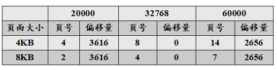