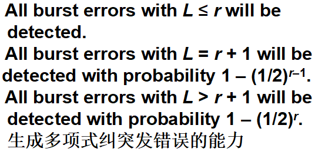
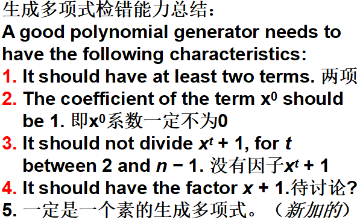
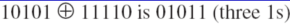
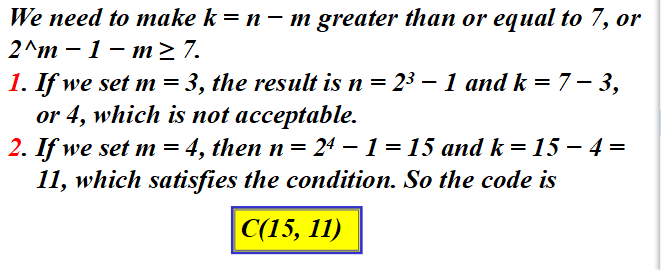
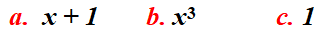
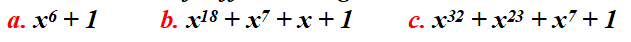

#  Data Communications and Networking 

## 
 数据通信与网络——第十章

## 名词解释
<ul>
<li>Redundancy -- 冗余</li>
<li>Forward Error Correction Versus Retransmission -- 前向纠错和重传</li>
<li>Versus --  对；与...相对；对抗</li>
<li>Hamming Distance -- 汉明距离</li>
<li>Polynomials  -- 多项式</li>
<li>burst error -- 突发性差错</li>
<li>error detection -- 检错</li>
<li>error correction -- 纠错</li>
<li>block coding -- 块编码</li>
<li>convolution coding -- 卷积编码</li>
<li>modular arithmetic -- 模运算</li>
<li>dataword -- 数据字</li>
<li>codeword -- 码字</li>
<li>two-dimensional parity check -- 二维奇偶校验</li>
<li>cyclic redundancy check(CRC) -- 循环冗余校验</li>
<li>polynomial -- 多项式</li>
<li>checksum -- 校验和</li>
</ul>

## 要点

在块编码中，我们把报文划分成块，每块k位，称数据字，并增加r个冗余位使其长度变为n=k+r，形成n位块称为码字。  

The Hamming distance between two words is the number of differences between corresponding bits.  

> 两个字的汉明距离是对应位不同的数量。

<b>最小汉明距离是一组字中所有可能对的最小汉明距离。  
为了保证检测出最多s个错误，块编码中最小汉明距离一定是dmin = s + 1。  
为了保证最多能纠正t个差错，块码中最小汉明距离是dmin = 2t + 1，因此纠错的最小距离是奇数。  
</b>
在线性块编码中，任两个有效码字的异或（即模二加）生成另一个有效码字。  
两个码字的汉明距离：直接让二者进行异或得出的结果中1的个数即是二者的汉明距离。  
接收到的码字与发送的码字的汉明距离即是传输中破坏的位数。  

<b>最小汉明距离求法：是具有最小1的个数的非0有效码字中1的个数。</b>
>在000，011，101，110中，码字中1的个数中非0的个数为2，2，2，因此最小汉明距离为2.  
>在00000，010111，10101，11110中，码字中1的个数中非0的个数为4，3，4，因此最小汉明距离为3.  

<b>简单的奇偶校验码是n = k + 1，且 dmin = 2的单比特检错码。  
奇偶校验只能检出奇数个错误，不能检出偶数个错误  
两维奇偶校验能检测出表中任何位置发生的最多三个差错,4位差错无法检出  
汉明距离m与码字长n和数据字长k的关系为 `n = 2^m − 1, k = n-m, r = n - k`,其中r为冗余位长度。  
</b>

<b>编码方案写成C(n,k)和一个单独的dmin表达式,n是码字的长度，k是数据的位数， dmin是最小汉明距离.</b>  

##### CRC
循环码是有一个附加性质的特殊的线性块码。这个性质是如果码字循环移位（旋转），结果还是另一个循环码字。  
CRC中，校正子S(x) ≠ 0说明有差错；=0说明无差错或者有差错但译码器无法检测出(超出检错能力)。  
做除法运算时，如果除数最左边是1，则商1，否则商0.  
若生成多项式至少有两项，且x的0次方的系数是1，则所有单比特错误都可以检出。  
若生成多项式不能整除0，`0 < t < n-1`，那么所有独立的双比特错误都能被检测到。  
包含x+1因子的生成多项式能检测到所有奇数个比特错误。  

CRC-8为：x^8 + x^2 + x + 1 ATM头部。  

##### 校验和
发送数的负数（补数）为校验和。  

> 发送方首先将要发送的数据求和，然后变为约束和，然后求反变成校验和，之后发送数据项和校验和，接收方对数据项和校验和求和，然后变成约束和，最后取反，如果结果为0，则表示数据没有被破坏。其中约束和的求法如用4位数表示21.  

## 问题
<b>计算000和011的汉明距离(Hamming Distance).</b>  
> 解：  
  
所以汉明距离为2，即d(000,011) = 2.  

<b>计算10101和11110的汉明距离。</b>  
> 解：  
  
所以汉明距离为3，即d(10101,11110) = 3.  

<b>汉明距离为4的编码方案，检错和纠错能力分别是多少？</b>  
> 解：能检测出3位错误，能纠正1位错误。  

<b>We need a dataword of at least 7 bits. Calculate values of k and n that satisfy this requirement.  
若数据字至少为7比特，计算n，k，r。</b>  
  

<b>Which of the following g(x) values guarantees that a single-bit error is caught? For each case, what is the error that cannot be caught?

</b>  
> Solution
> a. No xi can be divisible by x + 1. Any single-bit error can be caught.
> b. If i is equal to or greater than 3, xi is divisible by g(x).All single-bit 
> errors in positions 1 to 3 are caught.
> c. All values of i make xi divisible by g(x). No single-bit error can be 
> caught. This  g(x) is useless.
  
<b>Find the suitability of the following generators in relation to burst errors of different lengths.  

</b>
> Solution
a. This generator can detect all burst errors with a length less than or equal to 6 bits; 3 out of 100 burst errors with length 7 will slip by; 16 out of 1000 burst errors of length 8 or more will slip by.
>
b. This generator can detect all burst errors with a length less than or equal to 18 bits; 8 out of 1 million burst errors with length 19 will slip by; 4 out of 1 million burst errors of length 20 or more will slip by.
>
c. This generator can detect all burst errors with a length less than or equal to 32 bits; 5 out of 10 billion burst  errors with length 33 will slip by; 3 out of 10 billion  burst errors of length 34 or more will slip by.

<b>在反码运算中，如何只用4位来表示21？</b>
> 解：数字21的二进制表示为10101，把最左边的位加到最右边的4位上，0101 + 1 = 0110或6.

