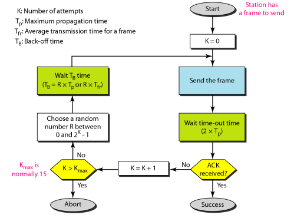

#  Data Communications and Networking 

## 
 数据通信与网络——第十二章

## 名词解释
<ul>
<li>multiple access(MA),多路访问</li>
<li>Carrier Sense Multiple Access(CSMA) -- 载波侦听多路访问协议</li>
<li>Carrier Sense Multiple Access with Collision Detection(CSMA/CD) -- 带有冲突检测能力CSMA</li>
<li>Carrier Sense Multiple Access with Collision Avoidance(CSMA/CA) -- 带冲突避免CSMA</li>
<li>Polling -- 轮询</li>
<li>Token Passing -- 令牌法</li>
<li>Frequency-Division Multiple Access(FDMA) -- 频分多址</li>
<li>Time-Division Multiple Access(TDMA) -- 时分多址</li>
<li>Code-Division Multiple Access(CDMA) -- 码分多址</li>
<li>p-persistent method -- p-持续方法</li>

</ul>

## 要点
数据链路层分为两个功能子层: 数据链路控制子层和多路访问控制子层  
多路访问控制协议的分类：随机访问协议 &nbsp;&nbsp;&nbsp;受控访问控制协议 &nbsp;&nbsp;&nbsp;通道化协议  
在随机访问或竞争访问方式中，没有一个站点是优于其它站点的，也不能控制其它站点。没有站点有权力允许或不允许其它站点发送或不发送数据。有数据要发送的站通过自身的协议决定发送还是不发送数据。  

纯ALOHA可能的冲突时间是帧长度的两倍.  
(pure)纯ALOHA指定超时后,每个站点在重发帧之前都会随机等待一段时间.一个站点在经过最大次数的重发尝试后,它必须放弃并在以后重试.  
<b>纯ALOHA:</b>  
  
纯ALOHA中一个冲突可能发生的时间是帧传输时间的2倍.  

<b>以下G表示一个帧传输时间内系统产生的帧的平均数量.</b>  

纯ALOHA的吞吐量是 S = G × e^(-2G),当G= (1/2)时，最大吞吐量为Smax = 0.184.  
时隙ALOHA网络中的帧，其可能的冲突时间是帧长度的1倍.  
时隙ALOHA的吞吐量是 S = G × e^(-G),当G= (1)时，最大吞吐量为Smax = 0.368.  
时隙ALOHA规定站点只有在时隙开始时才能发送.  
时隙ALOHA的脆弱时间是纯ALOHA的一半.  
纯ALOHA的脆弱时间是一个帧的平均传输时间的两倍.  

CSMA要求每一个站点在发送之前首先要监听介质.  
CSMA基于的原理是:传输前先侦听.  
CSMA能够减少冲突的概率,但是不能消除冲突.  
CSMA的脆弱时间是传输的最长时间,即一个信号从介质的末端到另一端的传播时间.  
CSMA/CA中的时间的安排，主要包括帧间间隔，竞争窗口，和确认。  
CSMA/CA中，若站发现信道忙，并不重启竞争窗口的定时器；而是停止定时器，直到信道空闲时再重启定时器。  

##### 持续方法:1-持续方法,非持续方法和p-持续方法.  
<b>1-持续方法:</b>
如果站点发现线路空闲,那么它就立即发送帧.
<b>非持续:</b>
要发送帧的站点侦听线路,如果线路空闲,那么它就立即发送,如果线路不空闲,站点就等待一个随机时间,然后再次侦听线路.  
<b>p-持续</b>
如果通道有时隙且时隙周期大于或等于最大传播时间,使用p-持续方法.  
站点发现线路空闲后,它采取以下步骤:
> 1.如果概率是p,站点发送帧.  
2.如果概率是i-p,站点会等待下一个时隙的开始并再次检查线路.  
3.如果线路空闲,它进入步骤1.  
4.如果线路繁忙,它会当做一个冲突已经发生了并使用补偿程序.  

##### CSMA/CD
带冲突检测得载波侦听多路访问.  
该方法中,任意站点都可以发送帧,然后监控介质看传送是否成功.如果成功,站点发送成功,反之,说明存在冲突,需要重新发送此帧.  
在该协议中,任何被比特率所分割的帧的长度都必须大于这些持续的时间段.  
帧传输时间必须至少是最大传播时间的两倍.  
CSMA/CD中,传输和冲突检测是一个连续的过程,站点的传输和接收是连续和同步的.在传输的过程中,不断的检测是否传输成功或出现冲突.  
CSMA/DA的吞吐量大于纯ALOHA和时隙ALOHA.1-持续方法中,当G=1时,得到最大吞吐量约为50%.  

通道的能量级别有三个值:0,正常和不正常.0表示空闲,正常表示一个站点成功占用了通道并正在发送一个帧,非正常级别表示发生了冲突且能量级别是正常级别的两倍.  

##### CSMA/CA
带冲突避免的载波侦听多路访问.  
三种方法避免冲突:帧间间隔,竞争窗口和确认.  
<b>帧间间隔:</b>
当发现通道时空闲时,站点并不马上发送,它会等待一段时间,这段时间称之为帧间间隔(inerframe space,IFS).如果IFS时间后,通道仍是空闲的,那么站点就能发送了,但是它仍然要等待一段时间,这段时间等于竞争时间.一个站点的IFS越短,它的优先级越高.  

<b>竞争窗口</b>
竞争窗口将时间分割成时隙.预备发送的站点选择一个随机时隙作为等待的时间.窗口中时隙的数量是根据补偿策略中的二元指数而变化的.即第一次设定一个时隙,以后每次站点在IFS时间后无法检测到空闲通道时,时隙的数量都要翻番.  
每次时隙后站点都要侦听通道.如果站点发现通道繁忙,它并不重启程序,而是停止定时器并在侦听到空闲时再重启定时器.  

在受控访问协议中，站点之间相互协商以确定那一个站有权发送。没有得到授权的站点无权发送数据。主要有以下三类受控访问协议。  
受控访问协议主要有三类：预约协议、轮询协议、令牌协议。  

<b>预约</b>
将时间划分为时隙,在每一个时隙内,数据帧发送之前先发送一个预约帧..如果系统有n个站点,在预约帧中就恰好有n个预约子时隙,每个子时隙均属于一个站点.发送数据帧前要先预约自己的子时隙.  
<b>轮询</b>
一个设备作为主站,另一些设备作为从站.  主设备控制链路,从设备跟随它的指令工作.如果主设备希望接收数据,它就询问从设备是否有数据要发送,这一功能叫轮询.如果主设备希望发送数据,它就通知从设备准备接收,这一功能叫选择.  
<b>令牌传递(Token-passing)</b>
网站中的站点被组织在逻辑环中,访问权限由站点的前驱节点传递给它,当该站点没有数据要发送时,便将权限传递给它的后记站点.  
在此方法中,需要一个令牌.令牌的持有者有访问通道发送数据的权限.  

#### 信道化
信道化协议:FDMA,TDMA,CDMA  
<b>FDMA:</b>可用的宽带被划分成频带,每个站点使用分配给它的频带发送数据.有最小防护频带防止站点间的冲突.  
FDMA是数据链路层,FMD是物理层.  
TDMA中.宽带被视为时间上共享的一个通道.  
CDMA中,一个通道同时承载所有传输.  
FDMA中，信道带宽被在频率域上被正交化，分割成若干子频带外加保护频带。  
TDMA中，信道带宽被在时间域上被正交化，分割成若干时隙。  
CDMA中，信道带宽被在码域上被正交化，各站用正交化的扩频码在共享信道中同时传输。  

## 问题
<b>一个纯ALOHA帧长200比特，带宽200kbps, 这个帧在传输过程中无冲突的条件是什么？</b>
> 解:帧的传输时间为Tfr = 200 bits/200 kbps = 1 ms. 则可能的冲突时间为2ms。意味着前1ms和后1ms都没有其它站发送数据帧。

<b>A network using CSMA/CD has a bandwidth of 10 Mbps. If the maximum propagation time (including the delays in the devices and ignoring the time needed to send a jamming signal, as we see later) is 25.6 μs, what is the minimum size of the frame?
CSMA网络中，带宽10Mbps，最大传播时间为25.6us，那么最小帧长度是多少？</b>  
> <b>Solution:</b>  
The frame transmission time is Tfr = 2 × Tp = 51.2 μs. This means, in the worst case, a station needs to transmit for a period of 51.2 μs to detect the collision. The minimum size of the frame is 10 Mbps × 51.2 μs = 512 bits or 64 bytes. This is actually the minimum size of the frame for Standard Ethernet.
解：帧传播时间必须最少为最大传播时间的两倍以上，即Tfr = 2 × Tp = 51.2 μs. 或者说，一个站点需要51.2us后才能检测到冲突。帧的最小长度是：
10 Mbps × 51.2 μs = 512 bits = 64 bytes. 这也是10兆以太网的最小帧长度。

