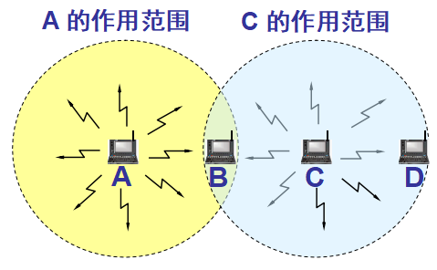
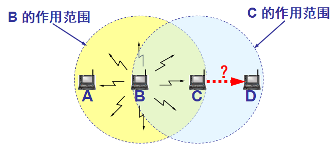

#  Data Communications and Networking 

## 
 数据通信与网络——第十四章

## 名词解释
<ul>
<li>basic service set (BSS) -- 基本服务集</li>
<li>access point (AP) -- 访问点</li>
<li>extended service set (ESS) -- 拓展服务集</li>
<li>no-transition -- 不迁移</li>
<li>distributed coordination function(DCF) -- 分布式协调功能</li>
<li>point coordination function(PCF) -- 点协调功能</li>
<li>distributed interframe space(DIFS) -- 分布式帧间间隔</li>
<li>network allocation vector(NAV) -- 网络分配矢量</li>
<li>repetition interval -- 重复间隔</li>
<li>beacon frame -- 信号帧</li>
</ul>

## 要点
IEEE 802.11定义了两个MAC子层:分布式协调功能(DCF)和点协调功能(PCF).  
DCF使用CSMA/CA作为访问方式.  
PCF在DCF的上面实现,主要用于对时间敏感的传输.  
PCF是集中式的无竞争的轮询访问方式.  
PCF优先级高于DCF.  

BSS迁移就是指站点可以从一个BSS移动到另外一个BSS.  
ESS迁移就是指站点可以从一个ESS移动到另外一个ESS.  

<b>CSMA/CD 协议要求一个站点在发送本站数据的同时还必须不间断地检测信道，但在无线局域网的设备中要实现这种功能就花费过大。</b>  

无线局域网不能使用 CSMA/CD，而只能使用改进的 CSMA 协议。  

<b>隐藏站问题:</b>   
当 A 和 C 检测不到无线信号时，都以为 B 是空闲的，因而都向 B 发送数据，结果发生碰撞。  
  

<b>暴露站问题:</b>  
B 向 A 发送数据，而 C 又想和 D 通信。C 检测到媒体上有信号，于是就不敢向 D 发送数据。  
  

由于PCF的优先级高于DCF，只使用DCF的站点可能得不到对介质的访问.  
CSMA/CA握手中的CTS帧可以避免来自隐藏站点的冲突。  
> CTS(Clear To Send) -- 允许发送

暴露站点使用握手协议解决.  

在CSMA/CD中允许冲突发生,如果冲突发生,它将被检测到并销毁,然后该帧将会被重发.在CSMA/CA中使用技术来避免冲突.  

## 问题