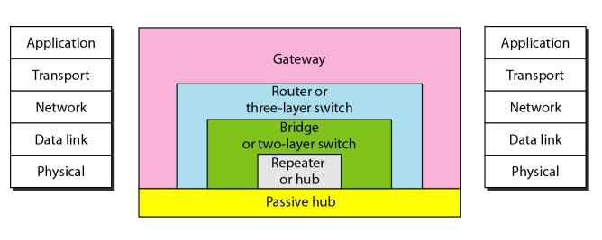

#  Data Communications and Networking 

## 
 数据通信与网络——第十五章

## 名词解释
<ul>
<li>connecting devices -- 连接设备</li>
<li>repeater -- 中继器</li>
<li>hub -- 有源集线器</li>
<li>spanning tree -- 生成树</li>
<li>forwarding port -- 转发端口</li>
<li>blocking port -- 阻塞端口</li>
<li>three-layer switch -- 三层交换机</li>
<li>two-layer switch -- 两层交换机</li>
<li>router -- 路由器</li>
<li>bus backbone -- 总线型主干网</li>
<li>virtual local area network(VLAN) -- 虚拟局域网</li>
</ul>

## 要点
根据在网络中所工作的层把连接设备分成五类:

1.工作在物理层以下的设备,如无源集线器.
2.工作在物理层的设备,如中继器或有源集线器.
3.工作在物理层和数据链路层的设备,如网桥或两层交换机.
4.工作在物理层和数据链路层和网络层的设备,如路由器和三层交换机
5.工作在所有五层的设备,如网关.

<b>无源集线器</b>
无源集线器只是一个连接器.  
<b>中继器</b>
中继器接收信号并在信号变得很弱或者被破坏之前重新生成原始的位模式,然后中继器发送新生成的信号.  
<b>中继器不能连接采用不同协议的两个局域网.  </b>
中继器转发每一帧,没有过滤能力.  
中继器是再生器,不是放大器.  
<b>有源集线器</b>
有源集线器是一个多端口的中继器.  
<b>网桥</b>
网桥用作物理设备时,它重新生成接收到的信号,用作数据链路层设备时,它可以检查帧包含的物理地址.  
网桥具有过滤能力,决定帧是被转发或丢弃.  
网桥不改变帧中所包含的物理(MAC)地址.  
IEEE规范需要网桥使用生成树算法来建立无循环拓扑结构.  
生成树是一个没有循环路径的图.  
生成树算法中,选择ID最小的作为树的根.  
<b>网桥在数据链路层能够连接使用不同协议的局域网.  </b>  
<b>交换机</b>
三层交换机工作在网络层,两层交换机工作在物理层和数据链路层.  
两层交换机是一个有许多端口并且有更好性能的网桥.  
路由器是三层设备,它基于分组的逻辑地址路由分组.  
三层交换机是路由器,但更快更复杂.  

<b>网关:</b>
网关通常是工作在因特网全部五层或者OSI模型中全部七层的计算机.网关拿到一条应用消息,读取消息并解释消息.它能作为两个使用不同模型的互联网的连接设备.  

<b>主干网</b>
在总线型主干网中,主干网的拓扑结构是总线型.总线型主干网通常作为分布式主干网来连接一个组织的不同建筑物.
> 总线型主干网在校园内连接单层或多层建筑物.每个单层建筑物通常有一个单独的局域网,每个多层建筑物有一个主干网连接每层的局域网.总线型主干网可以互连这些局域网和主干网.  

星型主干网也称为折叠式或交换式主干网,其拓扑结构是星型.在这个配置中,主干网仅是一台连接局域网的交换机.   

虚拟局域网(VLAN)技术的全部思想是将VLAN划分成逻辑的而不是物理的网段.在VLAN中,组的成员是由软件而不是硬件定义的,任何站点都可以逻辑的移动到另一个VLAN中.  
## 问题