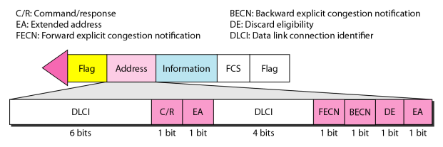
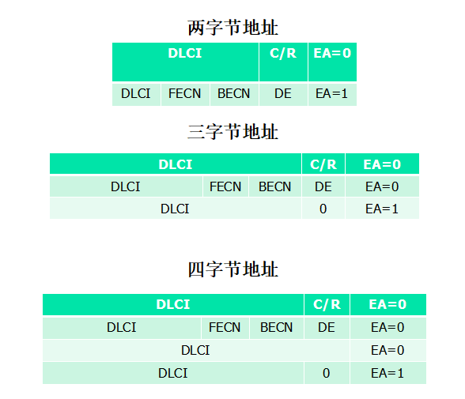

#  Data Communications and Networking 

## 
 数据通信与网络——第十八章

## 名词解释
<ul>
<li>Frame Relay -- 帧中继</li>
<li>data link connection identifier (DLCI) -- 数据链路连接标识符</li>
<li>permanent virtual circuit(PVC) -- 永久虚电路</li>
<li>switched virtual circuit(SVC) -- 交换虚电路</li>
<li>Frame Relay assembler/disassembler(FRDA) -- 帧中继组装器/分解器</li>
<li>congestion control -- 拥塞控制</li>
<li>quality of service (QoS) -- 服务质量</li>
<li>Asynchronous Transfer Mode(ATM) -- 异步传输模式</li>
<li>cell network -- 信元网络</li>
<li>virtual path identifier(VPI) -- 虚路径标识符</li>
<li>virtual circuit identifier(VCI) -- 虚电路标识符</li>
<li>application adaptation layer (AAL) -- 应用适配层</li>
</ul>

## 要点
三种交换技术:电路交换,分组交换和报文交换.  

##### 帧中继
帧中继是一种虚电路广域网.  
1.帧中继以较高的速率工作  
2.帧中继只工作在物理层和数据链路层.  
3.帧中继允许突发性数据  
4.帧中继允许的帧大小为9000字节,这适合于所有的局域网帧.  
5.帧中继花费较少  
6.帧中继仅在数据链路层有错误检测,没有流量控制和错误控制.  

<b>帧中继帧:</b>  
  
为了增加DLCI的范围,帧中继地址从原先的两字节拓展到三字节或四字节.  
两字节中10位DLCI,三字节16位DLCI,四字节23位DLCI.  
  

帧中继提供永久虚电路和交换虚电路.  
<b>帧中继中的VCI称为DLCI.  </b>  
SVC建立一个临时的,短的连接,该链接只存在于源地址与目的地址的数据传输过程中.  
帧中继使用一种称为帧中继组装器/分解器的设备处理从其他协议到达的帧.  

##### ATM
ATM是信元交换网络.当不同大小和格式的帧从分支网络到达信元网络时,它们被分割成相同大小的多个小数据单元.    
在信元网络中使用信元作为数据交换的基本单位.信元定义为一个小的,固定大小的信息块.  
ATM使用使用异步时分复用处理来自不同通道的信元.它使用固定大小的时隙.  
用户通过用户到网络接口(user-to-network interface,UNI)连接到网络内部的交换机上,交换机通过网络到网络接口(network-to-network interface,NNI)彼此连接.  
信元网络基于虚电路.  属于同一报文的所有信元沿着同一条虚电路传输,同时保持它们的原始次序直到到达目的地.  
一个虚连接由一对数字定义:VPI,VCI.  
<b>一个信元只有53字节,其中5个字节为头部,48个字节为有效载荷</b>  
<b>AAL1每个信元有效载荷47个字节,AAL3/4每个信元44个有效字节.</b>  
ATM使用交换机将信元从源端点路由到目的端点.  
ATM从上到下定义了三层:应用适配层,ATM层和物理层,端点使用所有这三层,交换机只使用底下两层.  
<b>ATM定义了四个版本:AAL1,AAL2,AAL3/4,AAL/5.</b>  
> AAL1支持按照恒定比特率传输数据的应用.  
AAL2用于低比特率通信和短帧通信.  
AAL3/4 分别用于面向连接和面向无连接的数据服务,被合并了.  
AAL5称为简单有效适配层.假设所有属于单个报文的信元顺序发送,并且控制功能已经包含在发送应用的上层中了.  

## 问题
<b>帧中继帧的地址字段是10110000 00010111.那么DLCI是什么(十进制)?</b>  
> We first need to look at the EA bits. In each byte, the EA bit is the last bit (the eight bit from the left). If EA bit is 0, the address ends at the current byte; if it 1, the address continues to the next byte. Address → 10110000 00010111. The first EA bit is 0 and the second is 1. This means that the address is only two
bytes (no address extension). DLCI is only 10 bits, bits 1 to 6 and 9 to 12 (from
left).  
 Address → 10110000 00010111  
 DLCI → 1011000001 → 705  

<b>AAL1层以2Mbps接收数据.那么每秒由ATM层产生多少个信元?</b>  
> In AAL1, each cell carries only 47 bytes of user data. This means the number of
cells sent per second can be calculated as [(2,000,000/8)/47] ≈ 5319.15.   

<b>如果应用程序使用AAL3/4并且有47787字节数据进入CS,那么需要多少填充字节.多少数据单元从SAR传递给ATM层?产生多少信元?</b>  
> a. In AAL3/4, the CS layer needs to pass 44-byte data units to SAR layer. This
means that the total length of the packet in the CS layer should be a multiple of
44. We can find the smallest value for padding as follows:  
 H + Data + Padding + T = 0 mod 44  
 4 + 47,787 + Padding + 4 = 0 mod 44  
 Padding = 33 bytes  
b. The number of data unit in the SAR layer is  
(4 + 47787 + 33 +4) / 44 = 1087  
c. In AAL3/4, the number of cells in the ATM layer is the same as the number of
data unit in the SAR layer. This means we have 1087 cells.  