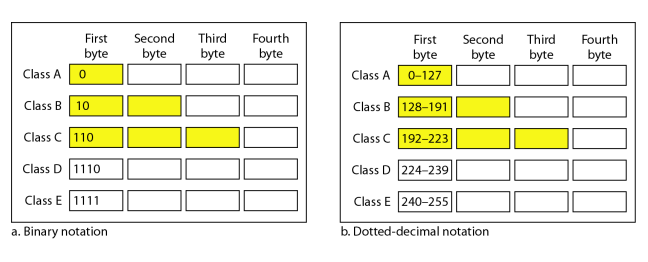

#  Data Communications and Networking 

## 
 数据通信与网络——第十九章

## 名词解释
<ul>
<li>classful addressing -- 分类寻址</li>
<li>classless addressing -- 无类寻址</li>
<li>netid -- 网络号</li>
<li>hosted -- 主机号</li>
<li>mask -- 掩码</li>
<li>subnetting -- 子网化</li>
<li>supernetting -- 超网化</li>
<li>prefix -- 前缀</li>
<li>suffix -- 后缀</li>
<li>network address translation(NAT) -- 网络地址转换</li>
<li>DHCP -- 动态主机配置协议</li>
<li>unicast address -- 单播地址</li>
<li>anycast address -- 任播地址</li>
<li>multicast address -- 多播地址</li>
<li>unspecified address -- 未指明地址</li>
<li>loopback address -- 环回地址</li>
<li>mapped address -- 映射地址</li>
</ul>

## 要点
##### IPv4
IPv4地址32位长,IPv6地址128位长.  
IPv4使用点分十进制来表示.  
在分类寻址中,地址空间被划分为5类:A,B,C,D,E.
<b>分类如下:</b>

A,B,C类中一个IP地址被分为网络号和主机号.  
D类和E类没有分成网络号和主机号.  
在A类中,一个字节定义网络号三个字节定义主机号,B类中,两个字节定义网络号,两个定义主机号,C类中,三个字节定义网络号,一个定义主机号.  

将一个地址划分为几个类组,并赋予每一组一个较小的网络叫做子网化.将几个网络联合起来构成一个超网叫做超网化.  
无类寻址中,没有超网化的必要.  

用二进制标记法的起始地址可设置最右边的32-n位都是0求得,最后地址可设置最右边的32-n都是1求得.  

块中的起始地址通常不分配给任何设备;它用作向世界上其他部分表示该组织的网络地址.  

(NAT)网络地址转换使用户在内部拥有大量的地址,而在外部只有少量的地址.而且,内部通信能使用内部的地址,而外部通信能使用外部地址.  

##### IPv6
IPv6使用十六进制冒号标记法,将128位划分为8个部分,每个部分2个字节.  
表示中,开始的0能够省略,最后的0不能省略.  
IPv6中定义了两种单播地址:基于地理的地址和基于提供者的地址.  
多播地址定义一组主机.  
发送到任播地址的分组必须传递给分组成员中的一个且仅有一个,即最近的一个.  

未指明地址用于当主机不知道自己的地址时,它发送查询以便找出其地址.环回地址是主机用来测试自己的.兼容地址用于IPv4到IPv6的转换(从IPv6发送到另一台IPv6但是要通过IPv4网络).映射地址用于IPv4到IPv6的转换(从IPv6主机发送到IPv4主机).

分类寻址定义了A,B,C的地址块,无类寻址基于需要定义了连续的地址块.  
## 问题
<b>将Ipv4地址10000001 00001011 00001011 11101111用点分十进制表示</b>
> 解:129.11.11.239

<b>在IPv4中掩码是什么,在IPv6中默认掩码是什么?</b>
> A mask in classful addressing is used to find the first address in the block when
one of the addresses is given. The default mask refers to the mask when there is no
subnetting or supernetting.  
当一个地址给出时,掩码用于找到分类地址中的第一个地址.默认掩码是当没有子网或超网时候的掩码.