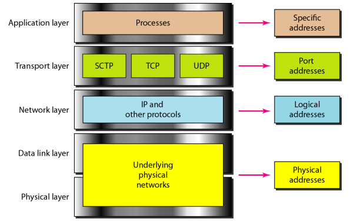
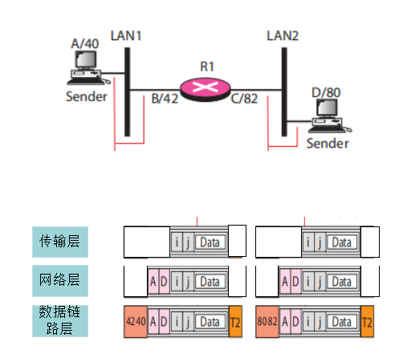

#  Data Communications and Networking 

## 
 数据通信与网络——第二章

## 名词解释

<ul>

<li>syntax -- 语法</li>

<li>semantics -- 语义</li>

<li>implementation -- 实现</li>

<li>architecture -- 体系结构</li>

<li>Service Access Point(SAP) -- 服务访问点</li>

<li>Protocol Data Unit(PDU) -- 协议数据单元</li>

 对等实体之间，为实现该层协议所交换的信息单元。

<li>Service Data Unit(SDU) -- 服务数据单元</li>

 上下两层所传送的逻辑数据单元。

<li>encrypt -- 加密</i>

<li>Peer-to-Peer Processes -- 对等进程</li>

<li>Encapsulation -- 封装</li>

</ul>

## 要点

物理层负责从一跳（节点）到另一跳（节点）的位（bit）传递。  

数据链路层负责从一跳（节点）到下一跳（节点）的帧（Frame）传递。  

网络层负责将各个分组（Packet）从源地址传递到目的地址。  

传输层负责一个报文（Message）从一个进程到另一个进程的传递。  

会话层负责对话控制和同步。  

表示层负责翻译、加密和压缩数据。  

应用层负责向用户提供服务(Service)。  

<b> OSI七层模型： </b>

<b> TCP/IP 协议簇被定义为四个层次: 主机到网络层,互联网层, 传输层和应用层:  </b>

<b> 混合五层模型：  </b>

<b> 一些分层协议：  </b>

<b> 两台主机发送信息的过程：  </b>

##### TCP/IP 协议簇的应用网络中使用4层地址: 物理地址, 逻辑地址, 端口地址和专用地址。  

<b>物理地址：</b>也称链路地址，是局域网或广域网定义的节点地址。在网络中使用，与网络有关。  

<b>逻辑地址：</b>与下面的物理网络无关。不适用于互联网的环境。  

<b>端口地址：</b>赋予进程的标识符称为端口地址。  

<b>专用地址：</b>有些面向用户的应用被设计为专用地址。如：电子邮件的地址和统一资源定位符（URL）。  

#### TCP/IP协议中各层与地址的关系

跳到跳时（每一跳）物理地址将改变，但是逻辑地址和端口地址保持不变。  

对等过程：每台机器上的特定层次的通信过程为对等过程。  

对等进程：两个或更多的设备在同一层上交流。  

地址解析协议（Address Resolution Protocol,ARP）将逻辑地址与物理地址联系起来。  

逆地址解析协议(Reverse Address Resolution Protocol,RARP)允许主机仅知道物理地址的情况下寻找因特网地址。  

## 问题

<b>从A向D发送一个报文，表明数据链路层、网络层和传输层每一跳的帧和分组内容.其中i,j分别是A,D的对应进程.</b>  

