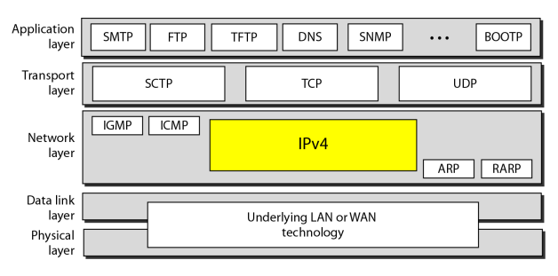
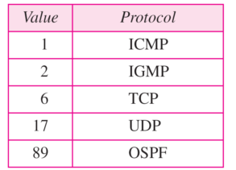
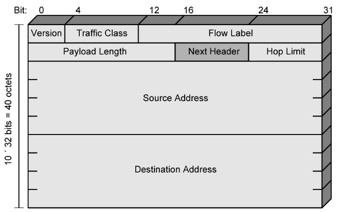

#  Data Communications and Networking 

## 
 数据通信与网络——第二十章

## 名词解释 
<ul>
<li>InternetProtocol(IP) -- 网际协议</li>
<li>connectionless service -- 无连接服务</li>
<li>connection oriented service -- 面向连接的服务</li>
<li>fragmentation -- 分段</li>
<li>flow label -- 流标号</li>
<li>congestion-controlled traffic -- 可进行拥塞控制的通信量</li>
<li>tunneling -- 隧道</li>
</ul>

## 要点
网络层不仅负责主机间的传递,还负责通过路由器或交换机对分组进行路由选择.  
网络层会等待所有分段到达后再对其进行重组,然后将重组后的分组交给传输层.  
因特网中的网络层交换是利用数据报分组交换方法实现.  
在面向连接的协议中,当一个连接建立后,对那些具有相同源和目的地址的分组序列只会进行一次路由策略.  
在无连接的服务中,网络层协议独立地对待每个分组.  
<b>因特网的网络层通信是无连接的</b>  
##### IPv4
<b>IPv4在TCP/IP协议族的位置:</b>

以太网对能够封装在一个帧中的数据有最小值和最大值的限制(46到1500字节).  
IPv4是一种不可靠的无连接数据报协议--尽力传递.IPv4不提供差错控制或流量控制.  
IPv4也是使用数据报的分组交换网的无连接协议.  
IPv4数据报总长度限制在65535字节,其中头部站20-60字节.  
<b>IPv4数据报格式:</b>

头部长度可由20到60个字节组成.当没有选项时是最小的20字节.  
注释:
> 版本(VER):定义是IPv4还是IPv6
> 头部长度(HLEN):以四个字节定义数据报头部的总长度,HLEN × 4 为头部长度
> 总长度:16位定义了一个以字节计的IPv4的总长度(头部加上数据).
> 生存时间:用于控制一个数据报所通过路由器的最大跳数.
> 协议:定义使用此IPv4层服务的高层协议

<b>协议值：</b>

路由器接收到的帧的格式和长度取决于此帧刚刚经过的物理网络所使用的协议；发出去的帧的格式和长度则取决于此帧将要经过的物理网络所使用的协议.  

为使数据报能够通过某些网络可能需要对数据报进行分割,这个过程叫做分段.  
数据报在到达最终目的端之前可能经过多次分段.  
数据报的重组只能发生在目的主机上.  

IP帧中有个标记是个三位字段.第一位保留,第二位为"不分段位" -- D位,如果其值是1,则该数据报不能被分段,是0,则可以.第三位为"多分段位" -- M位,其值是1,则表示此数据报不是最后分段,是0,则表示它是最后一个或唯一一个分段.  
IP帧中的分段偏移是表示这个分段在整个数据报中的相对位置,它是在原始数据报中的数据偏移量,<b>以8字节为度量单位.  </b>  

IPv4校验和只对头部进行.  
将整个头部划分为16部分,将各个部分相加,将结果取反码,即是校验和.  
IPv4不提供数据的加密和鉴别.  
##### IPv6
地址长128位.  
在IPv6中的加密和鉴别选项提供了分组的保密性和完整性.  
<b>IPv6头部</b>

基本头部长度是固定的40字节,可增加多大6个的扩展头部.  

在IPv4中如果数据报长度超过所要经过的网络的MTU时,源端或路由器就需要将其进行分段,在IPv6中,只有原始的源端才能进行分段.源端必须使用 路径MUL发现技术(path MTU discovery technique)来找出在其路径上的任何网络所支持的最小MTU,然后源端利用得到的这个知识进行分段.  

<b>双栈协议:</b>
一个站同时运行IPv4和IPv6.
<b>隧道协议</b>
两台IPv6计算机进行通信需要通过IPv4区域时使用.  
<b>头部转换</b>
发送方使用IPv6,但接收方不能识别IPv6,使用该技术,将IPv6头部转换成IPv4头部.  

## 问题
<b>到达的一个IPv4分组的前8为如下:
0100 0010
接收方是否应该丢弃分组?</b>
> 解:这个分组有错误,最左边四位是版本,没错.下一个4位是0010,表明它是一个无效长度(2×4 = 8).而头部的最小长度是20.

<b>在IPv4分组中,头部长度字段是5,总长度字段是0x0028,问该分组携带的数据时多少字节?</b>
> 解:2 × 16 + 8 - 5 × 4 = 20(字节)

<b>一个IPv4分组前几个十六进制数字如下：0x4500 0028 0001 0000 0102，在丢弃这个分组前，它经历了几跳?数据是属于上层的哪一个协议?</b>
> 解:生存时间字段是第9个字节,值为01,说明分组只能跳一次,协议下一字段是02,说明上层协议是IGMP.  

<b>到达的一个分组的偏移值是100,HLEN是5,总字段的值是100,试问第一个字节和最后一个字节的编号是什么?</b>
> 解:100 × 8 = 800,所以第一个字节的编号是800. 100 - 5 × 4 = 80,所以数据长度是80字节,所以最后一个字节编号是879.  