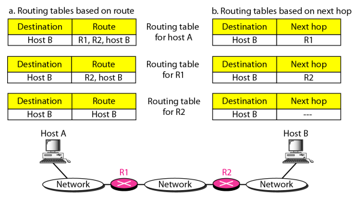
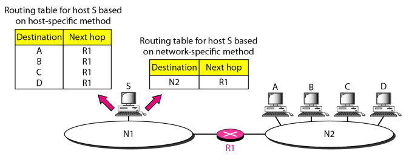
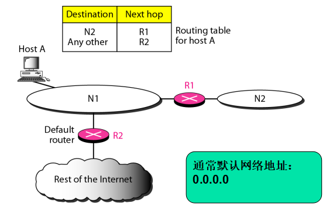
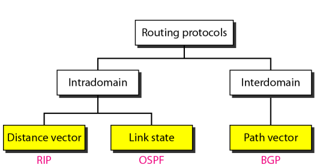
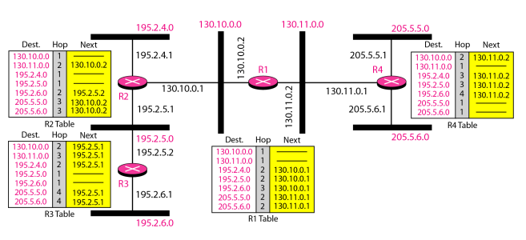
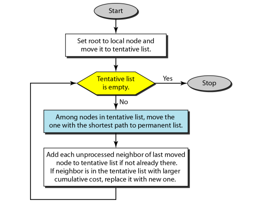
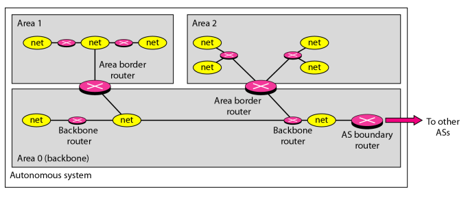
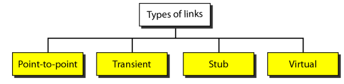

#  Data Communications and Networking 

## 
 数据通信与网络——第二十二章

## 名词解释 
<ul>
<li>delivery -- 传递</li>
<li>forwarding -- 转发</li>
<li>routing protocol -- 路由选择</li>
<li>multicast routing -- 多播路由</li>
<li>next-hop method -- 下一跳方法</li>
<li>network-specific method -- 特定网络方法</li>
<li>host-specific method -- 特定主机方法</li>
<li>address aggregation -- 地址聚合</li>
<li>longest mask matching -- 最长掩码匹配</li>
<li>static routing table -- 静态路由表</li>
<li>dynamic routing table -- 动态路由表</li>
<li>metric -- 度量</li>
<li>RIP -- 路由选择协议</li>
<li>OSPF -- 开放最短路径优先</li>
<li>BGP -- 边界网关协议</li>
<li>autonomous system(AS) -- 自治系统</li>
<li>interdomain routing -- 域间路由选择</li>
<li>interadomain routing -- 域内路由选择</li>
<li>immediate neighbor -- 邻站</li>
<li>split horizon -- 分割范围</li>
<li>posion reverse -- 毒性逆转</li>
<li>convergence -- 收敛</li>
<li>link state routing -- 链路状态路由选择</li>
<li>shortest path tree -- 最短路径树</li>
<li>Dijkstra algorithm -- Dijkstra算法</li>
<li>tentative -- 实验的</li>
<li>transient link -- 过渡链路</li>
<li>stub link -- 残桩链路</li>
<li>path vector routing -- 路径向量路由选择</li>
<li>broadcasting -- 广播</li>
<li>source-based tree -- 基于源树</li>
<li>core-based tree(CBT) -- 基于核的树</li>
</ul>

## 要点
<b>传递:</b>指在网络层控制下用底层的网络对一个分组进行处理的方法.  
<b>转发:</b>指将一个分组传递到下一个站点的方法.  
<b>路由选择:</b>指在转发过程中创建路由表的方法.  
路由选择协议用于不断地更新在转发和路由选择中要查找的路由表.  

网络层负责用底层物理网络处理分组,定义这种处理为分组的传递.  

传递包括直接传递和间接传递.  
一个传递永远包含一个直接传递和0个或多个间接传递,且最后的传递总是直接传递.  
<b>直接传递</b>是分组的最终目的端的主机与发送方连接在同一个物理网络上.当分组的源端和目的端都在同一个物理网络上或传递是在最后一个路由器与主机之间进行时,就出现直接传递.  
当目的主机与发送方不在同一个网络,分组就是<b>间接传递.</b>  

##### 转发技术
<b>下一跳方法</b>
在这种方法中路由表只保留下一跳的地址,而不保留完整路由信息.  
<b>路由方法</b>
在路由表中保留完整的路由信息.  
两种方法对比:

特定网络方法可使路由表减小和使查找过程简化.  
特定网络方法将连接在同一网络上的所有主机看做一个项目.

特定主机路由选择用于如检查路由或提供安全措施等目的.  

默认方法用来简化路由表.  

在此方法中,不必将所有网络列出,可以且仅可以使用一个默认项目代表其余部分.  

在无类寻址中,一个路由表至少要有4列,包括:掩码(/n),网络地址,下一跳地址,接口.  

无类寻址的路由选择使用<b>最长掩码匹配</b>原则,即如果有三个掩码:/27,/26,/24,首先匹配/27,最后匹配/24.  

静态路由表必须由管理员手动改变.   
动态路由表使用动态路由选择协议,如RIP,OSPF,BGP,可以周期性的更新.  

ifconfig命令可以查找有关服务器的IP地址和物理地址.  

在自治系统内部的路由选择为域内路由选择,在自治系统之间的路由选择为域间路由选择.  
每一个自治系统可以选择一种或多种域内路由选择协议,但是处理自治系统之间的路由选择通常只能使用一种域间路由选择协议.  

##### RIP
路由选择协议(RIP):是一种距离向量协议.  
开放最短路径优先(OSPF):是一种链路状态协议.  
边界网关协议(BGP):是一种路径向量协议.  

RIP和OSPF属于域内协议,BGP为域间协议.  

在距离向量路由选择中,任何两个节点之间路由最低代价是最小距离的路径.  
距离向量路由选择的总的思想是与邻站共享路由信息.  
在距离向量路由选择中,每个节点与它的邻站周期性的或有变化时共享它的路由表.  
定义16为无穷大，距离向量路由协议不能用于大的系统，网络的规模在每个方向上不能超过15跳。  

分割范围（split horizon）:发送表的一部分，发送路由表之前，先删除自己路由表的最后一行。最后一次更新后，系统稳定；即如果B认为通过A到达X是最佳路径,就不向A发送关于X的信息.  
毒性逆转（poison reverse）：分割范围的缺点是有定时器。二者结合：用无穷大做警告“不要使用这个值，我知道….”
三个节点之间仍具有不稳定性.  

RIP的度量为跳数,16定义为无穷大.  
RIP 协议的收敛(convergence)过程较快，即在自治系统中所有的结点都得到正确的路由选择信息的过程。  
RIP 协议使用运输层的用户数据报 UDP进行传送（使用 UDP 的端口 520）。  
因此 RIP 协议的位置应当在应用层。但转发 IP 数据报的过程是在网络层完成的。 
<b>RIP使用例子</b>

<b>链路状态路由选择</b>
1. 为每个节点建立链路状态分组(LSP)的链路状态；
2. 使用flooding的方法向其他路由器扩散LSP
3. 为每个节点构造一个最短通路树
4. 基于最短路径树计算路由表

<b>Dijkstra算法</b>

##### OSPF
OSPF 直接用 IP 数据报传送  
<b>开放最短路径优先(OSPF)是基于链路状态路由选择的一个域内路由选择协议.</b>
OSPF允许网络管理员给每一条路指定一个代价,称为度量(metric).  
OSPF将自治系统划分为一些区域,Area是AS中一些网络、主机和路由器的集合，区域之间是互联的；  
一个Area中，路由器都使用Flooding传送路由信息  
每个区域都是由标识的  
在自治系统中的所有区域必须与主干相连.  
若主干路由器和Area之间的连通性被破坏了，就必须建一条虚链路(Virtual Link)，有4种。  
<b>OSPF使用如下:</b>

<b>4中链路类型有:  </b>  

点到点链路:直接连接两个路由器.  
过渡链路:连接多个路由器的网络.所有局域网和某些具有两个或更多的路由器的广域网都属于此类型.  
残桩链路:只连接一个路由器的网络.  

在OSPF中:所有的路由器最终都能建立一个链路状态数据库。这个数据库实际上就是全网的拓扑结构图，它在全网范围内是一致的.OSPF 的链路状态数据库能较快地进行更新，使各个路由器能及时更新其路由表。

<b>OSPF 的其他特点 :</b>
> 每两个相邻路由器每隔10s交换1次问候分组。
若由40s未收到某个相邻路由器发来的问候分组，则可认为该相邻路由器是不可达，应修改链路状态数据库，并重新计算路由表。
OSPF 还规定每隔一段时间，如 30 分钟，要刷新一次数据库中的链路状态。 
由于一个路由器的链路状态只涉及到与相邻路由器的连通状态，因而与整个互联网的规模并无直接关系。因此当互联网规模很大时，OSPF 协议要比距离向量协议 RIP 好得多。 
OSPF 没有“坏消息传播得慢”的问题，据统计，其响应网络变化的时间小于 100 ms。 

##### 路径向量路由选择协议
路径向量路由选择协议是域间协议.  
使用代言节点,一个代言节点通知是在它的自治系统或其它自治系统中的路径,而不是节点的跳数的度量.  
在路径向量路由选择中,自治系统的一个代言节点与它邻站的代言节点共享它的路由表.  

##### BGP
边界网关协议是使用路径向量路由选择的域间协议.  
自治系统分为三类:残桩的,多接口的,转送的.  
残桩自治系统:数据起始或终止于该自治系统.  
多接口自治系统:它与多个自治系统连接,仍旧是数据流量的源端或接收端,不允许来自一个自治系统的数据经过它转发到另一个自治系统.  
转送自治系统:是一个多接口自治系统,允许过渡数据流量.  

<b>BGP使用TCP作为其传输层协议.  </b>  
边界网关协议 BGP 只能是力求寻找一条能够到达目的网络且比较好的路由（不能兜圈子），而并非要寻找一条最佳路由。  

##### 多播路由选择协议
在单播中，路由器将接收到的分组仅从其端口中的一个转发出去。  
在多播中，路由器可能通过它的多个端口将其所接收到的分组转发出去。  
用单播仿真多播效率不高并可能产生长的延迟，特别是对于大的分组。  
在多播路由选择中，每个相关的路由器都要为每个组构建一棵最短路径树。  

在基于源树方法中，对每个组每个路由器都需要有一个最短路径树。  
在组共享树方法中，只有一个核心路由器，它对多播所涉及的每一个组有一个最短路径树。  

多播链路状态路由选择使用基于源树的方法.  

逆路径转发消除了洪泛过程的回路.  
CBT,基于核的树协议是一种组共享协议.  
CBT的树是从叶子生成的.  
## 问题