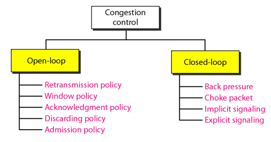
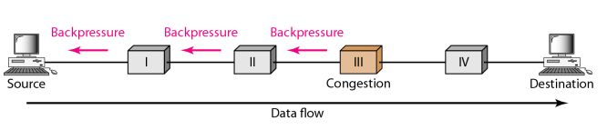
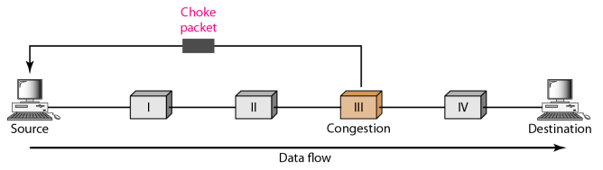
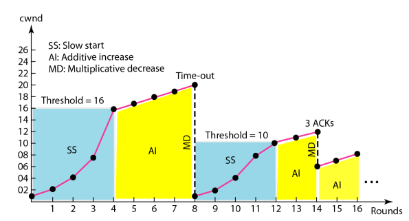
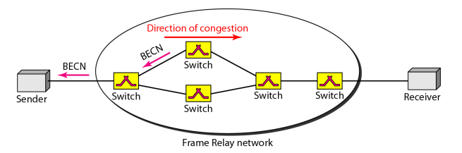
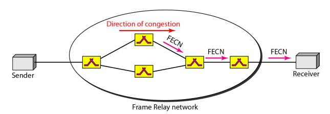

#  Data Communications and Networking 

## 
 数据通信与网络——第二十四章

## 名词解释 
<ul>
<li>peak data rate -- 峰值数据速率</li>
<li>maximum burst size -- 最大突发长度</li>
<li>effective bandwidth -- 有效带宽</li>
<li>constant-bit-rate(CBR) -- 恒定比特率</li>
<li>variable-bit-rate(VBR) -- 可变比特率</li>
<li>bursty data -- 突发性数据</li>
<li>congestion -- 拥塞</li>
<li>load -- 载荷</li>
<li>throughput -- 吞吐量</li>
<li>open-loop congestion control -- 开环拥塞控制</li>
<li>closed-loop congestion control -- 闭环拥塞控制</li>
<li>choke packet -- 抑制分组</li>
<li>multiplicative decrease -- 乘性减少 </li>
<li>backward explicit congestion notification(BECN) -- 后向显示拥塞通知</li>
<li>forward explicit congestion notification(FECN) -- 前向显示拥塞通知</li>
<li>quality of service(QoS) -- 服务质量</li>
<li>reliability -- 可靠性</li>
<li>jitter -- 抖动</li>
<li>first-in,first-out (FIFO) -- 先进先出</li>
<li>priority queuing -- 优先权队列</li>
<li>weighted fair queuing -- 加权公平队列</li>
<li>traffic shaping -- 通信量整形</li>
<li>leaky bucket -- 漏桶</li>
<li>token bucket -- 令牌桶</li>
<li>integrated service(IntServ) -- 综合业务</li>
<li>RSVP -- 资源预留协议</li>
<li>Differentiated Services(DS或Diffserv) -- 差分服务</li>

</ul>

## 要点
对拥塞控制和服务质量关注的重要方面是数据通信量.  
<b>平均数据速率 = 数据量 / 时间</b>  
平均数据量表明了通信量所需要的平均带宽.  
峰值数据速率定义了通信量最大数据速率.  
最大突发长度一般指峰值速率传输通信量所持续时间的最大值.  
有效带宽是指网络需要分配给通信流的带宽.  
拥塞控制是指控制拥塞和使载荷低于网络容量的机制和技术.  
拥塞控制包括两个测试网络性能的要素:延迟和吞吐量.  
<b>吞吐量定义为1秒内通过一个节点的位数.</b>  

##### 拥塞控制
拥塞控制包括两大类:开环拥塞控制(预防)和闭环拥塞控制(消除).  
  

开环拥塞控制是在拥塞发生之前,应用某种策略来预防拥塞现象的发生.在源端和目的端都可以处理  
预防的集中策略:重传策略,窗口策略,确认策略,丢弃策略,许可策略  

闭环拥塞控制策略使用在拥塞发生之后,可以缓解拥塞状况.  
闭环拥塞控制策略:背压,抑制分组,隐含信令,显示信令.  
背压是点到点的拥塞控制，它从一个点开始然后传播，数据流反方向到达源端.  
背压：  
  
抑制分组是一个分组,该分组由节点发送给源端,通知它发送拥塞的情况.  
抑制分组:  
  

TCP处理拥塞的一般策略是基于三个阶段:慢速启动,拥塞避免和拥塞检测.  
慢速启动:指数增长.拥塞窗口大小按指数规律增长,直到达到阈值.  
拥塞避免:拥塞窗口大小是加性增加的直到检测到拥塞.  
拥塞检测:乘性减少,做法如下:  
1.如果计时器到时  
> 设置阈值为当前拥塞窗口大小的一半  
> 设置`cwnd`为一个段大小  
> 启动慢启动阶段  

2.如果收到三个ACK  
> 设置阈值为当前拥塞窗口大小的一半   
> 设置`cwnd`为阈值  
> 启动拥塞避免阶段  

图示如下:  
  

高吞吐量和低延迟是帧中继协议的主要目标.  
帧中继协议没有流量控制协议.  
为避免拥塞,帧中继协议在帧中利用2个位来明确地提示源端和目的端拥塞的发生.  
后向显示拥塞通知(BECN)位提示发送方网络中的拥塞情况.  
  
前向显示拥塞通知(FECN)位用来提示接收方网络中拥塞的情况.  
  

改进QoS的技术:调度,通信量整形,许可控制和资源预留.  

调度中的三种方法:FIFO,优先权队列,加权公平队列.  
优先权队列优先对优先权高的队列进行处理,可能使优先权低的队列饿死.  
加权公平队列以轮换的方式处理每个队列的分组,所处理的分组的数量等于相应队列的权重.  

通信量整形:漏桶,令牌桶  
漏桶方法将突发性的大块数据存储在桶中,然后以平均速率发送出去.  
令牌桶算法允许空闲主机以令牌的形式为未来累计信用.  
只要令牌桶不空,主机就能发送突发性数据.  

两种服务质量模型:综合业务和差分业务.  

综合业务是用于IP的基于数据流的QoS模型.  
差分业务是用于IP的基于类的QoS模型.  

业务类型分为:保证型业务和受控型载荷业务.  
保证型业务用于实时传输,保证端到端的延迟最小.  
受控型业务可以接受一定的延迟,要求较低的分组丢失率或零分组丢失率.  

资源预留协议是一种信令协议.  

差分服务用于弥补综合业务缺陷的一种业务,主要处理过程从网络核心转移到网络边缘,解决收缩性问题,同时将针对每条数据流的业务改变为针对每种类型的业务,解决业务类型限制的问题.  

## 问题