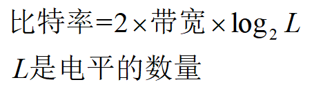
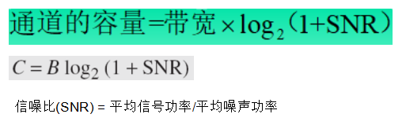
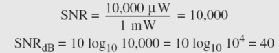

#  Data Communications and Networking 

## 
 数据通信与网络——第三章

## 名词解释

<ul>
<li>吞吐量（throughput capacity）</li>
 信道的实际带宽  
<li>传播时间(propagation time)</li>
 即：一个比特从源到目标的时间
<li>传输时间(transmission time)</li>
 传输时间  = 报文长度  / 带宽，是发送报文所需的时间。
<li>排队时间(queuing time)</li>
<li>处理延迟(processing time)</li>
<li>periodic -- 周期的</li>
<li>aperiodic -- 非周期的</li>
<li>Attenuation -- 衰减</li>
<li>Distortion -- 失真</li>
<li>Nyquist -- 奈奎斯特定理</li>
<li>Shannon Capacity Formula -- 香农容量定理</li>
<li>bandpass channel -- 带通通道</li>
<li>low-pass channel -- 低通通道</li>
</ul>

## 要点
在数据通信中，通常使用周期模拟信号和非周期数字信号。  
如果复合信号是周期性的，分解得到的是一系列具有离散频率的信号。  
如果复合信号是非周期性的，分解得到的是具有连续频率的正弦波组合。  
复合信号的带宽是信号最高频率与最低频率的差值。  
如果通道是带通通道，我们不能直接传送数字信号。
比特率（bit rate）是1秒中发送的位数,以每秒位（bps）表示。
### 波长 = 传播速度 ×  周期 = 传播速度 / 频率
#### 数字信号：如果信号有L个电平，则每个电平需要log2(L)位。  
比特长度是一个比特在传输介质上的距离。  
<b>比特长度 = 传播速度 × 比特持续时间。</b>  
<b>位长 = 传播速度 ×  位持续时间</b>

只有我们有无穷大或非常大带宽的低通通道，保持数字信号形状的数字信号基带传输才是可能的。  

<b>传输所需的最小带宽 B = 比特率/2（只用一次谐波）</b>  
<b>传输更好的带宽为3B，5B，7B等（分别为一次谐波加上三次，加上三次、五次谐波，加上三次、五次、七次谐波）。</b>

低通通道是从频率为0开始，带通通道不是从频率为0开始。  

<b>传输减损的三种类型：</b>衰减、失真、噪声。  
–3 dB或者3 dB衰减等价于功率损失了一半。  
<b>信噪比(SNR) = 平均信号功率/平均噪声功率</b>  
信噪比越大越好。  
## 无噪声信道：奈奎斯特定理 -- 所需信号电平数
  

## 有噪声信道：香农定理  -- 通道容量上限
单位（bps）

  
一般取香农定理得出的容量的三分之二作为可用带宽。

<b> 延迟=传播延迟 + 传输时间 + 排队时间 + 处理延迟</b>  
<b>带宽延迟积(单位bits) = 带宽（单位bps） × 延迟（单位s）</b>  

## 问题
<b>信号的功率是10 mW，噪声的功率是1 μW，那么SNR 和SNRdB是多少？</b>  
> 解：  

<b>我们需要通过带宽为20kHz的无噪声通道发送265kbps。我们需要多少信号电平？</b>  
> 解：  
  
所以需要128个电平。电平的个数要是2的幂次方。  

<b>如果网络的带宽是1 Gbps，那么2.5千字节的报文(一封电子邮件)的传播时间和传输时间是多少？假定发送方和接收方之间的距离是12,000 km，光以速度 2.4 × 10^8 m/s传输。</b>  
> 解：传播时间 = 12000×1000 /（2.4×100000000） = 50ms
   传输时间 = 2.5×1000 / 1000000000 = 0.020ms
