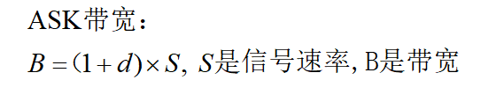
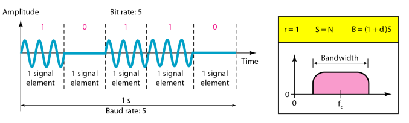
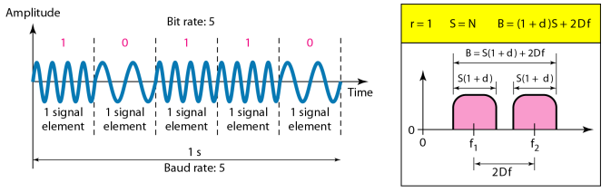
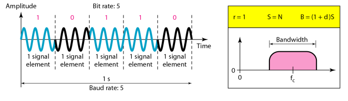
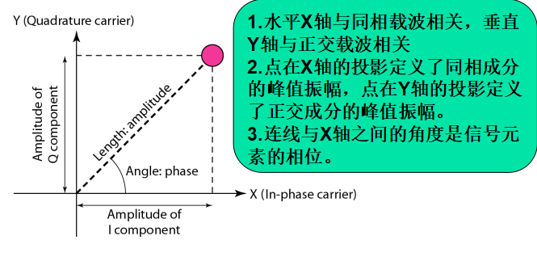
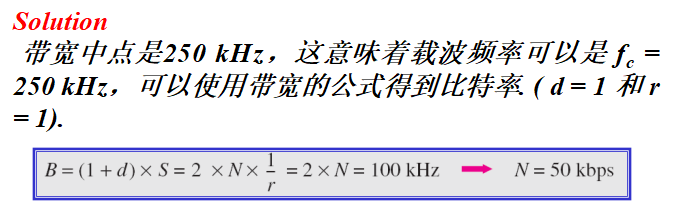
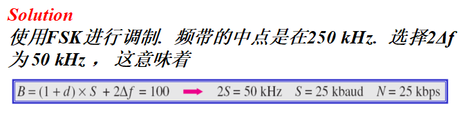
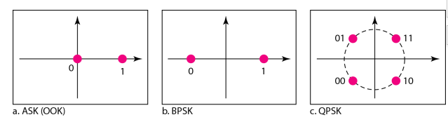

#  Data Communications and Networking 

## 
 数据通信与网络——第五章

## 名词解释
<ul>
<li>Aspects of Digital-to-Analog Conversion -- 数字到模拟转换的概念</li>
<li>Amplitude Shift Keying(ASK) -- 幅移键控</li>
<li>Frequency Shift Keying(FSK) -- 频移键控</li>
<li>Phase Shift Keying(PSK) -- 相移键控</li>
<li>Quadrature Amplitude Modulation -- 正交振幅调制</li>
<li>Amplitude Modulation -- 调幅</li>
<li>Frequency Modulation -- 调频</li>
<li>Phase Modulation -- 调相</li>
</ul>
## 要点
比特率是每秒发送的位数，波特率是每秒发送的信号元素数。在数字数据模拟传输中，波特率小于等于比特率。  

##### BASK

##### BFSK

##### BPSK

<b>BPSK和BASK一样简单，但比BASK不易受噪声影响.</b>

如果两个频率的差是2△f ,那么BFSK要求的带宽是

<b> 多电平FSK的带宽是 B = （1+d ) ×S + ( L -1 )2△f  =>  B = L × S</b>
<b>QPSK在每个信号元素中一次使用2位。</b>
### 星座图

AM所需的总带宽可以由音频信号的带宽确定: BAM = 2B.  
FM所需的总带宽可以由音频信号的带宽确定: BFM = 2(1 + β)B. β是调制因子，一般为4.  
PM 所需的总带宽可以由调制信号的带宽和最大振幅确定:BPM = 2(1 + β)B.  
## 问题
<b>有100 kHz的可用带宽，范围从 200 到 300 kHz. 如果通过使用 d = 1 的ASK 调制数据，那么载波频率和比特率是多少?</b>  

<b>有一个100 kHz 的可用带宽，范围从 200 to 300 kHz. 如果使用 d = 1 的 FSK 调制数据，那么载波频率和比特率应该是多少?</b>  

<b>我们需要用3Mbps的比特率每次发送3位，载波频率是 10 MHz，计算使用不同频率的个数、波特率和带宽。</b>   
解：使用不同频率的个数 L = 23 = 8. 波特率 S = 3 MHz/3 = 1 Mbaud.  这意味着载波频率必须是相隔 1 MHz (2Δf = 1 MHz).  带宽是B = 8 × 1000 = 8000 MHz.  

<b>试分别画出ASK (OOK), BPSK, 和 QPSK 的星座图.</b>  
