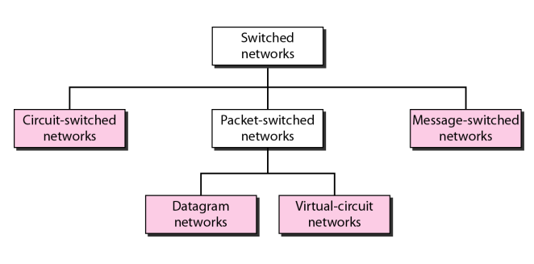
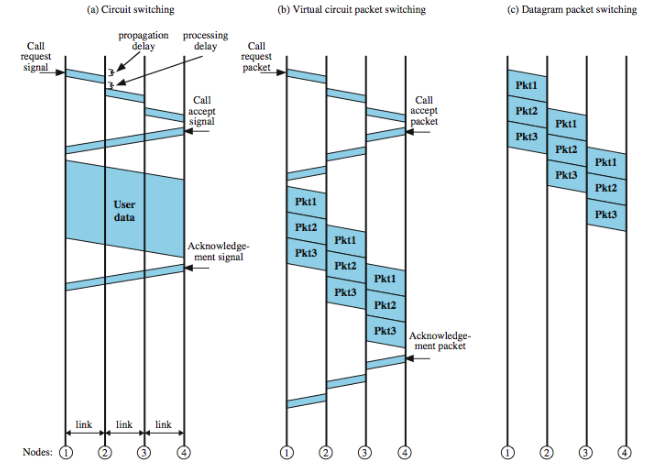

#  Data Communications and Networking 

## 
 数据通信与网络——第八章

## 名词解释
<ul>
<li></li>
</ul>

## 要点
<b>交换网络分类</b>

电路交换网络由物理链路连接的一组交换机组成，每条链路被分成了n个通道。  
在电路交换中，建立阶段必须预留资源，以作为整个数据传输间的专用资源直到拆除阶段。  
在分组交换网中，不存在资源预留，资源按需分配。  
因特网在网络层用数据报方法对分组进行交换。  
虚电路网络是结合电路交换网络和数据报网络的产物，它具有两者的某些特征。  
<b>电路交换网的通信有三个阶段：</b>连接建立、数据传输和连接拆除。  
数据报交换通常在网络层。数据报网有时也称为无连接网络。  
数据报网中的交换机（路由器）使用基于目的地址的路由表。  
数据报网分组的头部中的目的地址在分组传送期间保持不变。  
数据报网的效率比电路交换网高，延迟比虚电路交换网长。  
##### 虚电路网络
<ol>
<li>按照电路交换的思路，有建立阶段和拆除阶段。</li>
<li>同数据报一样，数据被划分为分组，其头部含有地址。</li>
<li>同电路交换网络一样，所有分组沿着连接期间建立的路径传送。</li>
<li>虚电路通常在数据链路层实现，电路交换通常在物理层实现，数据报通常在网络层实现。</li>
</ol>

	在虚电路交换中，属于相同源端和目的端的所有分组都按同一路径传送；但如果资源按需分配，分组达到目的端可能有不同延迟。

在交换广域网中，数据链路层通常采用虚电路技术实现。

#### 交换机
目前交换机采用两个技术：空分交换机和时分交换机。  

##### 比较

## 问题