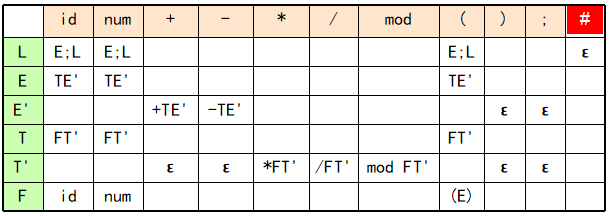
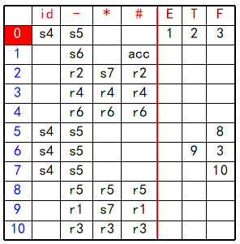

# 编译原理

- CFG -- 上下文无关文法
- CFL -- 上下文无关语言
- CSG -- 上下文有关文法

<b>解释器与编译器的区别:</b>  
主要区别在于：运行目标程序时的控制权在解释器而不在目标程序.  
编译器:工作效率高,交互性与动态性差,可移植性差.  
解释器:工作效率低,交互性与动态性好,可移植性好.  
共同点:均完成对源程序的翻译.  
差异:编译器采用先翻译后执行,解释器采用边翻译边执行.  

<b>编译器各阶段工作:</b>  
词法分析:词法分析的输入是源程序,输出是识别出的记号流.目的是识别单词.  
语法分析:输入是词法分析器返回的记号流,输出是语法树.目的是得到语言结构并以树的形式表示.对于声明性语句,进行符号表的查填,对于可执行语句,检查结构合理的表达式运算是否有意义.  
语义分析:根据语义规则对语法树中的语法单元进行静态语义检查,如类型检查和转换等,目的在于保证语法正确的结构在语义分析上也是合法的.  
中间代码生成:生成一种既接近目标语言,又与具体机器无关的表示,便于代码优化与代码生成.  
符号表管理:合理组织符号,便于各阶段查找\填写等.  
出错处理:动态错误和静态错误.静态错误分为语法错误和静态语义错误.  

逻辑上把编译器分为分析(前端)部分和综合(后端)部分.  
词法,语法和语义分析为分析部分,中间代码生成,优化为综合部分.  

词法分析的双重含义：  
  - 规定单词形成的规则，称为构词规则/词法规则；  
  - 根据词法规则识别输入序列，称为词法分析。  

<b>词法分析器的作用：</b>  
识别记号并交给语法分析器；  
滤掉源程序中的无用成分；  
处理与具体平台有关的输入；  
调用符号表管理器和出错处理器进行相关处理。  

<b>模式（pattern）</b>：产生/识别单词的规则  
<b>记号（token）</b>：按照某模式识别出的元素  
<b>单词（lexeme）</b>：被识别出的元素的值(字符串本身)  

<b>NFA相对于DFA的2点区别：（NFA的不确定性）</b>  
某个状态下，对同一字符可能有多于一个的下一状态；  
可能存在ε状态转移.  
NFA识别记号存在的问题:只有尝试了全部可能的路径才能确定一个输入序列不被接受,识别过程中需要大量的回溯.  

<b>语法分析的双重含义：</b>  
 - 规定各种句子的构成规则，称为语法规则；  
 - 根据语法规则识别输入序列（记号流）中的语言结构，称为语法分析。  

<b>正规式与正规文法：</b>  
正规式与正规文法用于描述线性结构，如构成句子的记号(终结符)；识别正规语言的自动机是有限自动机（FA），它们的特征是没有记忆能力；  
<b>上下文无关文法(CFG)：</b>CFG用于描述层次结构，如构成程序的句子；识别CFL的自动机是下推自动机（PDA），它是在有限自动机的基础上增加了一个下推栈，从而有了简单的记忆能力.  

CFG产生语言的基本方法－推导：用`产生式的右部`替换`句型中的非终结符`。  
CFG是一个四元组G = (N,T,P,S):
	
    N是非终结符的有限集合  
    T是终结符的有限集合  
    P是产生式的有限集合  
    S是文法开始符号  

句子:
句型:
短语:以非终结符为根子树中所有从左到右的叶子.  
直接短语:只有父子关系的树中所有从左到右排列的叶子.  
句柄:最左边的直接短语.  

在推导过程中,每次直接推导均替换句型中最左边的非终结符,则称为最左推导,由最左推导产生的句型称为左句型.最右推导和最左规约分别称为规范推导和规范规约.  

分析树的叶子,从左到右构成G的一个句型.若叶子仅由终结符标记,则构成一个句子.  
记号可以用正规式描述,句子可以用CFG描述.正规式所描述的语言结构均可以用CFG描述,反之则不一定.  
正规式适合描述线性结构,如标识符,关键字,注释等,CFG适合描述具有嵌套(层次)结构的非线性结构.如if-then-else,while-do等.  

<b>分析树与语法树：</b>分析树和语法树都反映了语言结构；分析树还记录了分析的过程（含有非终结符）.  

<b>文法的二义性：</b>  
二义性的本质是文法中缺少对文法符号优先级和结合性的规定，从而使得一个句子可以有多于一棵分析树。  
<b>二义性的消除：</b>  
改写二义文法为非二义文法；  
对文法符号施加优先级与结合性的限制，使得分析的每一步有唯一选择。  

<b>消除直接左递归的方法:</b>  
例子：	 

	A → Aα| β
    其中 β 均不以 A 开始。用下述产生式代替A产生式：
    A → β A'
	A'→ α A' |ε

<b>LL(1)文法及其判别：</b>  
预测分析表中没有多重定义条目（定义和推论3.2）;  
二义/含左递归/含左因子：都不是LL(1)文法  
LL(1)中的两个L分别代表:从左向右扫描,产生最左推导,1代表在确定分析器的每一步动作时向前看一个终结符.  

<b>LR文法的判别</b>  
允许左递归,但是不能有二义.  
有移进/规约冲突的不是LR（0）文法.  
<b>SLR(1)文法的判别</b>  
活前缀中,可能存在 移进/规约 冲突或 规约/规约 冲突,简单的向前看一个字符,若冲突可解决,则是SLR(1)文法反之,则不是.  
SLR(1)分析表就是 移进 - 规约分析表.  

	用基于LR(0)项目的、识别活前缀的DFA判别是否为LR(0)文法和SLR(1)文法时,如果有 "移进/规约 或 规约/规约" 冲突,则不是LR(0)文法, 假设有冲突 "E → T. 和 E → a.F" 则当 follow(T) ∩ first(F) = ε 或者 冲突为 "E → T. 和 E → U." 则当 follow(T) ∩ follow(U) == ε 则文法属于 SLR(1)文法.  

<b>LR 分析方法的扩充</b>  
 扩充分析器功能：归约时执行语义动作  
 扩充分析栈：增加一个 并列的 语义栈  
<b>递归下降分析方法的扩充</b>  
 扩充分析器功能：产生式右部任何位置均可有语义动作  
 扩充递归子程序：参数、返回值、局部量、全局量  

预测分析器由一张预测分析表,一个符号栈和一个驱动器组成,数学模型是下推自动机.  
预测分析表中:开始格局的剩余输入是全部输入序列,而接收格局中剩余输入为空.  
<b>构造预测分析表的步骤:</b>
1.计算X的First集合
2.计算所有非终结符的follow集合
3.构造预测分析表

<b> 语义分析的两个作用</b>  
检查结构正确的句子所表示的意思是否合法；  
执行规定的语义动作，如：  
表达式求值  
符号表的查询/填写  
中间代码生成等  
<b> 语义分析的方法</b>  
语法制导翻译 （Syntax Directed Translation）  

<b>编译器对两类语句的翻译：</b>  
声明性语句：  
  填写符号表，生成相应的环境(如对于变量：分配存储空间)  
操作性(可执行）语句：  
生成中间代码，如三地址码、注释树等  

继承属性从前辈和兄弟的属性计算得到,综合属性从子孙和自身的其他属性计算得到.即,继承属性"自上而下,包括兄弟",综合属性"自下而上,包括自身".  

中间代码应具备的特性:  
1.便于语法制导翻译  
2.既与机器指令的结构相近,又与具体机器无关.  
使用中间代码的好处:一是便于编译器程序的开发和移植,二是代码进行优化处理.  

三元式: (i) (op,arg1,arg2)  
三地址码: (i) := arg1 op arg2  
四元式: (i) (op,arg1,arg2,result)  

一个变量的声明包括两部分:类型定义 和 变量声明.  
类型定义:为编译器提供存储空间大小的信息.  
变量声明:为变量分配存储空间.  

过程包括过程头和过程体.  
过程的三种形式:过程定义,过程声明和过程调用.  
过程定义:过程头+过程体.  
过程声明:过程头.  

布尔表达式的计算有两种方式:数值表示的直接计算和逻辑表示的短路计算.  

<b>语法制导定义(Syntax Directed Definition)</b>  
    用抽象的属性和运算表示的语义规则；(公式，做什么)  

<b>翻译方案(Translation Scheme)</b>  
    用具体的属性和运算表示的语义规则。(程序段，如何做)

将属性附着在分析树对应文法符号上，形成<b>注释分析树</b>.  

注释语法树 ?  

<b>名字的作用域规则:</b>  
1.静态作用域规则  
> 编译时就可以确定名字的作用域。  

2.最近嵌套规则  

<b>第四章:散列表</b>  
名字挂在两个链上(便于删除操作)：
1. 散列链(hash link)： 链接所有具有相同hash值的元素，表头在表头数组中；  
2. 作用域链(scope link)：链接所有在同一作用域中的元素，表头在作用域表中。  

出现在赋值号左边和右边的量分别称为左值和右值;左值必须具有存储空间,右值可以仅是一个值,而没有存储空间.  

声明时的参数称为形参,引用时的参数称为实参.  

<b>参数传递形式：</b>

	值调用（call by value）
	引用调用（call by reference）
	复写－恢复（copy-in/copy-out）
	换名调用（call by name）

复写-恢复的特点:  
1. 过程内对参数的修改不直接影响实参，避免了副作用；  
2. 返回时将形参内容恢复给实参，实现参数值的返回。  

换名调用可以看做宏替换.  

设主程序（最外层过程）的嵌套深度dmain=1，  
<1> 若过程A直接嵌套定义过程B，则dB=dA+1；  
<2> 变量声明时所在过程的嵌套深度，被认为是该变量的嵌套深度。  

优先级从高到低：not  and  or  
结合性：and,or为左结合，not为右结合  

<b>拉链与回填</b>  
> 基本思想：  
> 当三地址码中的转向不确定时，将所有转向同一地址的三地址码拉成一个链；  
> 一旦所转向的地址被确定，则为此链上的所有三地址码中回填入此地址。  

词法分析器返回的完整记号包括<b>类别</b>和<b>属性</b>两部分.  

<b>编译器以阶段划分的编译器的基本组成</b>  
> 词法分析器,语法分析器,语义分析器,中间代码生成器,代码优化器,目标代码生成,符号表管理器,出错处理器.  

在以阶段划分的编译器中, <b>符号表管理</b> 和 <b>出错处理</b> 两个阶段的工作贯穿于编译器工作始终.  

在语法分析中,语法规则通常是由 <b>上下文无关文法(CFG)</b> 描述的,所采用的自动机是 <b>下推自动机.</b>  
在递归下降的语法分析中，文法中的每个非终结符对应一个子程序，每个子程序的过程体按产生式的候选项分情况展开，遇到终结符时 <b>匹配终结符</b>，遇到非终结符时 <b>调用相应子程序</b>.  

最左归约是 最右推导/规范推导 的逆过程，每步直接归约均是用 <b>产生式左部非终结符</b> 替换右句型中的<b> 句柄</b> ，直到归约为文法开始符号。  

拉链-回填技术是语法制导翻译过程中使用的一种基本技术，其基本思想是当三地址码中的转向不确定时 <b>将所有转向同一地址的三地址码拉成一个链</b> ，而一旦所转向的地址被确定，则 <b>为此链上所有的三地址码回填入此地址</b>  

<b>简述语言的语法和语义，并举一个实际的例子加以说明。</b>  
答：语法规定了句子形成的规则，表述了语言的形式，或者说语言的样子和结  
构，也被称为语法规则。根据语法规则可以识别记号流中的语言结构，也被称  
为语法分析。语义揭示了语言本身的含义、施加于语言结构上的限制或要执行  
的动作。例如“猫吃老鼠”和“老鼠吃猫”都是语法正确的句子，但后者表述的  
语义不对。  

<b>语法分析器在编译器中应完成什么任务？</b>
答：语法分析器根据语法规则识别出记号流中的结构，并构造一棵能够正确反  
映该结构的语法树。检查输入中的错误，调用出错管理器进行适当处理。  

<b>预测分析表</b>  
  
首先看看first集合,有的非空终结符直接写出推导项,有ε时,看看follow集合,follow集合中有的终结符对应的地方全部加上ε.     --p72  

<b>移进-规约(SLR)分析表</b>  
  
> 根据活前缀的DFA和first集合和follow结合来画.当看到箭头指向时移进(s),看到可规约项目集合时,看看follow集合,规约(r).    --P81,86  

