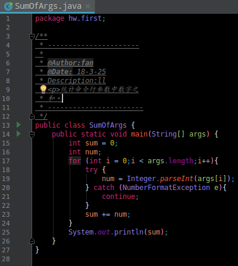
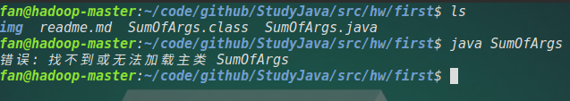
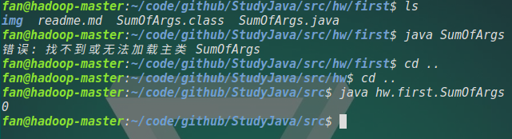
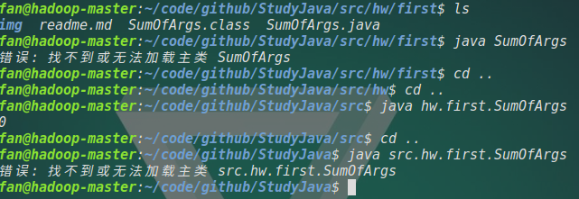
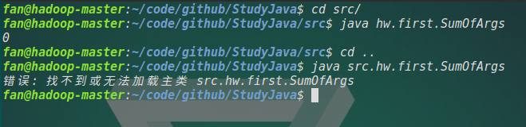

# Java homework first
<b>First:</b>  
Create a class named `SumOfArgs` that will print out the sum of all integer arguments found on the command line.  
example:  
	
	> java SumOfArgs 
	0
	> java SumOfArgs 10 9 8
	27
	> java SumOfArgs hello dave 1 2 3
	6
	> java SumOfArgs Hello World
	0

There uses SumOfArgs.java to implement it.  

<b>Second:</b>  
Create classes named `Book`, `Course` and `Student` to perform simple course-selecting system (CRS). Student has at least three overloaded constructors with different parameter list. Student may select one or more Course, and one Course also has some members of Book.  
example:  
	> java CRS 15131001 Java
  	15131001 select Java with books Thinking in Java, Java 8
  	
	> java CRS 15131001 Java WebEngineering
	15131001 select Java with books Thinking in Java, Java 8; and WebEngineering with Web Engineering. 

There uses Book.java, Course.java, AllCourse.java, student.java and Main.java to implement it.  

# Java文件中有包名的编译与执行
首先说结果：  
我们可以在任意位置编译目标文件，只要我们能够给出正确的文件地址。但是在执行.class文件时，我们必须给出的是文件的完整的名字。包括包名和文件名。  
源文件如下：  
  
含有包名 hw.first。  
<b>编译:</b>  
只要是编译的路径能够找到对应文件即可,如图:  
  
<b>执行代码:</b>  
当我们直接在.class文件所在位置执行它时：  
  
此时JVM会找不到主类。  
JVM会首先在源文件当前目录寻找字节码文件，找到之后，因为Java文件中含有包名，然后JVM会从执行该Java文件的目录向下寻找这个包，这样当然就找不到这个文件了。  
而我们从定义包的路径下执行该文件:  
  
此时，就能够正确执行了。  
但是，如果我们在包定义之前的文件中执行呢？  
  
结果出错了！  
对比一下：  
  
可以看出，我们执行Java文件的时候，后面应该跟着的是完整的文件名。  