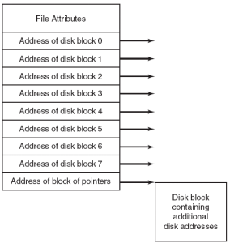

# 看书之后的补充

## 词义
<ul>
<li>contrast -- 对比</li>
<li>ivity -- 情况，性质</li>
<li>Strict Alternation -- 严格轮换法</li>
</ul>

## 要点
To obtain services from the operating system, a user program must make a <b>system call</b>, which traps into the kernel and invokes the operating system.  

Con-ceptually, each process has its own virtual CPU. In reality, of course,the real CPU switches back and forth from process to process. This rapid switching back and forth is called multiprogramming. Some-times people speak of pseudoparallelism（伪并行） in this context, to contrast it with the true hardware parallelism of multiprocessor systems.  

Four method for process creation  
1）系统初始化  
2）执行了正在运行的进程所调用的进程创建系统调用  
3）用户请求创建一个新进程  
4）一个批处理作业的初始化  

Four method for process termination  
1）正常退出（自愿的）  
2）出错退出（自愿的）  
3）严重错误（非自愿的）  
4）被其他进程杀死（非自愿的）  

Processes that stay in the background to handle some act ivity are called daemons.（守护进程）  

<b>CPU 利用率</b>  
CPU utilization = 1 –p^n（n 个进程，每个等待 io 的时间与停留在内存中时间的比为 p）  

To make it possible to write portable threaded programs, IEEE has defined a standard for threads in IEEE standard 1003.1c. The threads package it defines is called Pthreads.  
Some of the Pthreads function calls. Pthread_ create、Pthread_ exit.  

对共享内存进行访问的程序片段，好的解决方案，满足 4 个条件:  
1）任何两个进程不能同时处于其临界区  
2）不应对 CPU 的速度和数量作出任何假设  
3）临界区外运行的进程不得阻塞其他进程  
4）不得使进程无限期的等待进入临界区  

<b>TSL指令</b>  
  
可见当lock为0的时候,代表临界区没有进程使用,是可用的,是1的时候表示正在被使用,  

Busy waiting(忙等待)会一直占用CPU,使用睡眠与唤醒能够释放CPU而不浪费.  

<b>Multiple Queues 多级队列</b>  
设置优先级类.最高的一个时间片,次高的两个,再次一级的 4 个.一个进程用完后,进入下一类.  
例：一个进程需 100 个片,最初 1 个,换出来,下次两个,下来依次 4 个,8 个等.当一个进程用完分配给它的时间片后,它被移到下一类.共需 7 次交换,而轮转法需 100 次.  

An address space is the set of addresses that a process can use to address memory. Each process has its own address space, independent of those belonging to other proc-esses.  
(地址空间是一个进程可用于寻址内存的一套地址)  

<b>Swapping (交换技术):</b>  
把一个进程完整调入内存,使该进程运行一段时间,然后把它存回磁盘.  
若进程的数据段增长,动态分配内存.当换入或移动内存时,分配一些额外的内存.  
交换会导致内存出现大量空洞,可用内存紧缩处理,但是一般不做处理,因为会浪费大量CPU时间.  

In paging, each page is a contiguous range of addresses.  

每个程序拥有自己的地址空间,这些空间被分割为许多块,每一块叫做一页或页面.每一页有连续的地址范围.这些页被映射到物理内存,但并不是所有的页都必须在内存中才可运行程序.当程序引用到一部分在物理内存中的地址空间时,由硬件立即执行必要的映射.当程序引用到不在物理内存中的地址空间时,由 OS 负责将缺失的部分装入物理内存并重新执行失败的指令.  

Translation Lookaside Buffers(TLB) 转换检测缓冲区是一个小型的硬件设备将虚拟地址直接映射到物理地址,不必再访问页表.  
当一个页面访问在内存中不在 TLB 中时,产生软失效 soft miss，更新一下 TLB.当页面不在内存中（当然也不在 TLB 中）,硬失效 hard miss.需要一次磁盘存取以装入该页面.  

<b>工作集页面置换算法 The Working Set Page Replacement Algorithm</b>  
请求调页 demand paging：页面是在需要时被调入的,而不是预先装入的.  
一个进程当前正在使用的页面的集合称为它的工作集 working set.  
在进程运行前预先装入其工作集页面称为预先调页 prepaging.  
工作集是最近 k 次内存访问所访问过的页面的集合,函数 w(k,t)是时刻 t 时工作集的大小.  
OS 跟踪哪些页面在工作集中.当发生 page fault 时,淘汰一个不在工作集中的页面.  
一个进程的工作集从它开始执行到当前所实际使用的 CPU 时间总数叫做当前实际运行时间current virtual time.进程的工作集可以定义为在过去的 τ 秒实际时间中进程实际访问的页面集合.  
τ 为当前实际运行时间,age 为当前时间减去上次使用时间.若都符合条件,淘汰生存时间最长的,也就是上次使用时间最小的.  

<b>工作集时钟页面置换算法 The WSClock Page Replacement Algorithm</b>  
当 R 位为 1 时：把该页面的 R 位置为 0,指针指向下一个页面.R 位为 0 时：如果生存时间大于 τ 且该页面是干净的,该页面也不在工作集中,（磁盘上有其副本）则申请此页框,并把新页面放在其中.若不干净,为避免写操作的切换,指针继续走.走了一圈返回起始点：要么至少经历过一次写操作（这时指针仅是寻找干净页面,既已调度
写操作,就置换遇到的第一个干净页面）,要么没经历过（都在工作集里,随便挑置换一个干净页面.实在没有？就置换当前的页面）.  

  
> e：每个页表项需要 e 个字节.s：进程平均大小为 s 个字节.p：页面大小为 p 个字节.  
平均情况下,最后一个页面一半为空.  

<b>文件实现</b>  
<b>Linked List Allocation</b>  
在内存中采用表的链表分配 Linked List Allocation Using a Table in Memory取出每个磁盘块的指针字,放在内存的一个表中.内存中这样一个表格称为文件分配表 FAT (File Allocation Table).在目录项中只要记录一个整数（起始块号）,就可以找到文件的全部块.缺点是必须把整个表都存放在内存中.  
  
<b>i 节点</b>  
最后一个记录各个文件分别包含哪些磁盘块的方法是给每个文件赋予一个称为 i 节点（index-node）的数据结构其中列出了文件属性和文件块的磁盘地址.只有对应的文件打开时,其 i 节点才在内存中.比 FAT 占用的空间小,因为表的大小正比于磁盘大小.而 i 节点需要在内存中有一个数组,大小正比于可能要同时打开的最大文件个数,与磁盘大小无关.  
  
其中只包含一个一次间接块.  

<b>Properties of a precise interrupt</b>  
1.PC (Program Counter) is saved in a known place.  
2.All instructions before the one pointed to by the PC have fully executed.  
3.No instruction beyond the one pointed to by the PC has been executed.  
4.Execution state of the instruction pointed to by the PC is known.  

An interrupt that dose not meet these requirements is called an imprecise interrupt.  

<b>Device independence</b> means is that it should be possible to write programs that can access any I/O device without having to specify the device in advance.  

<b>SCAN算法就是 电梯/扫描 算法.  
C-SCAN算法是单向扫描算法.和改进的电梯调度算法相同.都是走到最后再从头开始.</b>  

